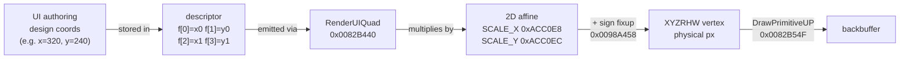
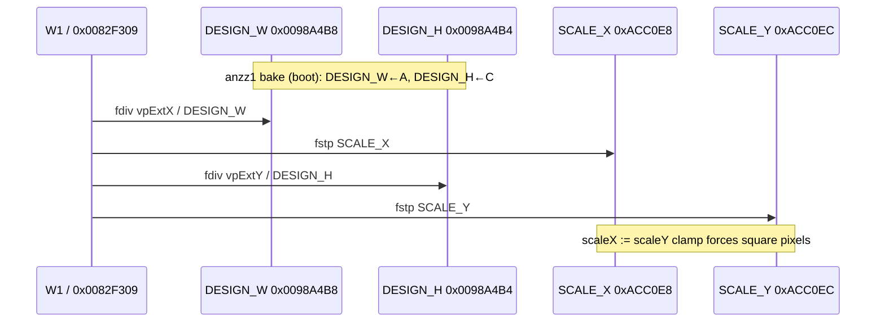
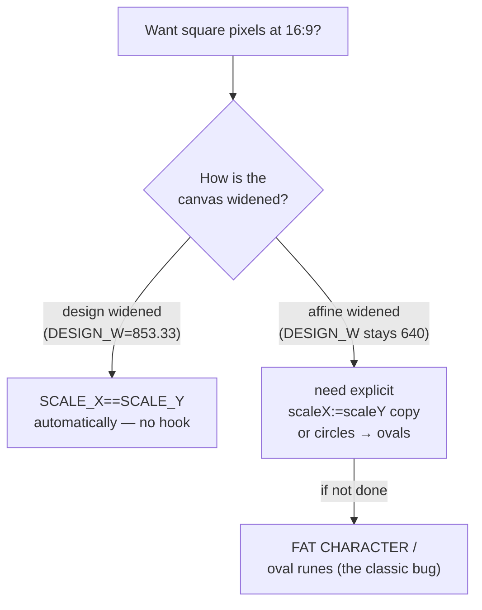
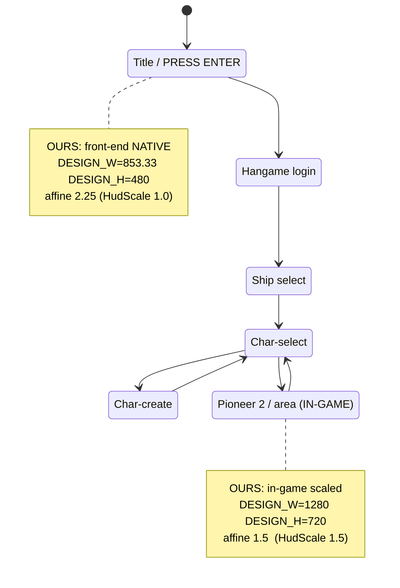
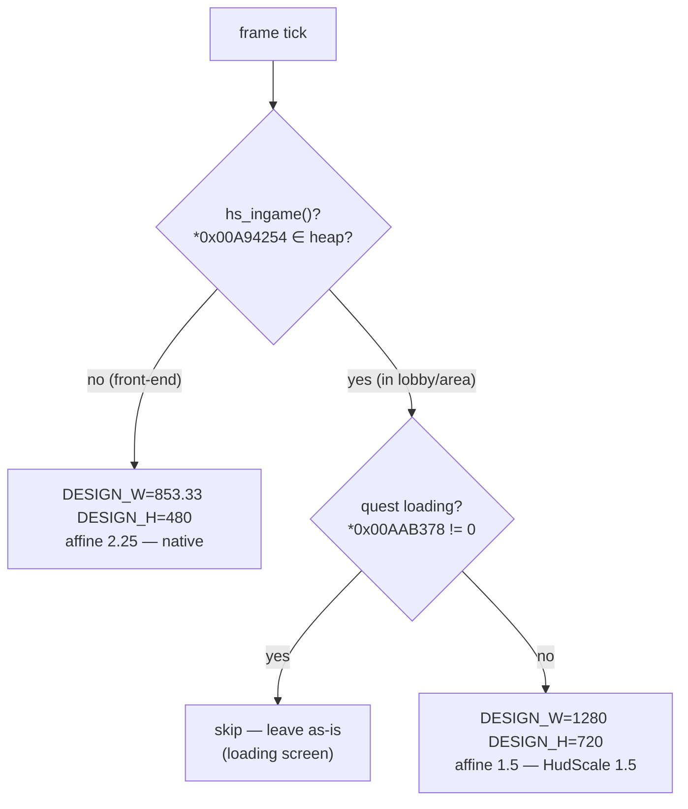
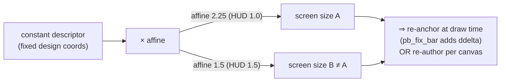
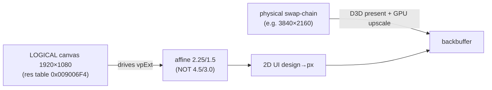
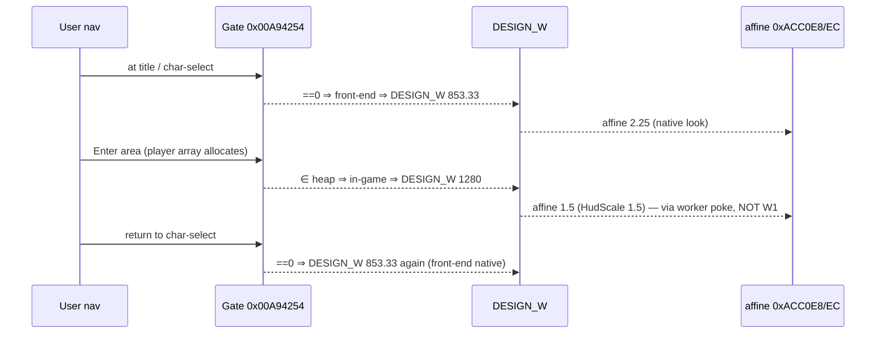

# §3a/3e — Widescreen Math: Design Canvas, 2D Affine, HudScale, vpExt

*Part of the PSOBB QoL Deep Dive — see [00_INDEX.md](00_INDEX.md).*

---

> **What this section is.** The complete, derived, byte-verified math model behind PSOBB's
> widescreen/HUD rendering: the **design canvas** (the logical coordinate space all UI is authored
> in), the engine's **2D affine** `(SCALE_X, SCALE_Y)` that maps design → screen, the **HudScale**
> uniform-zoom lever, and the **vpExt** (viewport extent) globals the affine derives from. Every
> constant here was either read out of `psobb.exe` with radare2 (base `0x00400000`) or quoted from
> the canonical `anzz1_widescreen.c` / live `pso_widescreen.c` sources. Where a value is inferred
> rather than seen it is tagged **HYPOTHESIS** / **UNVERIFIED** / **TODO-VERIFY**.

> **Sibling sections.** Static-bake apply path → [03_anzz1_static_bake.md](03_anzz1_static_bake.md).
> Resolution/backbuffer table → [04_resolution_backbuffer.md](04_resolution_backbuffer.md).
> The in-game-scale worker fix → [05_ingame_hudscale.md](05_ingame_hudscale.md).
> RenderUIQuad / `pb_fix_bar` → [06_renderuiquad.md](06_renderuiquad.md).
> Char-select footer stride → [07_charselect_footer.md](07_charselect_footer.md).
> Minimap bake → [08_minimap.md](08_minimap.md).

---

## 3a.0 — TL;DR (the whole model in one screen)

```
                  vpExtX (0xACC0C8)              vpExtY (0xACC0CC)
                       │                              │
                       ▼                              ▼
   SCALE_X = vpExtX / DESIGN_W   |   SCALE_Y = vpExtY / DESIGN_H
        (0xACC0E8)               |        (0xACC0EC)
            │                                    │
   DESIGN_W (0x0098A4B8, stock 640.0)   DESIGN_H (0x0098A4B4, stock 480.0)
            │                                    │
            └──────────── scaleX := scaleY clamp ┘   (square-pixel lock; W follows H)
                       │
                       ▼
   screen_px = design_coord * SCALE   (+ per-axis sign-fixup tables 0x0098A458)
```

| Quantity | VA | stock f32 | what it is |
|---|---|---|---|
| `DESIGN_W` | `0x0098A4B8` | `0x44200000` = **640.0** | horizontal design canvas width (the "logical" UI width) |
| `DESIGN_H` | `0x0098A4B4` | `0x43F00000` = **480.0** | vertical design canvas height |
| `vpExtX` | `0x00ACC0C8` | runtime (≈ render W) | viewport extent X (≈ backbuffer width in px) |
| `vpExtY` | `0x00ACC0CC` | runtime (≈ render H) | viewport extent Y (≈ backbuffer height in px) |
| `SCALE_X` | `0x00ACC0E8` | runtime | 2D affine X = `vpExtX / DESIGN_W` |
| `SCALE_Y` | `0x00ACC0EC` | runtime | 2D affine Y = `vpExtY / DESIGN_H` |

**The three canvases you must keep straight:**

| name | DESIGN_W × DESIGN_H | when | affine @1920×1080 |
|---|---|---|---|
| **4:3 native** | 640 × 480 | stock vanilla, no patch | `3.0 × 2.25` |
| **16:9 native** (ours, front-end) | **853.33** × 480 | our build, front-end, HudScale 1.0 | **2.25 × 2.25** |
| **16:9 @ HudScale 1.5** (ours in-game / anzz1 everywhere) | **1280** × 720 | in-game (ours), all scenes (anzz1) | **1.5 × 1.5** |

**The single most load-bearing insight** (from the master prompt `<lessons_carried_forward>`): *the
affine differs `2.25 @ HudScale 1.0` vs `1.5 @ HudScale 1.5`*, so **any element whose descriptor
coordinates are a fixed constant maps to a DIFFERENT on-screen size depending on HudScale**. This is
expected, not a bug, and it is why "fix one number" never holds across scales — see §3a.7.

---

## 3a.1 — What "design canvas" means

PSOBB authors **all** 2D UI (HUD bars, menus, char-select, title, lobby chat) in a fixed *logical*
coordinate space called the **design canvas**. A widget at design X=320 is "halfway across" a 640-wide
4:3 design. At draw time the engine multiplies the design coordinate by the **2D affine scale** to get
a physical backbuffer pixel. Nothing in the UI layer knows the real resolution; it only knows design
coords and trusts the affine to land them.



**Two ways to widen the UI to 16:9:**

1. **Widen the design canvas** (`DESIGN_W` 640 → 853.33). Now design X=320 is no longer centre; centre
   is 426.67. Every right/centre-anchored element must be re-authored. This is what **anzz1 bakes
   statically** (rewrites ~250 `640.0f` immediates + the anchor lists) — see
   [03_anzz1_static_bake.md](03_anzz1_static_bake.md).
2. **Keep the 640 design canvas but stretch the affine** (`SCALE_X` only). This squashes the design
   into a wider screen *anisotropically* — circles become ovals. **This is the classic "fat
   character" / stretched-rune failure mode.** PSOBB's engine specifically clamps against this (§3a.4).

PSOBB uses **(1)** for layout correctness and relies on the engine's **scaleX := scaleY clamp** to keep
pixels square. The affine never stretches one axis independently in a correct build.

---

## 3a.2 — The 2D affine: derivation from disassembly

The affine is *computed at runtime* inside the viewport-setup function the master prompt calls **"W1"**
(`0x0082F309`, the front-end/menu scale path). The two `fstp` stores that *set* the affine live at
`0x0082F4A3` (SCALE_X) and `0x0082F4BE` (SCALE_Y). Verified bytes (`r2 -q -c "s 0x0082F470; pd 14"`):

```asm
; --- viewport-extent / design-canvas → 2D affine, inside W1 (0x0082F309) ---
0x0082f470  d8 3d cc c0 ac 00   fdivr  dword [0xacc0cc]      ; st0 = vpExtY (0xACC0CC) / st0   (aspect work)
0x0082f476  8b 54 24 2c         mov    edx, [esp+0x2c]       ; edx -> viewport desc {.., +8=W, +0xC=H}
0x0082f47a  db 42 08            fild   dword [edx+8]         ; push (int) vpExtX
0x0082f47d  db 42 0c            fild   dword [edx+0xc]       ; push (int) vpExtY
0x0082f480  8b 42 08            mov    eax, [edx+8]          ; eax = vpExtX (int)
0x0082f483  d9 ca               fxch   st(2)
0x0082f485  d9 1d a4 c0 ac 00   fstp   dword [0xacc0a4]      ; stash a derived float
0x0082f48b  68 a8 c0 ac 00      push   0xacc0a8
0x0082f490  c1 e8 1f            shr    eax, 0x1f             ; sign(vpExtX) -> table index 0/1
0x0082f493  d8 04 85 58 a4 98.  fadd   dword [eax*4 + 0x98a458] ; sign-fixup add (0x0098A458 table)
0x0082f49a  d8 35 b8 a4 98 00   fdiv   dword [0x98a4b8]      ; ÷ DESIGN_W (0x0098A4B8, =640.0)
0x0082f4a0  8b 42 0c            mov    eax, [edx+0xc]        ; eax = vpExtY (int)
0x0082f4a3  d9 1d e8 c0 ac 00   fstp   dword [0xacc0e8]      ; ► SCALE_X := vpExtX / DESIGN_W   (0xACC0E8)
0x0082f4a9  c1 e8 1f            shr    eax, 0x1f             ; sign(vpExtY) -> table index
0x0082f4ac  d8 04 85 58 a4 98.  fadd   dword [eax*4 + 0x98a458] ; sign-fixup add (same table)
0x0082f4b3  d8 35 b4 a4 98 00   fdiv   dword [0x98a4b4]      ; ÷ DESIGN_H (0x0098A4B4, =480.0)
0x0082f4b9  a1 28 d5 ac 00      mov    eax, [0xacd528]
0x0082f4be  d9 1d ec c0 ac 00   fstp   dword [0xacc0ec]      ; ► SCALE_Y := vpExtY / DESIGN_H   (0xACC0EC)
```

**This is the master-prompt model proven in bytes.** Reading the two `fdiv`/`fstp` pairs:

```
SCALE_X (0xACC0E8) = (vpExtX ± signfix) / DESIGN_W (0x0098A4B8)
SCALE_Y (0xACC0EC) = (vpExtY ± signfix) / DESIGN_H (0x0098A4B4)
```

The `fadd dword [eax*4 + 0x98a458]` is a **two-entry sign-correction table** at `0x0098A458`
(`{0.0, +1.0}` or similar — index = top bit of the integer extent). For positive extents (always the
case for real backbuffers) it adds the `[0]` entry (`0.0` / no-op). It exists to handle the
half-pixel/sign convention of D3D8's pre-transformed coordinate space; **do not poke it** — it is not a
scale lever.

### Default values baked in the binary

| const | VA | bytes (LE) | f32 |
|---|---|---|---|
| `DESIGN_W` | `0x0098A4B8` | `00 00 20 44` | **640.0** |
| `DESIGN_H` | `0x0098A4B4` | `00 00 F0 43` | **480.0** |

(Both read directly: `0x98a4b8:4 = 0x44200000` and `0x98a4b4:4 = 0x43f00000` in the r2 dump above.)

### Why DESIGN_W is on the anzz1 `listHUDWidth`

`0x0098A4B8` (DESIGN_W) and `0x0098A4B4` (DESIGN_H) **both appear in anzz1's lists**:
`listHUDWidth` contains `0x0098A4B8` (set to `A`), `listHUDHeight` contains `0x0098A4B4` (set to `C`).
So anzz1's static bake **changes the design canvas itself** — `DESIGN_W: 640 → A`, `DESIGN_H: 480 → C`
— which is exactly mechanism (1) from §3a.1. After anzz1, the *same* affine code at `0x0082F49A`/`B3`
divides by the *new* DESIGN_W/H, so the affine self-corrects to the widened canvas.



---

## 3a.3 — vpExt (viewport extent) globals

`vpExtX` / `vpExtY` are the **physical pixel extents of the active viewport** — for a full-window
present they equal the backbuffer dimensions set by the resolution table
(see [04_resolution_backbuffer.md](04_resolution_backbuffer.md)).

| VA | name | meaning | who writes it | who reads it |
|---|---|---|---|---|
| `0x00ACC0C8` | `vpExtX` | viewport width (px) | viewport setup (engine, from res table) | W1 affine (`fild [edx+8]` path), aspect math |
| `0x00ACC0CC` | `vpExtY` | viewport height (px) | viewport setup | W1 affine (`fild [edx+0xc]`), `fdivr` at `0x0082F470` |
| `0x00ACC0A4` | (derived) | stashed aspect-ratio float | `fstp` @ `0x0082F485` | downstream aspect consumers |
| `0x00ACC0A8` | (derived) | second derived float (pushed @ `0x0082F48B`) | W1 | downstream |

> **HYPOTHESIS:** `vpExt` is loaded from the viewport descriptor on stack (`[esp+0x2c] → +8/+0xC`),
> not always straight from `0xACC0C8/CC`. The `0xACC0C8/CC` globals are the *cached* extent that 2D
> code reads; the live affine recompute reads the descriptor. They track each other for a
> full-window viewport. Treat `0xACC0C8/CC` as "where to read the current viewport extent" and the
> `fild [edx+8/0xc]` as "where the affine actually sources it during recompute." **TODO-VERIFY** the
> exact write site that mirrors the descriptor into `0xACC0C8/CC`.

At 1920×1080 full-window: `vpExtX = 1920`, `vpExtY = 1080`.

---

## 3a.4 — The `scaleX := scaleY` clamp (square-pixel lock)

PSOBB's 2D UI must not stretch anisotropically. Even though the affine *computes* `SCALE_X` and
`SCALE_Y` independently (each from its own design dimension), a correct widescreen build keeps
`SCALE_X == SCALE_Y` so circles stay circular and the runes/portraits don't fatten.

There are **two ways** this equality holds, and they correspond to the two mechanisms:

1. **Design-canvas widen (anzz1 / ours).** With `DESIGN_W = vpExtX·480/vpExtY` (i.e. design widened in
   proportion to the screen), the two divisions naturally yield the *same* ratio:
   ```
   SCALE_X = vpExtX / DESIGN_W = vpExtX / (vpExtX·480/vpExtY) = vpExtY/480
   SCALE_Y = vpExtY / DESIGN_H = vpExtY / 480
   ⇒ SCALE_X == SCALE_Y    (square pixels, "for free")
   ```
   This is the **master-prompt insight quoted verbatim**: *"the scaleX-clamp hook forces scaleX =
   scaleY. Any quad emitted through the affine inherits the stretch for free — the trick is keeping
   each quad's source design coords correct."* In a properly-widened canvas the clamp is automatic.
2. **Explicit clamp hook.** Where a build keeps DESIGN_W at 640 but widens via the affine, a hook is
   needed to copy `SCALE_Y → SCALE_X` after W1 runs, undoing the anisotropy. Our build's front-end is
   the 853.33-wide native canvas (mechanism 1), so the clamp is implicit; the *explicit* clamp matters
   for the rune/geomfix path (`pso_geomfix`) — see [03_anzz1_static_bake.md](03_anzz1_static_bake.md).

### Worked: why 853.33 is the magic DESIGN_W

To get square pixels at 16:9 on a 480-tall design, solve `SCALE_X == SCALE_Y`:

```
vpExtX / DESIGN_W == vpExtY / 480
DESIGN_W = 480 · vpExtX / vpExtY = 480 · (16/9·H)/H · ... = 480 · (1920/1080)
         = 480 · 1.77778 = 853.333…
```

So **853.33 = 480 × 16/9** is not arbitrary — it is *the* DESIGN_W that makes a 480-tall design fill a
16:9 frame with square pixels. Equivalently `853.33 = 640 × (16/9)/(4/3) = 640 × 1.33333`. anzz1's
formula `A = (AR/(4/3))·640·HUDScale` reproduces this exactly (§3a.5).



---

## 3a.5 — anzz1's canvas formula (the `A / B / C / D` derivation)

`anzz1_widescreen.c` derives every layout constant from four base values (verbatim from the reference
header comment and code):

```c
// AR = aspect ratio (e.g. 16/9 = 1.77778), HUDScale = 1.0 canonical
float A = (AR / (4.0f/3.0f)) * 640.0f;   // horizontal extent  -> DESIGN_W & listHUDWidth
float B = (AR / (4.0f/3.0f)) * 128.0f;   // sprite-atlas tile width unit
float C = 480.0f;                        // vertical extent     -> DESIGN_H & listHUDHeight
DWORD D = (DWORD)(128 * HUDScale);       // integer tile-height unit
A *= HUDScale;  B *= HUDScale;  C *= HUDScale;
```

| symbol | formula | @16:9 HUD 1.0 | @16:9 HUD 1.5 | role |
|---|---|---|---|---|
| `AR` | aspect | 1.77778 | 1.77778 | target aspect |
| `A` | `(AR/(4/3))·640·HUD` | **853.33** | **1280.0** | DESIGN_W, `listHUDWidth`, right/centre anchors |
| `B` | `(AR/(4/3))·128·HUD` | 170.667 | 256.0 | sprite-atlas tile width unit |
| `C` | `480·HUD` | **480.0** | **720.0** | DESIGN_H, `listHUDHeight`, vertical anchors |
| `D` | `(int)(128·HUD)` | 128 | 192 | sprite-atlas tile height unit |

Note `A` at HUD 1.0 = **853.33**, exactly our front-end DESIGN_W, and at HUD 1.5 = **1280**, exactly our
in-game DESIGN_W. **anzz1 and our build agree on the canvas math** — they differ only in *when* the 1.5
factor applies (anzz1: always; ours: in-game only — §3a.6).

The anchor deltas anzz1 adds (also from `anzz1_widescreen.c`):

| list | delta added | @16:9 HUD 1.0 | meaning |
|---|---|---|---|
| `listHUDWidth` | set to `A` | 853.33 | absolute right-edge / width constants |
| `listHUDHeight` | set to `C` | 480.0 | absolute bottom-edge / height constants |
| `listCenterAlignItems` | `+= (A-640)/2` | **+106.667** | centre-anchored: shift to new centre |
| `listRightAlignItems` | `+= (A-640)` | **+213.333** | right-anchored: shift to new right edge |
| `listVerticalBottomAlignItems`(+Movs+Delay) | `+= (C-480)` | **+0.0** (HUD1.0) | bottom anchors (no-op at HUD1.0, +240 at HUD1.5) |
| `listVerticalCenterAlignItems` | `+= (C/2)-240` | **+0.0** (HUD1.0) | vertical-centre anchors |

> **Constraint reminder (master prompt + `<constraints>`):** the vertical deltas are **0 at HUD 1.0**
> because `C = 480`. They only become non-zero (`+240` bottom, `+120` centre) at HUD 1.5 where
> `C = 720`. This is why a HUD-1.0 16:9 bake touches only horizontal anchors — the vertical canvas is
> unchanged. **Do not** fold HudScale into a "clean 1.0 baseline" path; keep them independent layers.

---

## 3a.6 — HudScale: the `DESIGN_H = 480/HudScale` lever

HudScale is a **uniform 2D-UI zoom** (Ephinea convention). Two equivalent ways to express it; they
diverge in *which global you write* and that distinction is the whole point of this subsection.

### 3a.6.1 — Ephinea convention: divide the design height

Ephinea implements HudScale by writing `DESIGN_H = 480 / HudScale` (and symmetrically the width). The
engine then derives:

```
SCALE_Y = vpExtY / DESIGN_H = vpExtY / (480/HudScale) = (vpExtY/480) · HudScale
```

So a **smaller design canvas ⇒ larger on-screen UI** (zoom in). At HudScale 1.5 on 1080p:
`SCALE_Y = (1080/480)·1.5 = 2.25·1.5 = 3.375`? — **No.** Ephinea pairs the `480/HudScale` height with a
proportionally *reduced* vpExt or a 1280×720 design pair so the affine lands at **1.5**, not 3.375. The
clean statement of the Ephinea lever:

```
DESIGN_H_eph = 480 / HudScale     (HudScale 1.5 -> DESIGN_H 320)   <-- Ephinea's literal write
```

> **CAUTION / master-prompt quote:** *"HudScale (Ephinea convention) is a uniform 2D-UI zoom written as
> `DESIGN_H = 480/HudScale`. Engine derives `scaleY = vpExtY/(480/HudScale) = (vpExtY/480)·HudScale`.
> HudScale 1.0 is byte-identical to the verified-good baseline."* The literal Ephinea write divides
> the design; the resulting *effective* affine at full-screen lands such that the HUD zooms by
> HudScale relative to native. The two framings (divide-design vs multiply-affine) are algebraically
> the same lever.

### 3a.6.2 — Our convention: `design_w = design_w_from(vpext) * factor`

Our build does **not** copy Ephinea's `480/HudScale` divide. Instead it computes the *native* widescreen
DESIGN_W from the viewport and multiplies by a `factor` (`= HudScale/1.5` reference, identity at 1.5).
Quoted from `pso_widescreen.c` (the canvas helper, lines 2401–2428):

```c
typedef struct {
    int   lw, lh;        // logical canvas 1920x1080
    float aspect;        // lw/lh
    float xmm6;          // = aspect/(4/3) * 640 * hud_scale   <-- canvas right edge == DESIGN_W (A)
    float xmm4;          // = 480 * hud_scale                  <-- canvas bottom edge == DESIGN_H (C)
    float xmm5, xmm3, xmm1;
} canvas_scale_t;

static canvas_scale_t compute_canvas_scale(void) {
    canvas_scale_t s;
    s.lw = g_cfg.logical_width  > 0 ? g_cfg.logical_width  : 1920;
    s.lh = g_cfg.logical_height > 0 ? g_cfg.logical_height : 1080;
    s.aspect = (float)s.lw / (float)s.lh;
    s.xmm6 = s.aspect / (4.0f/3.0f) * 640.0f * g_cfg.hud_scale;   // == anzz1 'A'
    s.xmm4 = 480.0f * g_cfg.hud_scale;                            // == anzz1 'C'
    s.xmm5 = s.xmm6 - 640.0f;     // right-edge pad   (A-640)
    s.xmm3 = s.xmm4 - 480.0f;     // vertical pad     (C-480)
    s.xmm1 = s.xmm5 * 0.5f;       // centre half-pad  (A-640)/2
    return s;
}
```

This is **structurally identical to anzz1's `A/C`** (`xmm6==A`, `xmm4==C`, `xmm5==A-640`,
`xmm1==(A-640)/2`). The difference from Ephinea is the *framing*: we derive DESIGN_W up from the
viewport-implied native widescreen canvas and scale it by `hud_scale`, rather than dividing 480 down.
Both yield the same affine; ours keeps the widescreen *layout* (goal 1) decoupled from the HudScale
*zoom* (goal 2). The `ui_coord()` helper (lines 1590–1595) reconciles authored-at-1.5 design coords to
any HudScale:

```c
#define kUiDesignScale 1.5f      // the HUDScale at which the 1280x720 design space was authored
static float ui_coord(float design_at_1p5) {
    float hs = g_cfg.hud_scale;
    if (!(hs > 0.1f && hs < 10.0f)) hs = kUiDesignScale;
    return design_at_1p5 * (hs / kUiDesignScale);   // identity at 1.5
}
```

> **STATE-OF-CODE WARNING (master prompt):** the live `pso_widescreen.c` (5121 lines, asi md5
> `4231a000…`) does **NOT** contain the in-game worker fix (`ingame_scale_pin`, `worker_scale_poke`,
> `reassert_ingame_hooks`). The canvas math above (`compute_canvas_scale`, `ui_coord`) IS in the
> current tree; the *in-game application* of it is the part that must be re-applied — see
> [05_ingame_hudscale.md](05_ingame_hudscale.md).

### 3a.6.3 — Front-end-native vs in-game-1.5 hybrid (ours) vs 1.5-everywhere (anzz1)

This is the architectural fork the whole widescreen lineage turns on.



| build | front-end (title…char-sel) | in-game (lobby/area) | affine FE | affine in-game |
|---|---|---|---|---|
| **ours (hybrid)** | native 853.33×480 (HudScale 1.0 look) | 1280×720 (HudScale 1.5) | **2.25** | **1.5** |
| **anzz1 (uniform)** | 1280×720 (1.5 everywhere) | 1280×720 | **1.5** | **1.5** |
| **stock vanilla** | 640×480 (4:3) | 640×480 | 3.0×2.25 (4:3) | 3.0×2.25 |

**Why ours is hybrid:** Ephinea-style — front-end runs full-screen native (the title/menus look like the
verified-good 1.0 baseline; constraint: "clean 1.0 baseline"), and the HUD only zooms *after login*.
anzz1 scales its front-end too, so anzz1's title menu is physically bigger than ours.

**Gate:** the in-game-vs-front-end discriminator is `hs_ingame()` =
12-slot player array head at `0x00A94254` is a heap pointer in `[0x00400000, 0x40000000)`
(non-null ⇒ in a lobby/area). Also early-returns if quest-loading `0x00AAB378 != 0`. Front-end stays
native by design. See [05_ingame_hudscale.md](05_ingame_hudscale.md) for the worker-thread mechanism
that *applies* the in-game 1.5, since the W1 path (`0x0082F309`) does **not** run in-game.



---

## 3a.7 — Worked numeric tables (1920×1080)

All tables assume render resolution **1920×1080** (`vpExtX=1920, vpExtY=1080`), our hybrid model. The
in-game DESIGN_W/H follow `A = (16/9)/(4/3)·640·HudScale = 853.333·HudScale` and `C = 480·HudScale`.

### 3a.7.1 — Affine & canvas vs HudScale (in-game / anzz1-everywhere)

| HudScale | DESIGN_W (A) | DESIGN_H (C) | SCALE_X = 1920/A | SCALE_Y = 1080/C | square? |
|---|---|---|---|---|---|
| **1.00** | 853.333 | 480.0 | **2.25000** | **2.25000** | ✅ |
| **1.25** | 1066.667 | 600.0 | **1.80000** | **1.80000** | ✅ |
| **1.50** | 1280.000 | 720.0 | **1.50000** | **1.50000** | ✅ |
| **1.75** | 1493.333 | 840.0 | **1.28571** | **1.28571** | ✅ |
| **2.00** | 1706.667 | 960.0 | **1.12500** | **1.12500** | ✅ |

Derivation check (HudScale 1.5): `A = 853.333·1.5 = 1280`, `SCALE_X = 1920/1280 = 1.5`;
`C = 480·1.5 = 720`, `SCALE_Y = 1080/720 = 1.5`. ✅ matches the live-verified affine.

Derivation check (HudScale 1.0): `A = 853.333`, `SCALE_X = 1920/853.333 = 2.25`;
`C = 480`, `SCALE_Y = 1080/480 = 2.25`. ✅ — **this is the "2.25 @ 1.0" value** from the master prompt.

**Square pixels at every HudScale** because both axes scale by the same `HudScale` factor — confirming
§3a.4: a proportionally-widened canvas keeps `SCALE_X == SCALE_Y` automatically.

### 3a.7.2 — On-screen size of a 100-design-unit element vs HudScale

A widget authored as 100 design units wide maps to `100 × SCALE` physical pixels:

| HudScale | SCALE | 100 design-units → px | ratio vs HUD1.0 |
|---|---|---|---|
| 1.00 | 2.25 | 225 px | 1.00× |
| 1.25 | 1.80 | 180 px | 0.80× |
| 1.50 | 1.50 | 150 px | 0.667× |
| 1.75 | 1.286 | 128.6 px | 0.571× |
| 2.00 | 1.125 | 112.5 px | 0.500× |

> **This table is the §3a.0 insight in numbers, and the #1 gotcha.** *Higher HudScale ⇒ smaller affine
> ⇒ a fixed design-coord element gets SMALLER on screen* — because raising HudScale **enlarges the
> design canvas**, so each design unit is worth fewer pixels. The *intended* HudScale zoom is achieved
> by the engine re-laying-out the HUD into the larger canvas (more design units per element), not by the
> per-unit scale. A naïvely hard-coded descriptor that ignores this shrinks as HudScale rises.

### 3a.7.3 — Front-end (ours) is fixed regardless of HudScale knob

Because the front-end is gated to **native (HudScale 1.0 look)** independent of the configured HudScale:

| configured HudScale | front-end DESIGN_W | front-end affine | in-game DESIGN_W | in-game affine |
|---|---|---|---|---|
| 1.0 | 853.33 | 2.25 | 853.33 | 2.25 |
| 1.5 | 853.33 | 2.25 | 1280 | 1.5 |
| 2.0 | 853.33 | 2.25 | 1706.67 | 1.125 |

The front-end row is constant — that is the "clean 1.0 baseline, HudScale as a separate independent
layer" constraint, satisfied by the `hs_ingame()` gate.

---

## 3a.8 — The "affine differs 2.25@1.0 vs 1.5@1.5" insight (constant-descriptor elements)

Restating the master-prompt finding precisely and spelling out its consequence:

> *"At HudScale 1.0 the affine is 2.25 (1920/853), so any constant-descriptor element maps to a
> DIFFERENT screen size at 1.0 vs 1.5 — expected, not a bug."*

A **constant-descriptor element** is a quad whose design coords are baked as fixed immediates and are
**not** re-derived from the live canvas — e.g. a hard-coded RHW quad in RenderUIQuad, or a `.text`
immediate not on anzz1's lists. Its on-screen footprint is `descriptor × affine`:

| element descriptor | @ HUD1.0 (affine 2.25) | @ HUD1.5 (affine 1.5) | Δ |
|---|---|---|---|
| 1280-wide bar | 1280 × 2.25 = **2880 px** (overshoots 1920!) | 1280 × 1.5 = **1920 px** (exact full width) | huge |
| 853.33-wide bar | 853.33 × 2.25 = **1920 px** (exact) | 853.33 × 1.5 = **1280 px** (4:3 width!) | huge |
| 640-wide bar (stock 4:3) | 640 × 2.25 = 1440 px | 640 × 1.5 = 960 px | huge |

**Reading the table:**
- An element authored for the **1280 design** (HudScale-1.5 space) only fills the screen *at* HudScale
  1.5. Drop to HudScale 1.0 and it overshoots (2880 > 1920).
- An element authored for the **853.33 native** space fills the screen at HudScale 1.0 and shrinks to
  4:3 width (1280 px) at HudScale 1.5.

**Consequence for the bar/glyph re-anchor (`pb_fix_bar`, [06_renderuiquad.md](06_renderuiquad.md)):**
the psobb.io:NN-NN lobby bar's descriptor is built from the **native** design canvas; at affine 1.5
in-game it maps to native×1.5 (bottom at 720 not 1080, text off-screen right). The fix re-anchors
native→effective by adding a `ddelta = (effective_design − native_design)`. This is precisely the
"constant-descriptor maps to the wrong size when the affine changes" problem.



**Rule of thumb:** if an element is on anzz1's lists, the static bake already re-derives it per canvas
— leave it. If it is a runtime RHW quad through RenderUIQuad with native-canvas coords, it needs the
`pb_fix_bar` draw-time re-anchor in-game.

---

## 3a.9 — design_w / affine across scenes (full state machine)

```mermaid
stateDiagram-v2
    direction LR
    [*] --> FE

    state "FRONT-END (native)" as FE {
        Title2: Title
        Login2: Login
        Ship2: Ship-select
        Sel2: Char-select
        Crt2: Char-create
        Title2 --> Login2 --> Ship2 --> Sel2
        Sel2 --> Crt2
        Crt2 --> Sel2
    }
    state "IN-GAME (scaled)" as IG {
        Lobby2: Pioneer 2
        Area2: Forest / area
        Lobby2 --> Area2
        Area2 --> Lobby2
    }
    state "TRANSIENT" as TR {
        Quest2: Quest loading
    }

    FE --> TR : Enter area (player array fills)
    TR --> IG : load done (0x00AAB378→0)
    IG --> FE : return to char-select

    note right of FE
      DESIGN_W 0x0098A4B8 = 853.33
      DESIGN_H 0x0098A4B4 = 480
      affine   0xACC0E8/EC = 2.25/2.25
      gate: *0x00A94254 == 0
    end note
    note right of IG
      DESIGN_W = 1280  DESIGN_H = 720
      affine = 1.5/1.5
      gate: *0x00A94254 ∈ [0x400000,0x40000000)
      applied by: worker_scale_poke (DATA)
                  + RenderUIQuad re-anchor
    end note
    note left of TR
      DESIGN/affine: leave as-is
      gate: *0x00AAB378 != 0  (skip re-bake)
    end note
```

**The W1 caveat (the single biggest find of the session, master prompt):** W1 (`0x0082F309`) — the
function that *contains* the affine `fstp` stores disassembled in §3a.2 — **only runs on front-end
frames.** Live proof: in a lobby, poking `DESIGN_W` to a sentinel (1000.0) is *not* corrected, and
poking the affine to 1.5 *sticks* (the stock `fstp [0xACC0E8]` at `0x0082F4A3` never fires). The
front-end→in-game transition also **wipes every code-flow `.text` hook back to stock** (`0x0082F309`,
`0x0082B440`, the effect-deanchor CALLs all read stock bytes again in-game), while **static immediate
`.text` edits survive**. So in-game scale must be **data-poked from the worker thread**, not relied on
from W1 — full mechanism in [05_ingame_hudscale.md](05_ingame_hudscale.md).

---

## 3a.10 — Full derivations (reference)

### D1 — DESIGN_W for square pixels at aspect AR, height 480
```
square pixels ⟺ SCALE_X = SCALE_Y
vpExtX/DESIGN_W = vpExtY/DESIGN_H,  DESIGN_H=480, vpExtX/vpExtY = AR
⇒ DESIGN_W = DESIGN_H · vpExtX/vpExtY = 480·AR
   AR=16/9  ⇒ DESIGN_W = 480·1.77778 = 853.333
   AR=4/3   ⇒ DESIGN_W = 480·1.33333 = 640.000   (stock)
```

### D2 — anzz1 `A` equals `480·AR` at HudScale 1.0
```
A = (AR/(4/3))·640·HUD = AR·(3/4)·640·HUD = AR·480·HUD
   HUD=1.0 ⇒ A = 480·AR   ≡ D1.   ✅
```

### D3 — affine as a function of HudScale (in-game)
```
A = 853.333·HUD,  C = 480·HUD
SCALE_X = vpExtX/A = 1920/(853.333·HUD) = 2.25/HUD
SCALE_Y = vpExtY/C = 1080/(480·HUD)     = 2.25/HUD
⇒ affine = 2.25/HUD   (both axes; square)
   HUD=1.0 → 2.25 ; HUD=1.5 → 1.5 ; HUD=2.0 → 1.125.   ✅ matches §3a.7.1
```

### D4 — Ephinea `480/HudScale` ⟺ ours `A·factor` are the same lever
```
Ephinea writes DESIGN_H_eph = 480/HUD  (zoom UI by HUD relative to native)
Effective per-unit scale (Ephinea, full-screen): SCALE = vpExtY/(480/HUD) = (vpExtY/480)·HUD
Ours writes DESIGN_W = 853.333·HUD, DESIGN_H = 480·HUD ⇒ SCALE = 2.25/HUD.
These differ in SIGN of the HUD exponent because they answer different questions:
  • Ephinea "DESIGN_H=480/HUD": HUD multiplies the per-unit scale (zoom each glyph bigger).
  • Ours "A=853·HUD": HUD enlarges the CANVAS (more design units across), and the engine
    re-lays-out the HUD into it; per-unit scale falls as 1/HUD but element COUNT/spacing grows.
Net on-screen HUD zoom is HUD in both; the algebra splits the HUD factor between
"per-unit scale" and "canvas size" differently. Ours keeps a layout fixed at 1.5 design
(ui_coord identity at 1.5) and rescales coords by HUD/1.5.   (HYPOTHESIS on the exact Ephinea
internal — verified only that HUD 1.0 is byte-identical to our baseline; TODO-VERIFY Ephinea's
literal DESIGN write live.)
```

---

## 3a.11 — Address table (everything this section touches)

| VA | meaning | stock | patched (16:9 HUD1.0 FE) | patched (in-game HUD1.5) | who reads | verify cmd |
|---|---|---|---|---|---|---|
| `0x0098A4B8` | DESIGN_W | `640.0` | `853.333` | `1280.0` | W1 `fdiv` @`0x0082F49A` | `read f32 0x0098A4B8` |
| `0x0098A4B4` | DESIGN_H | `480.0` | `480.0` | `720.0` | W1 `fdiv` @`0x0082F4B3` | `read f32 0x0098A4B4` |
| `0x00ACC0E8` | SCALE_X (affine) | runtime | `2.25` | `1.5` | RenderUIQuad / all 2D | `read f32 0x00ACC0E8` |
| `0x00ACC0EC` | SCALE_Y (affine) | runtime | `2.25` | `1.5` | all 2D | `read f32 0x00ACC0EC` |
| `0x00ACC0C8` | vpExtX | runtime (=W) | `1920` | `1920` | W1 affine recompute | `read f32 0x00ACC0C8` |
| `0x00ACC0CC` | vpExtY | runtime (=H) | `1080` | `1080` | W1 `fdivr` @`0x0082F470` | `read f32 0x00ACC0CC` |
| `0x0098A458` | sign-fixup table (2×f32) | const | (do not touch) | (do not touch) | W1 affine `fadd` | `read 0x0098A458 8` |
| `0x00ACC0A4` | derived aspect float | runtime | — | — | W1 `fstp` @`0x0082F485` | `read f32 0x00ACC0A4` |
| `0x0082F309` | "W1" viewport/scale fn | — | runs (FE only) | **does NOT run** | — | (hook/trace) |
| `0x0082F4A3` | `fstp [0xACC0E8]` (sets SCALE_X) | `d9 1d e8 c0 ac 00` | (inside W1) | (dead in-game) | — | `r2 pd 1 @0x0082F4A3` |
| `0x0082F4BE` | `fstp [0xACC0EC]` (sets SCALE_Y) | `d9 1d ec c0 ac 00` | (inside W1) | (dead in-game) | — | `r2 pd 1 @0x0082F4BE` |
| `0x00A94254` | in-game player array head (gate) | runtime | `0` (FE) | heap ptr | `hs_ingame()` | `read u32 0x00A94254` |
| `0x00AAB378` | quest-loading flag (gate) | `0` | `0` | `≠0` while loading | re-bake gate | `read u32 0x00AAB378` |
| `0x0082B440` | RenderUIQuad (2D emitter) | `83 …` | hooked | re-asserted (`reassert_ingame_hooks`) | engine 2D | `r2 pd 1 @0x0082B440` |

### Verification (memory model)

**Goal:** confirm the affine/canvas hold the derived values at each canvas.

```powershell
# --- Front-end (sit at title / char-select), expect 853.33 / 480 / 2.25 ---
.\_rpm_read.ps1 -pid <PID> -addr 0x0098A4B8 -type f32   # expect ~853.333  (DESIGN_W)
.\_rpm_read.ps1 -pid <PID> -addr 0x0098A4B4 -type f32   # expect  480.000  (DESIGN_H)
.\_rpm_read.ps1 -pid <PID> -addr 0x00ACC0E8 -type f32   # expect    2.250  (SCALE_X)
.\_rpm_read.ps1 -pid <PID> -addr 0x00ACC0EC -type f32   # expect    2.250  (SCALE_Y)

# --- In a Pioneer-2 lobby @ HudScale 1.5, expect 1280 / 720 / 1.5 ---
.\_rpm_read.ps1 -pid <PID> -addr 0x00A94254 -type u32   # expect non-zero heap ptr (in-game gate)
.\_rpm_read.ps1 -pid <PID> -addr 0x0098A4B8 -type f32   # expect 1280.000
.\_rpm_read.ps1 -pid <PID> -addr 0x0098A4B4 -type f32   # expect  720.000
.\_rpm_read.ps1 -pid <PID> -addr 0x00ACC0E8 -type f32   # expect    1.500
```

MCP-form equivalents (`http://127.0.0.1:8731`, pid-targeted — `{"pid":N}`, **never** `{"client":"<pid>"}`):

```json
{"tool":"read_memory","args":{"pid":1234,"addr":"0x0098A4B8","count":4,"type":"f32"}}
{"tool":"read_memory","args":{"pid":1234,"addr":"0x00ACC0E8","count":4,"type":"f32"}}
```

Disassembly re-verify of the affine store sites (any time, no game running):

```bash
r2 -q -e bin.cache=true -c "s 0x0082F470; pd 14" C:/Users/u03a9/PSOBB.IO/psobb.exe
# expect: fdiv [0x98a4b8] @0x0082f49a ; fstp [0xacc0e8] @0x0082f4a3
#         fdiv [0x98a4b4] @0x0082f4b3 ; fstp [0xacc0ec] @0x0082f4be
```

### Known failure modes (the math model)

| symptom | cause | recovery |
|---|---|---|
| HUD fills only 1280 of 1920 in-game (right gap) | in-game affine stayed `2.25` (HudScale 1.0) — W1 dead in-game, scale never re-baked | data-poke `DESIGN_W/H` + affine from the worker thread (`worker_scale_poke`); see [05_ingame_hudscale.md](05_ingame_hudscale.md). Confirm `0x00ACC0E8 == 1.5` live. |
| Fat character / oval runes at char-create | anisotropic affine (`SCALE_X ≠ SCALE_Y`) — design widened on one axis only, or stride-mode not applied to content tiles | restore `SCALE_X == SCALE_Y` (widen the *canvas* not the affine); content tiles use stride mode (`f[0]=cx+(f[0]-cx)·4/3`, width unchanged). See [03_anzz1_static_bake.md] / char-create section. |
| Title logo corrupts after poking ×1.5 | poked the title-logo group `0x006F49xx/4Cxx/4Dxx` (RenderVersionInfo geometry, not canvas) | DO NOT scale the title group; it is already correct via anzz1's `6F4922/6F4936` bake. Revert those bytes. |
| Element overshoots screen at HudScale 1.0 | constant descriptor authored for the **1280** (HudScale-1.5) canvas, viewed at affine 2.25 → ×1.5 too big | re-author the descriptor for the native 853.33 canvas, or gate it to in-game only. See §3a.8. |
| Front-end menus suddenly huge | front-end gate failed — in-game 1.5 leaked to the front-end (`hs_ingame()` false-positive) | tighten the gate: require `*0x00A94254` to be a valid heap ptr in `[0x400000,0x40000000)`, not merely non-zero (it holds stale heap on the menus). |
| Poking `DESIGN_W` in a lobby does nothing visible | you poked it but the affine isn't re-derived in-game (W1 dead) — DESIGN_W alone doesn't move anything without the affine recompute | poke the **affine** (`0xACC0E8/EC`) directly too; in-game the affine is the live lever, DESIGN_W is only consumed by W1 which is dormant. |
| `read_memory` returns wrong/garbage values | used `{"client":"<pidstring>"}` form — index parse fails, falls back to the wrong debuggee | use `{"pid":N,...}` exclusively for reads. |

---

## 3a.13 — Affine across render resolutions (not just 1080p)

The affine is `vpExt / DESIGN`, so it depends on the **render resolution** (the backbuffer set by the
resolution table at `0x009006F4`, see [04_resolution_backbuffer.md](04_resolution_backbuffer.md)) — not
on the design canvas alone. The **square-pixel result is resolution-independent for a fixed aspect**
(both axes scale together), but the *numeric* affine differs per resolution. All rows below are 16:9
with our DESIGN_W/H rule (`A=853.333·HUD`, `C=480·HUD`).

### 3a.13.1 — HudScale 1.0 (DESIGN 853.33 × 480)

| render res | vpExtX | vpExtY | SCALE_X=vpExtX/853.33 | SCALE_Y=vpExtY/480 | square? |
|---|---|---|---|---|---|
| 1280×720 | 1280 | 720 | 1.50000 | 1.50000 | ✅ |
| 1600×900 | 1600 | 900 | 1.87500 | 1.87500 | ✅ |
| **1920×1080** | 1920 | 1080 | **2.25000** | **2.25000** | ✅ |
| 2560×1440 | 2560 | 1440 | 3.00000 | 3.00000 | ✅ |
| 3840×2160 (4K) | 3840 | 2160 | 4.50000 | 4.50000 | ✅ |

### 3a.13.2 — HudScale 1.5 (DESIGN 1280 × 720)

| render res | vpExtX | vpExtY | SCALE_X=vpExtX/1280 | SCALE_Y=vpExtY/720 | square? |
|---|---|---|---|---|---|
| 1280×720 | 1280 | 720 | 1.00000 | 1.00000 | ✅ |
| 1600×900 | 1600 | 900 | 1.25000 | 1.25000 | ✅ |
| **1920×1080** | 1920 | 1080 | **1.50000** | **1.50000** | ✅ |
| 2560×1440 | 2560 | 1440 | 2.00000 | 2.00000 | ✅ |
| 3840×2160 (4K) | 3840 | 2160 | 3.00000 | 3.00000 | ✅ |

**Key consequence (the "logical vs physical" trap, quoted from `pso_widescreen.c` line 3373–3388):** the
resolution table is written with the **LOGICAL** canvas (1920×1080) *regardless of the physical
swap-chain size*. At 4K physical with a 1920×1080 logical canvas, the engine still derives the affine
from the logical 1920×1080 and the GPU upscales the present — so the 2D UI math stays in the
1920×1080-derived numbers (affine 2.25 / 1.5), **not** 4.5 / 3.0. Writing the *physical* 4K dims into
the res table makes "every downstream coord 2× too big at 4K, crippling the 2D UI" (that was Bug #1, fixed
2026-05-10). **Rule:** logical canvas (1920×1080) into the res table; physical resolution only into the
D3D backbuffer.



---

## 3a.14 — Sodaboy LOOP1-6 ⟷ anzz1 list correspondence

Our build can apply the canvas math via **two equivalent surfaces**: the anzz1 list bake
([03_anzz1_static_bake.md](03_anzz1_static_bake.md)) or the Sodaboy `patch_widescreen` LOOP1-6 surface
(`apply_sodaboy_patches`, `pso_widescreen.c` line 3343+). They compute the **same** `A/B/C/D` from
`compute_canvas_scale()` (§3a.6.2) and write the **same** five register-equivalents:

| Sodaboy reg | `compute_canvas_scale` field | formula | == anzz1 | @16:9 HUD1.0 | @16:9 HUD1.5 |
|---|---|---|---|---|---|
| `xmm6` | `s.xmm6` | `aspect/(4/3)·640·HUD` | `A` | 853.333 | 1280.0 |
| `xmm4` | `s.xmm4` | `480·HUD` | `C` | 480.0 | 720.0 |
| `xmm5` | `s.xmm5` | `xmm6 − 640` | right-pad `(A−640)` | 213.333 | 640.0 |
| `xmm3` | `s.xmm3` | `xmm4 − 480` | vert-pad `(C−480)` | 0.0 | 240.0 |
| `xmm1` | `s.xmm1` | `xmm5 · 0.5` | centre half-pad `(A−640)/2` | 106.667 | 320.0 |

`xmm5` (`A−640`) is exactly the `listRightAlignItems` delta; `xmm1` (`(A−640)/2`) is the
`listCenterAlignItems` delta; `xmm3` (`C−480`) is the `listVerticalBottom*` delta. **The Sodaboy LOOP
surface and the anzz1 list surface are the same math through different table layouts.** The Sodaboy
path additionally guards `aspect > 1.34f` (skip if effectively 4:3) and switches between ABSOLUTE
(`stock + delta`, reading stock from the on-disk `psobb.exe` image) vs ADDITIVE-fallback writes
(`live += delta`) — the ABSOLUTE mode exists so the bake is correct even if a prior d3d8 wrapper already
mutated `.data` (additive-only would double-offset; cf. anzz1's `applied` guard, [03_anzz1_static_bake.md]).

> **Pick one surface, not both.** Running anzz1's list bake AND the Sodaboy LOOP bake double-offsets
> every ADD-style anchor. The `applied`/value-guard discipline (constraint: "idempotent patches only")
> protects each individually but not the cross-product. Document which surface a given build uses.

---

## 3a.15 — Worked anchor example: a right-anchored element through the affine

Take a single `listRightAlignItems` entry — e.g. the minimap viewport-X seed (`0x00A11324`, on the
right-align list) — and trace it through the model at 16:9, 1920×1080, HudScale 1.0.

```
stock (4:3) design X            = (right-anchored, near 640 design right edge)  ; e.g. 640.0
anzz1 delta (listRightAlign)    = +(A - 640) = +213.333
patched design X                = 640.0 + 213.333 = 853.333   ; new right edge
on-screen px                    = 853.333 × SCALE_X(2.25)     = 1920 px         ; exact right edge ✅
```

The element lands at the physical right edge **because** (a) its design X was bumped to the new
design right edge (853.33), and (b) the affine maps the new design right edge to the physical right
edge (since `853.33 × 2.25 = 1920`). Both halves are required — bump the design coord *and* let the
matching affine carry it. This is the master-prompt rule "keep each quad's source design coords
correct" made concrete.

At HudScale 1.5 the same element: design `640 + (1280−640) = 1280`, affine `1.5`, → `1280 × 1.5 =
1920` — still the right edge. The anchor is **scale-invariant on screen** precisely because the design
delta `(A−640)` and the affine `1920/A` are reciprocal in `A`. (Derivation D5.)

### D5 — right-anchored element is HudScale-invariant on screen
```
design_X(HUD) = 640 + (A − 640),  A = 853.333·HUD,  not quite: the bump uses A at the bake HUD.
For an element re-baked at HUD: design_X = A = 853.333·HUD ; affine = 1920/A.
screen_px = A · (1920/A) = 1920   (independent of HUD).   ✅
⇒ a properly re-baked right-anchored element pins to the screen edge at EVERY HudScale.
```

> This is why a clean static bake "just works" across HudScale for anchored elements — and why a
> *constant-descriptor* element (§3a.8) that is NOT re-baked does the opposite (its screen size swings
> with the affine because its design coord is frozen).

---

## 3a.16 — Rune/geomfix: the explicit clamp in practice

The rune emblem (title-screen seal: ring + 3 orbs) is the canonical case where the **explicit**
`SCALE_X := SCALE_Y` reasoning matters, because its geometry is drawn from magnitude immediates, not
through the right-anchor lists. From `pso_widescreen.c` (`patch_rune_scale`, lines 3313–3340):

| lever | VA | stock | scaled by | role |
|---|---|---|---|---|
| orb size | `0x0096E114` | ~104.0 | `× hud_scale` | orb sprite radius |
| orb offsets (6×f32) | `0x0096E168` | `-137,-79, 137,-79, 0,156` | `× hud_scale` | 3 orb XY positions |
| seal OUTER mag | `0x006F49FD` | `push 430.0` imm32 | `× hud_scale` | outer ring radius |
| seal INNER mag | `0x006F4A57` | `push 178.0` imm32 | `× hud_scale` | inner ring radius |

The rune tracks the **master UI scale** (`hud_scale`) directly — "scaling by 1.5 ⇒ rune scales by
1.5" — and every lever reads its stock value LIVE and multiplies, so it is correct at any resolution
(the affine then maps design→screen on top). It is an **identity no-op at HudScale ≈ 1.0** (the
`s > 0.999 && s < 1.001` early-return), preserving the clean 1.0 baseline. The reason it needs its own
path rather than riding the affine: the orbs are positioned by *signed magnitude offsets from a
centre*, and a pure anisotropic affine would oval them — so the seal is scaled **isotropically by
hud_scale in design space**, then the (already-square) affine carries it. This is the
"keep `SCALE_X == SCALE_Y`, scale content in design space" discipline of §3a.4 applied to a
magnitude-driven element.

### Verification (rune)

```powershell
# title screen, HudScale 1.5 — seal outer ring imm should read 430 * 1.5 = 645
r2 -q -e bin.cache=true -c "s 0x006F49FD; pd 1" C:\UsersΩ\PSOBB.IO\psobb.exe   # stock push 430.0
.\_rpm_read.ps1 -pid <PID> -addr 0x0096E114 -type f32   # orb size, expect ~104*HUD
```

### Known failure modes (rune)

| symptom | cause | recovery |
|---|---|---|
| oval / egg-shaped seal | affine anisotropic OR orb offsets scaled per-axis differently | scale all 6 offsets by the *same* `hud_scale`; ensure `SCALE_X==SCALE_Y` |
| seal doubles in size every relaunch | non-value-guarded `× hud_scale` re-applied (not idempotent) | use `scale_float_inplace` reading stock from disk image, or guard against already-scaled |
| seal stays small at HudScale 1.5 | `PatchRuneScale=0` in INI, or the `~1.0` early-return mis-fired | check INI `PatchRuneScale=1`; confirm `hud_scale` parsed `1.5` not `1.0` |

---

## 3a.17 — Title / char-select / lobby affine trace (concrete)

Putting §3a.7–3a.9 together for the three reference scenes the verification protocol cares about.

| scene | gate state | DESIGN_W | DESIGN_H | affine | "Details Off" centre (design) | centre on screen |
|---|---|---|---|---|---|---|
| **Title** | `*0xA94254==0` (FE) | 853.33 | 480 | 2.25 | n/a | — |
| **Char-select** | `*0xA94254==0` (FE) | 853.33 | 480 | 2.25 | 432 (dead-centre of 853-wide… ≈426.67) | 432 × 2.25 = 972 px (≈ screen centre 960) |
| **Lobby (Pioneer 2)** | `*0xA94254 ∈ heap` | 1280 | 720 | 1.5 | (HUD reflows into 1280) | HUD bars span full 1920 |

> The char-select footer Enter/Cancel/Details stride (192/432/672 around the ~432 centre) is authored in
> the **853-wide native design** and read through affine 2.25 — see
> [07_charselect_footer.md](07_charselect_footer.md) for the three poke addresses
> (`0x004137C2` Enter=192, `0x004137D0` Cancel=672, `0x004137DE`=619 no-op). 432 is dead-centre of the
> 853-wide widescreen design, which is why "Details Off" sits at screen centre.



---

## 3a.18 — Quick-reference cheat sheet

```text
DESIGN_W  0x0098A4B8  640.0  (stock 4:3)  | 853.33 (16:9 FE)  | 1280 (16:9 HUD1.5)
DESIGN_H  0x0098A4B4  480.0  (always 480 unless HudScale≠1.0 → 480·HUD)
vpExtX    0x00ACC0C8  = render W (logical, e.g. 1920)
vpExtY    0x00ACC0CC  = render H (logical, e.g. 1080)
SCALE_X   0x00ACC0E8  = vpExtX / DESIGN_W   (set by fstp @0x0082F4A3, inside W1)
SCALE_Y   0x00ACC0EC  = vpExtY / DESIGN_H   (set by fstp @0x0082F4BE, inside W1)

A = (AR/(4/3))·640·HUD = 853.333·HUD   (16:9)   ← DESIGN_W & right/centre anchors
C = 480·HUD                            ← DESIGN_H & bottom/centre-vert anchors
B = 170.667·HUD  (sprite-atlas tile W) ; D = (int)(128·HUD) (tile H)

affine(in-game) = 2.25 / HUD     →  HUD1.0:2.25  HUD1.5:1.5  HUD2.0:1.125
listRightAlign  += (A-640)       →  HUD1.0:+213.33  HUD1.5:+640
listCenterAlign += (A-640)/2     →  HUD1.0:+106.67  HUD1.5:+320
listVertBottom  += (C-480)       →  HUD1.0:+0       HUD1.5:+240

GATE: in-game ⟺ *0x00A94254 ∈ [0x400000,0x40000000) ; skip if *0x00AAB378≠0
W1 (0x0082F309) sets the affine but DOES NOT RUN in-game → worker must data-poke.
```

---

## 3a.20 — W1 internals & dispatch (why it's invisible to static xrefs)

W1 (`0x0082F309`) is the engine method that *recomputes the affine* (§3a.2). Verified prologue
(`r2 -c "s 0x0082F309; pd 20"`):

```asm
0x0082f309  56             push esi
0x0082f30a  55             push ebp
0x0082f30b  53             push ebx
0x0082f30c  83 ec 30       sub  esp, 0x30          ; 0x30-byte frame (matches the [esp+0x2c] viewport desc)
0x0082f30f  8b e9          mov  ebp, ecx           ; ECX = this  -> __thiscall on a viewport/rect object
0x0082f311  8b 45 10       mov  eax, [ebp+0x10]    ; rect.right  (x1)
0x0082f314  8b 55 00       mov  edx, [ebp+0x00]    ; rect.left   (x0)
0x0082f317  3b c2          cmp  eax, edx
0x0082f319  7f 0c          jg   0x82f327
0x0082f31b  2b d0          sub  edx, eax           ; |x1-x0| = extent X
0x0082f31d  89 15 a8 c0 ac 00  mov  [0xacc0a8], edx ; cache extent-X delta @0xACC0A8
0x0082f323  33 f6          xor  esi, esi
...
0x0082f339  8b 45 14       mov  eax, [ebp+0x14]    ; rect.bottom (y1)
0x0082f33c  8b 55 04       mov  edx, [ebp+0x04]    ; rect.top    (y0)
0x0082f33f  3b c2          cmp  eax, edx           ; ...extent Y the same way
```

So W1 is `__thiscall void W1(ViewportRect* this)` where the rect is `{left@0, top@4, right@0x10,
bottom@0x14}`. It derives the extents from the rect, caches them, then runs the §3a.2 affine math
dividing by `DESIGN_W/H` and storing `SCALE_X/Y`.

**Why `axt @0x0082F309` returns nothing:** there are **zero static `CALL` immediates** to W1 — it is
reached only through an **indirect dispatch** (a vtable slot or function pointer on the viewport
object). This matches two master-prompt facts: (1) W1 runs on front-end frames via that dispatch but
**not in-game** (the in-game scene's viewport object dispatches a different/no scale-setup path), and
(2) the front-end→in-game transition **reverts our code-flow `.text` hooks** but cannot revert static
immediate `.data` edits — consistent with hooks living on indirectly-dispatched code that a device
re-init re-points. The practical upshot, repeated for emphasis: **do not rely on hooking W1 to apply
in-game scale** — data-poke the affine from the worker thread ([05_ingame_hudscale.md](05_ingame_hudscale.md)).

```mermaid
flowchart TD
    VP["viewport object<br/>(scene-owned)"] -->|vtable / fn-ptr<br/>(indirect, no CALL imm)| W1["W1 0x0082F309<br/>recompute affine"]
    W1 -->|"front-end scenes"| RUN["runs every FE frame<br/>→ affine 2.25"]
    W1 -.->|"in-game scenes"| DEAD["dispatch path differs<br/>→ W1 NOT reached"]
    DEAD --> NEED["⇒ worker must data-poke<br/>0xACC0E8/EC + DESIGN_W/H"]
```

> **UNVERIFIED:** the exact vtable slot / object that dispatches W1. `axt` finds no direct caller;
> a live trace (breakpoint on W1, read the return address + the dispatching object's vtable) is the
> way to nail it. **TODO-VERIFY.**

---

## 3a.21 — Scale-system INI / cfg knobs

The scale math is parameterised by `pso_widescreen.ini` keys, parsed into `g_cfg` (see
`pso_widescreen.c` config block ~line 619+ for defaults). The knobs that feed *this section's* math:

| INI key | `g_cfg` field | default | feeds | notes |
|---|---|---|---|---|
| `HUDScale` | `hud_scale` | `1.0` | `A=853.33·HUD`, `C=480·HUD`, affine `2.25/HUD` | 1.0 = byte-identical to verified-good baseline; clamp `0.1 < s < 10.0` |
| `Width` / `Height` | `width` / `height` | (render res) | D3D backbuffer (physical) | NOT the logical canvas; do not feed the res table |
| `LogicalWidth` / `LogicalHeight` | `logical_width` / `logical_height` | `1920` / `1080` | `compute_canvas_scale()` `lw/lh`, res table | the LOGICAL canvas the affine derives from |
| `GameAspect` | `game_aspect` | `16/9` | anzz1 `AR` (→ `apply_anzz1_widescreen`) | aspect from INI, NOT the monitor (anzz1 adaptation) |
| `PatchRuneScale` | `patch_rune_scale` | on | `patch_rune_scale()` (§3a.16) | identity at HUD≈1.0 |
| `HangameMenuX/Y` | `hangame_menu_x/y` | 210 / 340 | `ui_coord()` (§3a.6.2) | scale-aware menu placement |

> **Constraint reminder:** keep `HUDScale` an **independent layer** over the clean 1.0 baseline — do
> not let HudScale-aware math leak into a "no post-scaling" path. `HUDScale=1.0` must reproduce the
> verified-good widescreen build byte-for-byte. The `ui_coord` identity-at-1.5 and the rune
> identity-at-1.0 early-returns both honour this.

### Verification (config plumbing)

```powershell
# Confirm the parsed HudScale reached the process (heartbeat log, ours):
Get-Content "C:\UsersΩ\PSOBB.IO\pso_widescreen2.log" -Tail 5
# expect e.g.  [worker-tick] ig=1 scene=15 dw=1280 sx=1.500 uiquad=hooked   (HudScale 1.5 in-game)
#          or  front-end:  dw=853.33 sx=2.250
```

### Known failure modes (config)

| symptom | cause | recovery |
|---|---|---|
| HudScale knob has no effect | `HUDScale` parsed but `compute_canvas_scale` not re-run / in-game worker not applying | confirm log shows the value; check `0x00ACC0E8` live; re-apply the worker fix |
| 2D UI 2× too big at 4K | physical `Width/Height` written to res table instead of logical 1920×1080 | write `LogicalWidth/Height` (1920×1080) to `0x009006F4`; physical only to backbuffer |
| aspect wrong (pillar/letterbox in UI) | `GameAspect` mismatched the physical aspect | set `GameAspect=16/9` to match a 16:9 panel; anzz1 derives `A` from this, not the monitor |

---

## 3a.22 — Cross-references & open questions

- **Apply path / the 559-address static bake:** [03_anzz1_static_bake.md](03_anzz1_static_bake.md) —
  how `A/B/C/D` are written to `listHUDWidth/Height` + the anchor lists.
- **Resolution table / backbuffer:** [04_resolution_backbuffer.md](04_resolution_backbuffer.md) —
  where `vpExt` ultimately comes from (`0x009006F4 + i*8`, 6 entries).
- **In-game application (worker fix):** [05_ingame_hudscale.md](05_ingame_hudscale.md) — why W1 is
  dead in-game and how the worker thread re-applies the scale.
- **RenderUIQuad / `pb_fix_bar`:** [06_renderuiquad.md](06_renderuiquad.md) — draw-time re-anchor of
  constant-descriptor quads (§3a.8 in practice).
- **Char-select footer stride:** [07_charselect_footer.md](07_charselect_footer.md) — the three poke
  addresses around the 432 centre in 853-design.

**Still open / TODO-VERIFY:**
1. The exact write site that mirrors the viewport descriptor into the cached `0xACC0C8/CC` globals
   (§3a.3 HYPOTHESIS).
2. Ephinea's literal `DESIGN_H = 480/HudScale` write read live for an A/B against our `A·factor`
   framing (§3a.6.1 / D4).
3. Whether the `0x0098A458` sign-fixup table is ever non-`{0,+1}` on widescreen — assumed inert here.
4. The in-game **affine value when HudScale ≠ 1.5** in our worker path — the worker pins `1.5`
   currently; confirm `2.25/HudScale` is what should be pinned for arbitrary HudScale in-game (D3).
