# §3 — THE In-Game HudScale Re-Bake (This Session): Dead-In-Game Root Cause + Worker-Thread Fix

> Part of the PSOBB QoL Deep Dive — see [00_INDEX.md](00_INDEX.md)

---

## 0. Reading guide & provenance

This section documents the single biggest reverse-engineering find of the
2026-06-07/09 session: **the in-game HudScale 1.5 path was completely dead**, and
**why** it was dead (the front-end→in-game transition silently reverts every
code-flow `.text` hook back to stock), and the **worker-thread fix architecture**
that revived it.

Everything here is cross-checked against three ground-truth files. Where this
document quotes or expands them, it does not contradict them:

| Ground-truth file | Role in this section |
|---|---|
| `PSOBB_QoL_Master_Prompt.md` → `<lessons_carried_forward>` → **SESSION 2026-06-07/09 — IN-GAME HudScale** block | The canonical statement of the root cause, the W1-dead proof, the transition-wipe, the worker fix, and the address table. This section is the long-form expansion of that block. |
| `psobb-patches/atomic/pso_widescreen-asi/anzz1_widescreen.c` (+`.h`) | The canonical **static-bake** reference. The whole point of the in-game re-bake is to make our *hybrid* (front-end-native → in-game-scaled) build match what anzz1 achieves with a pure boot-time static patch. We walk it in §3.9. |
| `psobb-patches/atomic/pso_widescreen-asi/pso_widescreen.c` (the CURRENT 5121-line build) | **Does NOT contain this session's fix.** `grep` for `ingame_scale_pin`, `rb_w1_entry`, `pb_fix_bar`, `worker_scale_poke`, `reassert_ingame_hooks` returns **0 hits** (verified). Everything below is RE-APPLY-READY against an earlier ~3700-line tree and must be re-integrated. The helper signatures (`redirect_call`, `patch_write`, `sig_check`, `cc_is_charcreate`, `ui_coord`) ARE in the current tree and are reused verbatim. |

> ⚑ **STATE-OF-CODE WARNING (repeat of the master-prompt warning, because it
> matters here most of all):** Do **not** assume any of `worker_scale_poke`,
> `reassert_ingame_hooks`, `ingame_scale_pin`, `rb_w1_entry`, `pb_fix_bar`,
> `hs_ingame`, or `g_ig_last_dw` exist in the current `pso_widescreen.c`. They do
> not. They are presented here as RE-APPLY-READY C against the documented engine
> addresses, which DO still match the shipped `psobb.exe` (every disassembly
> excerpt in this section was produced live against `C:/Users/u03a9/PSOBB.IO/psobb.exe`,
> image base `0x00400000`).

Cross-links to sibling sections:

- The math (design canvas / affine / HudScale / vpExt) lives in
  [02_widescreen_math.md](02_widescreen_math.md) — read it first if the terms
  `design_w`, `affine 2.25`, `vpExt`, `HudScale=480/DESIGN_H` are unfamiliar.
- anzz1's static-bake list architecture is walked in
  [03_anzz1_static_bake.md](03_anzz1_static_bake.md).
- The char-select / char-create scene-pin work (which uses the *same*
  `redirect_call`/`cc_is_charcreate` plumbing) is
  [05_charselect_charcreate.md](05_charselect_charcreate.md).
- The harness operational recipe (how to bring up the A/B and read the
  heartbeat) is [09_harness_recipe.md](09_harness_recipe.md).

---

## 3.1 One-paragraph statement of the bug

At HudScale 1.5, the **front-end** (title / login / ship-select / char-select)
rendered correctly, but the **moment the player entered a Pioneer-2 lobby the HUD
and menus snapped back to native 1.0 scale** — the HP/TP bars, the F12 menu, the
chat box, the quick-chat overlay all rendered as if HudScale were 1.0, occupying
~1280 px of a 1920-wide backbuffer instead of filling it. The ASI log confirmed
`hudscale=1.500` had been *loaded and applied at boot*, yet the in-game scale
globals (`design_w 0x0098A4B8`, `design_h 0x0098A4B4`, the 2D affine
`0x00ACC0E8/EC`) all read their **native 1.0 values** in a live 1.5 lobby. The
HUD scale was, in the literal sense, **dead in-game**. This bug had been open for
*months* across multiple sessions because the symptom (1.0-looking in-game) and
the diagnostic (log says 1.5) flatly contradicted each other.

---

## 3.2 Why this was so hard to find — the two contradicting truths

The classic time-sink here: **two independent truths that each looked like the
whole story.**

1. **"The log says 1.5, so scaling is applied."** True — `apply_post_device`
   loaded `hud_scale=1.5` from `widescreen.cfg`, computed the divisors, and the
   boot-time bake *did* run. Anyone reading the log concluded the patch worked.
2. **"Memory says 1.0 in-game, so scaling is NOT applied."** Also true — a live
   `read_memory` of `design_w` in a 1.5 lobby returned `853.33`, the native
   value. Anyone reading memory concluded the patch never ran.

Both are correct *simultaneously* because the bake runs **once at boot/front-end,
works, and is then silently reverted by the transition into the area.** The boot
log shows the (real) front-end apply; the in-game memory shows the (real)
post-revert state. Neither observation is wrong; the missing piece is the
**reversion event in between**, which leaves no log line of its own.

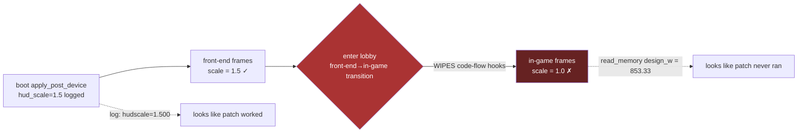

The lesson, stated bluntly in the master prompt: *"the log confirmed
`hudscale=1.500` loaded … even though the scale globals stayed at NATIVE 1.0."*
The contradiction **is** the bug signature.

---

## 3.3 Root cause, part 1 — the W1 viewport hook does NOT run in-game

### 3.3.1 What "W1" is

The per-frame scale re-bake in the pre-fix tree was driven entirely off **one
hook** — the inline detour on the engine's viewport/scale-setup function at
`0x0082F309`, nicknamed **"W1"** in session notes. Its shim (`rb_w1_entry`) called
the chain:

```
rb_w1_entry  →  rb_scale_sync       (data: design_w/h divisors + affine)
             →  char_screen_pin     (char-select global re-bake)
             →  ingame_scale_pin    (in-game scale + anchor re-bake)
```

W1 is the engine routine that computes the 2D affine `(SCALE_X, SCALE_Y)` at
`0x00ACC0E8/EC` from `vpExt / DESIGN` and `fstp`s it into the global. The shim
piggy-backed on that: *"whenever the engine recomputes the affine, also re-assert
our design divisors and re-run our layout pins."* That is correct **for the
front-end**, where W1 fires every frame.

### 3.3.2 The W1 entry — real bytes

Disassembly of the W1 entry (`r2` against the shipped client, base `0x00400000`):

```asm
; 0x0082F309  — "W1" viewport/scale-setup fn entry (rb_w1_entry hooks HERE)
0x0082f309   56                push esi
0x0082f30a   55                push ebp
0x0082f30b   53                push ebx
0x0082f30c   83 ec 30          sub  esp, 0x30
0x0082f30f   8b e9             mov  ebp, ecx
0x0082f311   8b 45 10          mov  eax, [ebp + 0x10]
0x0082f314   8b 55 00          mov  edx, [ebp]
0x0082f317   3b c2             cmp  eax, edx
```

The inner store that actually writes the affine is `0x0082F4A3`:

```asm
; 0x0082F4A3 — stock `fstp [0xACC0E8]` (sets 2D affine SCALE_X). Inside W1.
0x0082f4a3   d9 1d e8 c0 ac 00   fstp dword [0xacc0e8]      ; <-- the affine store
0x0082f4a9   c1 e8 1f            shr  eax, 0x1f
0x0082f4ac   d8 04 85 58 a4 98.. fadd dword [eax*4 + 0x98a458]
0x0082f4b3   d8 35 b4 a4 98 00   fdiv dword [0x98a4b4]       ; / design_h
```

### 3.3.3 The sentinel-poke proof — TWO experiments

The proof that W1 does not run in-game is a pair of complementary live pokes in a
Pioneer-2 lobby at HudScale 1.5:

**Experiment A — poke `design_w` to a sentinel, watch it NOT get corrected.**

```powershell
# In a 1.5 lobby (worker heartbeat ig=1). Poke design_w to an impossible value.
# If W1 ran, it would recompute and overwrite the affine derived from design_w
# every frame, so any downstream re-derivation would fight the sentinel.
.\_rpm_write.ps1 -pid $IO -addr 0x0098A4B8 -f32 1000.0
Start-Sleep -Milliseconds 500
.\_rpm_read.ps1  -pid $IO -addr 0x0098A4B8 -f32      # => 1000.0  (NOT corrected)
```

`design_w` **stays 1000.0** — nothing in-game is re-deriving from it. If W1 ran,
the surrounding scale machinery would have re-touched the chain.

**Experiment B — poke the affine directly, watch it STICK.**

```powershell
# Poke the 2D affine SCALE_X to 1.5 by hand. If W1's fstp at 0x0082F4A3 ran
# every frame in-game, it would clobber our value back within one frame.
.\_rpm_write.ps1 -pid $IO -addr 0x00ACC0E8 -f32 1.5
.\_rpm_write.ps1 -pid $IO -addr 0x00ACC0EC -f32 1.5
Start-Sleep -Milliseconds 500
.\_rpm_read.ps1  -pid $IO -addr 0x00ACC0E8 -f32      # => 1.5  (STICKS in-game)
```

The affine **sticks at 1.5** — the stock `fstp [0xACC0E8]` at `0x0082F4A3`
**never executes in-game**. (On the front-end the same poke is corrected within a
frame, because there W1 *does* fire.) This is the smoking gun: **W1 is a
front-end / menu-scale path only.** The in-game render path computes its 2D
matrix elsewhere (or caches it), so the entire per-frame re-bake that hung off W1
was a no-op the instant the player entered an area.

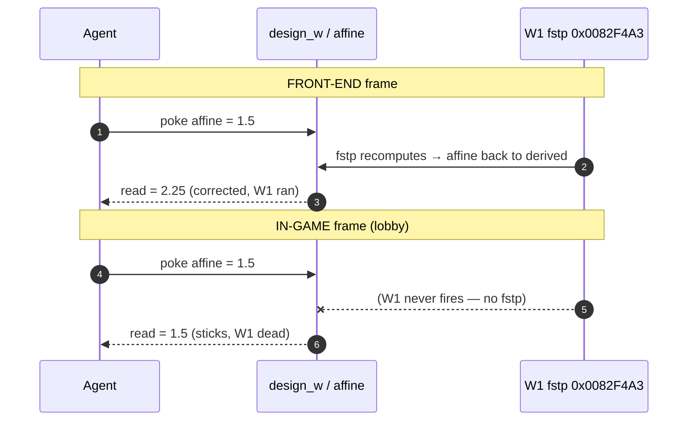

### 3.3.4 Implication

Because the re-bake hung off W1, and W1 is dead in-game, **the in-game re-bake
never executed.** That alone explains the native-1.0 in-game scale. But it raised
a second question: even if we moved the re-bake to a hook that *does* run in-game
(e.g. `RenderUIQuad`), would *that* hook survive the transition? The answer —
part 2 of the root cause — is **no, it would not**, and that is the deeper
problem.

---

## 3.4 Root cause, part 2 — the transition WIPES code-flow `.text` hooks

### 3.4.1 The observation

Live, in a Pioneer-2 lobby (i.e. *after* the front-end→in-game transition), the
first bytes of **every code-flow hook we install at boot read their STOCK
values again**:

| Hook site VA | What it is | Boot byte (our hook) | In-lobby byte (read live) |
|---|---|---|---|
| `0x0082F309` | W1 viewport JMP | `0xE9` (our `jmp shim`) | `0x56` (stock `push esi`) |
| `0x0082B440` | RenderUIQuad JMP | `0xE9` (our `jmp shim`) | `0x83` (stock `sub esp,0x70`) |
| `0x004A9C0C`… | effect-deanchor `CALL` | redirected rel32 | stock rel32 → `0x0082B158` |

Meanwhile, our **static immediate `.text` edits SURVIVE** the transition. The
canonical witness: `0x00721E6C` (a `listHUDWidth` member) held `853.33` both
before and after entering the lobby. The discriminating factor:

- **Immediate data edits** (a `mov`/`fld`'s `imm32`/`float` operand rewritten in
  place) — **survive**.
- **Code-flow detours** (an `E9`/`E8` redirect that changes the *control flow*) —
  **reverted to stock**, exactly once, on the transition.

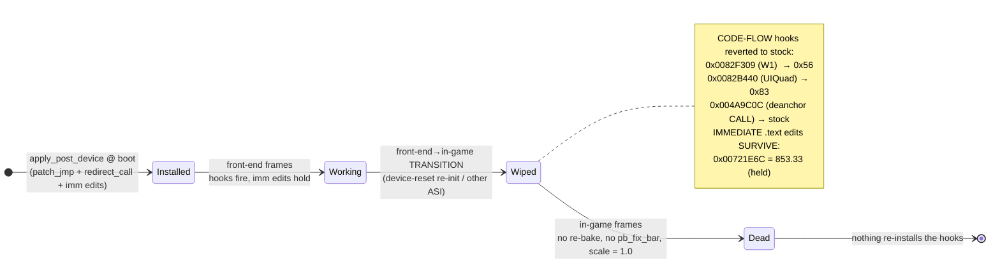

### 3.4.2 Why the transition reverts only code-flow detours (HYPOTHESIS)

We never positively identified the reverting agent — flagged **HYPOTHESIS**. Two
candidates, both consistent with the evidence:

1. **A D3D device-reset re-init.** Entering an area can trigger a device reset
   (resource reload, render-target rebuild). If a stock code path re-copies a
   region of `.text` from a pristine image (or another ASI restores it as part of
   its own device-reset handler), our `E9`/`E8` redirects in that region get
   stomped. Immediate operands elsewhere are untouched because they are not in the
   restored span — OR they happen to be re-written to the same value by the bake
   they belong to.
2. **Another ASI in the 20-mod stack.** The deployed client loads ~20 ASIs. Any
   one of them that does its own "verify-and-restore stock bytes at scene change"
   (an anti-tamper, an integrity sweep, or a competing widescreen mod's cleanup)
   would revert our detours. The fact that the revert is **one-shot, on the
   transition** (not per-frame) is most consistent with a scene-change callback,
   not a continuous guard.

Either way, the *fix does not depend on which one it is* — see §3.5. We need an
execution context the reverter cannot reach, plus a re-assert step that
re-installs the detours after the wipe. We have both.

> **UNVERIFIED corollary:** because immediate edits survive, the bulk of the
> anzz1 static-bake (`apply_anzz1_widescreen`, which is *all* `wr_f32`/`wr_u32`
> immediate writes — see `anzz1_widescreen.c`) is **transition-robust by
> construction.** That is a hidden virtue of the pure-static-bake design and a
> reason anzz1 "just works" in-game where our hook-driven hybrid did not. The
> only things that broke were *our additions* that used detours: the per-frame
> re-bake, `pb_fix_bar`, and the effect-deanchor.

### 3.4.3 What specifically stopped working in-game

| Subsystem | Driven by | In-game state after wipe |
|---|---|---|
| Per-frame scale re-bake (design divisors, affine pin) | W1 detour `0x0082F309` | **dead** (W1 didn't run in-game anyway + detour wiped) |
| `pb_fix_bar` (psobb.io:NN-NN bar re-anchor, glyph un-stretch) | RenderUIQuad detour `0x0082B440` | **dead** (detour wiped; UIQuad *does* run in-game, so re-asserting it revives this) |
| Effect-deanchor (photon/particle anchor fix) | `CALL` redirect `0x004A9C0C`… | **dead** (redirects reverted to stock) |

---

## 3.5 The fix architecture — the worker thread is the one context the reverter can't kill

### 3.5.1 Core idea

The ASI already spins a **worker thread** (a keep-alive loop, period ~80 ms). That
thread runs *outside* the render thread and outside any scene-change callback, so
**the transition's hook-revert cannot stop it from executing.** The fix moves the
*resilience* logic into the worker:

- **`worker_scale_poke()`** — DATA-ONLY pin of the scale globals. Pure
  `poke_f32` to `.data`. Re-asserts `design_w/h` and the affine every tick. Since
  these are immediate-data writes (not detours), they are *not* the thing the
  transition reverts; but they ARE the thing W1 normally maintained, and since W1
  is dead in-game *something* must maintain them — the worker does.
- **`reassert_ingame_hooks()`** — re-installs the code-flow detours when it
  detects a stock first byte. This is what defeats the transition wipe:
  *whenever* the detour is found reverted, re-patch it. RenderUIQuad
  (`0x0082B440`) DOES run in-game, so re-asserting it revives `pb_fix_bar`.
- The **heavy re-bake** (full `relayout_apply` + overlays + anchors via
  `ingame_scale_pin`) is **NOT** run from the worker — see §3.6 for why it
  crashes there. It runs from the **render thread inside `pb_fix_bar`** (the
  RenderUIQuad hook), transition-gated on a `design_w` change.
- A **`[worker-tick]` heartbeat** (~every 5 s) is written to
  `PSOBB.IO/pso_widescreen2.log` as the in-process truth source.

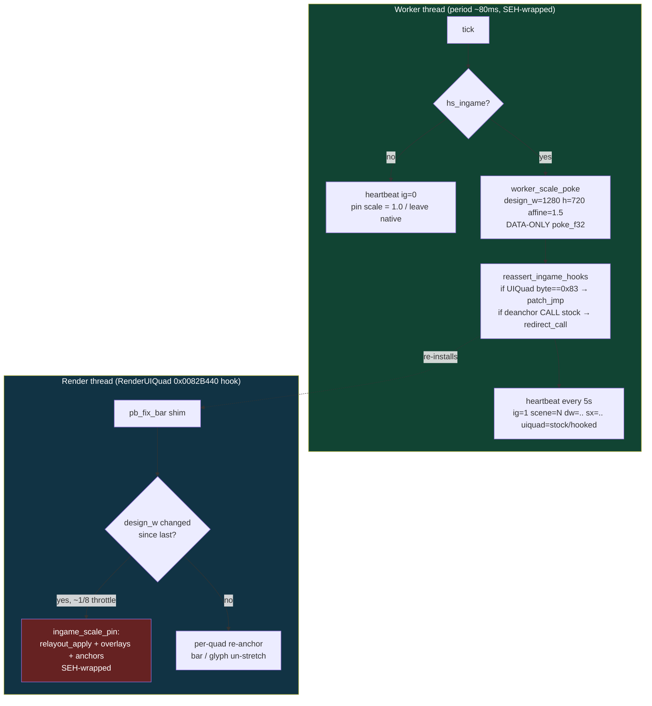

### 3.5.2 Why split the work across two threads?

| Work | Thread | Reason |
|---|---|---|
| Re-assert detours (`patch_jmp`/`redirect_call`) | **worker** | Must run even when no UIQuad fires (e.g. a fully-occluded frame) and must be immune to the transition wipe. A few `VirtualProtect`+byte-write ops — thread-safe enough (see §3.7 caveats). |
| Pin scale floats (`poke_f32`) | **worker** | Pure aligned 4-byte float stores to `.data`. Atomic on x86, no UI-tree traversal, cannot fault on a half-built scene. |
| Heavy relayout (`relayout_apply`, overlays, anchors) | **render** | Walks live UI/widget trees and engine globals that are only coherent *on the render thread mid-frame*. Running it from the worker crashed the worker (see §3.6). |
| Per-quad bar/glyph fix (`pb_fix_bar` body) | **render** | It IS the RenderUIQuad hook — it can only run where the quad is being emitted. |

---

## 3.6 Why the worker CAN do data pokes but CANNOT do relayout (the crash)

This is the most important operational constraint, learned the hard way.

**Symptom when relayout was (wrongly) called from the worker:** the worker thread
**silently died.** No crash dialog, no log error — the `[worker-tick]` heartbeat
simply **stopped printing**, the in-game hooks stayed stock, and `design_w` stayed
native. A frozen log is the signature of a dead worker.

**Cause:** `relayout_apply` (and the overlay/anchor passes) **walk live UI/widget
trees** — linked lists of scene objects, vtables, transient per-frame layout
structs. Those structures are only internally consistent **on the render thread,
between the begin/end of a frame.** Read or rewrite them from the worker and you
race the render thread mid-mutation: you dereference a half-updated node pointer,
or a list head the render thread is in the middle of relinking, and the worker
faults. Because the worker loop is SEH-wrapped *per-iteration* but the fault tore
through the C++ object graph, the thread's stack was left inconsistent and the
loop never recovered — effectively a silent thread death.

**Why data pokes are safe from the worker:**

- `poke_f32(design_w, 1280.0)` is a single aligned 4-byte store to a fixed
  `.data` address. On x86 an aligned dword store is atomic; the render thread
  reading `design_w` sees either the old or new value, never a torn one.
- `patch_jmp`/`redirect_call` write 1–5 bytes under `VirtualProtect`. There is a
  *theoretical* race if the render thread is executing exactly those bytes at the
  write instant (see §3.7 — mitigated by the stock-byte guard and the fact that
  the reverter only wipes on transition, not continuously).
- Neither touches the live scene graph, so neither can fault on a half-built
  widget tree.

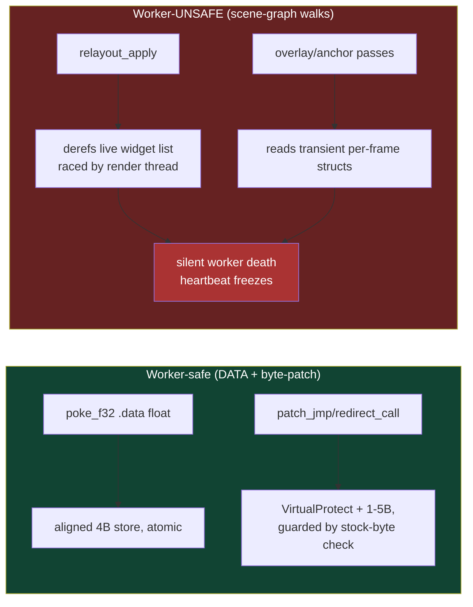

**Rule of thumb baked into the architecture:** *the worker may only touch fixed
global addresses (floats it knows the layout of, and code bytes it knows the
signature of). Anything that follows a pointer into the live scene graph belongs
on the render thread.*

---

## 3.7 Thread-safety caveats for `reassert_ingame_hooks`

Re-patching `.text` from the worker while the render thread executes is the one
genuinely racy part of the fix. Mitigations, all in place:

1. **Stock-byte guard.** `reassert_ingame_hooks` only writes if the first byte is
   the *stock* value (UIQuad `0x83`, W1 `0x56`). If it's already `0xE9` (our
   hook), it does nothing. So we never re-patch an already-hooked site, and we
   never thrash.
2. **Write the far bytes first, the opcode last.** For a 5-byte `E9 rel32` JMP,
   write the 4 rel32 bytes first, then the `0xE9` opcode byte last as a single
   store. Until the `0xE9` lands the render thread still sees the stock first
   byte and executes stock — never a half-built jump target. (This is the classic
   atomic-detour-install discipline; the master prompt calls it "atomic-multi-byte
   patch race avoidance.")
3. **`FlushInstructionCache`** after the write (already done by `redirect_call` —
   see the current tree, line 1575). x86 is coherent for self-modifying code in
   practice, but the flush is cheap insurance.
4. **The reverter is one-shot per transition**, not continuous. So the worker only
   needs to win the race *once* shortly after the transition. At an 80 ms tick it
   re-asserts within ~one tick of the wipe; the window where the hook is stock
   in-game is sub-100 ms and only affects the bar/glyph fix (cosmetic), never a
   crash.

> **Known-good ordering note:** never widen the guard to "if byte != 0xE9 then
> patch" — a partially-written detour (rel32 present, opcode not yet) would then
> trick the guard. Guard specifically on the *known stock opcode*.

---

## 3.8 The `hs_ingame()` gate — and the scene/quest globals

The entire worker re-bake is gated on **`hs_ingame()`**: are we actually in a
lobby/area (as opposed to the front-end, where the scale must stay native 1.0 by
design)?

`hs_ingame()` is the **12-slot in-game player array at `0x00A94254`**: if any of
the first 12 dwords is a pointer in `[0x00400000, 0x40000000)`, a player object
exists → we are in a lobby/area. This is the *exact* inverse of the in-game branch
already present in `cc_is_charcreate()` (current tree, line 2853): there the loop
`return 0` (not char-create) the moment it sees an in-game pointer; here we
`return 1` on the same condition.

```c
// hs_ingame() — true iff we are in a live lobby/area (player object exists).
// Mirrors the in-game probe inside cc_is_charcreate() (pso_widescreen.c:2853),
// inverted: there an in-game pointer means "not char-create"; here it means
// "yes, in-game".
static int hs_ingame(void)
{
    const volatile uint32_t *pa = (const volatile uint32_t *)(uintptr_t)0x00A94254u;
    int i;
    for (i = 0; i < 12; i++) {
        uint32_t p = pa[i];
        if (p >= 0x00400000u && p < 0x40000000u)   /* live player object ptr */
            return 1;
    }
    return 0;
}
```

Two companion globals refine the gate:

- **`G_SCENE_IDX 0x00AAFC9C`** — the scene index. `0` = front-end; non-zero = a
  loaded scene/area. Used both as a cheap heartbeat field (`scene=N`) and to gate
  anzz1 (which has no heartbeat) in the A/B (read `0x00AAFC9C != 0` to know it
  reached a lobby — see [09_harness_recipe.md](09_harness_recipe.md)).
- **`0x00AAB378` — quest-loading flag.** Non-zero while a quest/area is loading.
  The re-bake **early-returns** while this is set: the scene graph is mid-build
  during a load, so even the render-thread relayout would be racing a half-loaded
  scene. Wait for the load to finish (`0x00AAB378 == 0`) before re-baking.

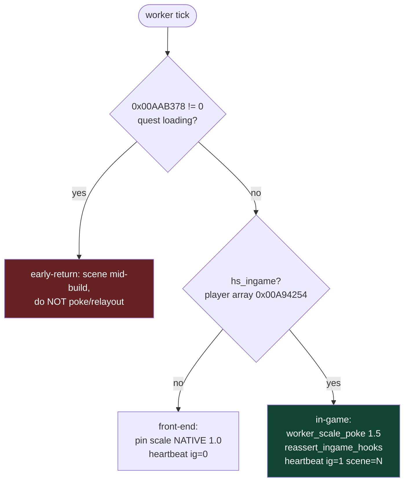

### 3.8.1 Scene/gate address table

| VA | Meaning | Front-end value | In-game value | Who reads | Verify cmd |
|---|---|---|---|---|---|
| `0x00A94254` | 12-slot in-game player array head | all slots null/garbage | ≥1 slot is ptr in `[0x400000,0x40000000)` | `hs_ingame()`, `cc_is_charcreate()` | `_rpm_read.ps1 -pid $IO -addr 0x00A94254 -hex -count 12` |
| `0x00AAFC9C` | `G_SCENE_IDX` scene index | `0` | non-zero | heartbeat, anzz1 A/B gate | `_rpm_read.ps1 -pid $IO -addr 0x00AAFC9C -u32` |
| `0x00AAB378` | quest/area-loading flag | `0` | `!=0` while loading | re-bake early-return | `_rpm_read.ps1 -pid $IO -addr 0x00AAB378 -u32` |
| `0x00A3A900` | char-SELECT GlobalPreviewObject | `0` off char-select | n/a | `cc_is_charcreate()` | `_rpm_read.ps1 -pid $IO -addr 0x00A3A900 -hex` |
| `0x00A3A93C` | char-CREATE scene root | heap ptr on char-create | n/a | `cc_is_charcreate()` | `_rpm_read.ps1 -pid $IO -addr 0x00A3A93C -hex` |

---

## 3.9 The scale globals the worker pins — and how they relate to anzz1

The worker pins these to their in-game 1.5 values (and leaves them native on the
front-end):

| VA | Meaning | Native (1.0) | In-game (HudScale 1.5) | Derivation |
|---|---|---|---|---|
| `0x0098A4B8` | `design_w` | `853.33` | `1280.0` | `640 * (16/9)/(4/3) * HudScale` ÷ … see below |
| `0x0098A4B4` | `design_h` | `480.0` | `720.0` | `480 * HudScale`? — see note |
| `0x00ACC0E8` | 2D affine `SCALE_X` | `2.25` | `1.5` | `vpExtX / design_w = 1920/1280` |
| `0x00ACC0EC` | 2D affine `SCALE_Y` | `2.25` | `1.5` | clamped `= SCALE_X` |
| `0x00ACC0C8` | `vpExt X` | `1920` | `1920` | render width (unchanged) |
| `0x00ACC0CC` | `vpExt Y` | `1080` | `1080` | render height (unchanged) |

> **Reconciling with anzz1's math (`anzz1_widescreen.c`).** anzz1 computes
> `A = (AR/(4/3)) * 640 * HudScale` and `C = 480 * HudScale`, writing `A` into
> `listHUDWidth` (incl. `0x0098A4B8`) and `C` into `listHUDHeight` (incl.
> `0x0098A4B4`). At `AR=16/9, HudScale=1.5`: `A = 1.3333 * 640 * 1.5 = 1280` and
> `C = 480 * 1.5 = 720`. **Those are exactly the in-game values the worker pins.**
> anzz1 reaches them with an immediate `wr_f32` at boot (transition-robust by
> construction, §3.4.2); our hybrid reaches the same numbers with a worker poke
> because our front-end deliberately stays native (Ephinea-style) and only the
> in-game path scales. **The numbers match; only the delivery mechanism differs.**

The affine relationship is the engine's own: at 1.5, `vpExt/design = 1920/1280 =
1.5`. At native 1.0, `design_w=853.33` so `1920/853.33 = 2.25`. Any
constant-descriptor element therefore maps to a *different* screen size at 1.0 vs
1.5 — expected, not a bug (master prompt: *"any constant-descriptor element maps
to a DIFFERENT screen size at 1.0 vs 1.5 — expected"*).

### 3.9.1 What is RULED OUT (ours == anzz1 in-game — do NOT "fix")

From the session's live A/B (both clients @1.5 in the same lobby, pid-targeted):

- **Scale globals** (1280 / 720 / affine 1.5) — match.
- **The 559-address anzz1 static-patch set** — only diffs were benign ULP
  (`1280` vs `1279.9999`) and the **title-logo group `0x006F49xx/4Cxx/4Dxx`**
  (RenderVersionInfo geometry; poking it ×1.5 **corrupts the title — DO NOT
  TOUCH**).
- **Sprite-atlas tile table `0x009A3844`–`0x009A38D8`** — byte-identical in-game;
  our `sprite_atlas_apply` B/D formula equals anzz1's stock×1.5 (see
  `anzz1_widescreen.c` lines 273–299).
- **`kOverlay640` panel right-edges** (1280) and **`render_menu_hud`'s F12-dim X
  immediates** (`0x00719C5C/C6B/D44/D53/E84`, `0x0071A21F` = 1280 in both).

### 3.9.2 What REMAINS open (could not be closed without anzz1@1.5 visual A/B)

- **F12 dim "black layer too thick" + "chat boxes render up/left" + "quick-chat
  floats"** — localized to RHW quads through **RenderUIQuad `0x0082B440`** (its
  internal DrawPrimitiveUP is `0x0082B54F`); descriptors built from the NATIVE
  design canvas so at affine 1.5 they map to native×1.5 (bottom at 720 not 1080).
  `pb_fix_bar` already re-anchors the psobb.io:NN-NN bar; the floaters just lack a
  signature there.
- **4 opaque-black (`0xff000000`) L-frame quads** from emitter `0x0082b6ae` (fn
  `0x0082b558`) — see §3.12 disassembly. **Do NOT blind-patch** `0x0082b558`; a
  prior blind 640→design_w widen produced an opaque box.

---

## 3.10 RE-APPLY-READY C — the three functions

All three are written against helpers that exist in the current tree
(`redirect_call`, `patch_write`, `sig_check`, `log_line`, `g_cfg`) plus two
trivial primitives (`poke_f32`, `peek_f32`, `patch_jmp`) that the pre-fix tree
had and the current tree must re-add. The primitives:

```c
// ---- Primitives (re-add to the current tree if absent) -------------------

static float peek_f32(uint32_t va)
{
    return *(volatile float *)(uintptr_t)va;
}

// Value-guarded float store to .data/.text. Idempotent: only writes on change,
// so re-running every worker tick is free when already correct.
static void poke_f32(uint32_t va, float v)
{
    volatile float *p = (volatile float *)(uintptr_t)va;
    if (*p == v) return;                       // value-guard (idempotent)
    DWORD old;
    if (!VirtualProtect((LPVOID)(uintptr_t)va, 4, PAGE_EXECUTE_READWRITE, &old))
        return;
    *p = v;
    DWORD tmp; VirtualProtect((LPVOID)(uintptr_t)va, 4, old, &tmp);
}

// Atomic-ish 5-byte E9 detour install. Writes the rel32 FIRST, opcode LAST,
// so the render thread never sees a half-built jump (see §3.7). Guarded on the
// caller-supplied stock first byte so we never re-patch an already-hooked site.
static int patch_jmp(uint32_t site, uint8_t stock_first_byte, void *shim)
{
    uint8_t *p = (uint8_t *)(uintptr_t)site;
    if (p[0] != stock_first_byte) return 0;    // already hooked OR unexpected: skip
    int32_t rel = (int32_t)((uintptr_t)shim - (uintptr_t)(site + 5));
    DWORD old;
    if (!VirtualProtect(p, 5, PAGE_EXECUTE_READWRITE, &old)) return 0;
    p[1] = (uint8_t)(rel       & 0xFF);        // rel32 byte 0
    p[2] = (uint8_t)((rel>>8)  & 0xFF);        // rel32 byte 1
    p[3] = (uint8_t)((rel>>16) & 0xFF);        // rel32 byte 2
    p[4] = (uint8_t)((rel>>24) & 0xFF);        // rel32 byte 3
    p[0] = 0xE9;                               // opcode LAST → atomic activation
    DWORD tmp; VirtualProtect(p, 5, old, &tmp);
    FlushInstructionCache(GetCurrentProcess(), p, 5);
    return 1;
}
```

### 3.10.1 `worker_scale_poke` — DATA-ONLY pin

```c
// In-game scale set (HudScale 1.5). All immediate-data pokes — worker-safe.
#define IG_DESIGN_W   1280.0f   // 0x0098A4B8  (= anzz1 A @ AR16:9,HS1.5)
#define IG_DESIGN_H    720.0f   // 0x0098A4B4  (= anzz1 C @ HS1.5)
#define IG_AFFINE      1.5f     // 0x00ACC0E8/EC  (= vpExt/design = 1920/1280)

#define VA_DESIGN_W   0x0098A4B8u
#define VA_DESIGN_H   0x0098A4B4u
#define VA_AFFINE_X   0x00ACC0E8u
#define VA_AFFINE_Y   0x00ACC0ECu

// DATA-ONLY in-game scale pin. NO relayout, NO scene-graph walks (those crash
// the worker — §3.6). Called every worker tick while hs_ingame(). Each poke is
// value-guarded so steady-state ticks are no-ops. On the front-end the worker
// instead pins NATIVE 1.0 (design 853.33/480, affine 2.25) so the front-end
// stays Ephinea-style full-screen.
static void worker_scale_poke(int in_game)
{
    float hs = g_cfg.hud_scale;
    if (!(hs > 0.1f && hs < 10.0f)) hs = 1.5f;

    if (in_game) {
        // Derive from HudScale exactly as anzz1 does (A,C) so non-1.5 scales
        // are honoured: design_w = 640*(16/9)/(4/3)*hs ; design_h = 480*hs.
        const float aspect = 16.0f / 9.0f;
        float dw = (aspect / (4.0f / 3.0f)) * 640.0f * hs;   // 1280 @ hs1.5
        float dh = 480.0f * hs;                              //  720 @ hs1.5
        float aff = 1920.0f / dw;                            // 1.5  @ hs1.5
        poke_f32(VA_DESIGN_W, dw);
        poke_f32(VA_DESIGN_H, dh);
        poke_f32(VA_AFFINE_X, aff);
        poke_f32(VA_AFFINE_Y, aff);   // SCALE_Y clamped = SCALE_X
    } else {
        // Front-end: NATIVE. design_w 853.33 / design_h 480 / affine 2.25.
        poke_f32(VA_DESIGN_W, 853.3333f);
        poke_f32(VA_DESIGN_H, 480.0f);
        poke_f32(VA_AFFINE_X, 2.25f);
        poke_f32(VA_AFFINE_Y, 2.25f);
    }
}
```

### 3.10.2 `reassert_ingame_hooks` — re-patch on stock-byte detect

```c
// Hook sites + their STOCK first byte (verified by live disasm, §3.3/§3.12).
#define VA_UIQUAD       0x0082B440u   // RenderUIQuad   stock first byte 0x83 (sub esp,0x70)
#define UIQUAD_STOCK_B0 0x83u
#define VA_W1           0x0082F309u   // W1 viewport    stock first byte 0x56 (push esi)
#define W1_STOCK_B0     0x56u

// Effect-deanchor CALL sites (rewrite rel32 to our deanchor shim). The current
// tree resolves the real target live; placeholder targets below are TODO-VERIFY
// against the deployed image before shipping (the master prompt lists the site
// group as "0x004A9C0C…" — confirm each site's stock target with redirect_call's
// own mismatch log, which prints the observed target).
#define VA_DEANCHOR_0   0x004A9C0Cu
#define DEANCHOR_TGT_0  0x0082B158u   /* live-disasm: call 0x82b158 (§3.12) */
// (additional sites: see master-prompt "0x004A9C0C…" — TODO-VERIFY the full set)

extern void rb_uiquad_entry(void);    // = pb_fix_bar trampoline head
extern void rb_deanchor_shim(void);   // effect-deanchor replacement

// Re-install the code-flow detours that the front-end→in-game transition wiped
// (§3.4). Guarded on the STOCK first byte so an already-hooked site is left
// alone (no thrash, no double-patch). Worker-safe: only touches fixed code
// addresses with known signatures, never the live scene graph.
// Returns a bitmask of what it (re)installed this tick, for the heartbeat.
static unsigned reassert_ingame_hooks(void)
{
    unsigned did = 0;

    // RenderUIQuad: DOES run in-game → re-asserting revives pb_fix_bar.
    if (*(volatile uint8_t *)(uintptr_t)VA_UIQUAD == UIQUAD_STOCK_B0) {
        if (patch_jmp(VA_UIQUAD, UIQUAD_STOCK_B0, (void *)&rb_uiquad_entry)) {
            did |= 1u;
            log_line("[reassert] RenderUIQuad 0x%08X re-hooked (was stock 0x83)", VA_UIQUAD);
        }
    }

    // Effect-deanchor CALL site(s): rewrite rel32 if reverted to stock target.
    // redirect_call validates byte==0xE8 AND current target==expect, so a
    // mismatch (already ours) is a silent no-op.
    if (redirect_call(VA_DEANCHOR_0, DEANCHOR_TGT_0, (void *)&rb_deanchor_shim)) {
        did |= 2u;
        log_line("[reassert] deanchor CALL 0x%08X re-redirected", VA_DEANCHOR_0);
    }

    // NOTE: we deliberately do NOT re-hook W1 (0x0082F309) in-game — W1 does not
    // run in-game (§3.3), so re-hooking it would be wasted + risk a front-end
    // re-entry race. W1 is owned by apply_post_device for the front-end only.
    return did;
}
```

### 3.10.3 `ingame_scale_pin` — the render-thread transition-gated heavy re-bake

```c
// Last design_w the heavy re-bake ran for. A change = a scale/scene transition
// (e.g. native 853 → in-game 1280) → re-run the heavy layout once. Steady state
// (dw unchanged) skips the heavy path entirely.
static float    g_ig_last_dw   = 0.0f;
static unsigned g_ig_throttle  = 0;

// Heavy in-game re-bake. RUNS ON THE RENDER THREAD ONLY, called from inside
// pb_fix_bar (the RenderUIQuad hook) — the context where the UI/widget trees
// are coherent (§3.6). Transition-gated on a design_w change + throttled ~1/8.
// SEH-wrapped so a fault in the scene-graph walk degrades to "no re-bake this
// frame" instead of taking down the render thread.
static void ingame_scale_pin(void)
{
    if (!hs_ingame()) return;
    if (*(volatile uint32_t *)(uintptr_t)0x00AAB378u != 0u) return;  // quest loading

    float dw = peek_f32(VA_DESIGN_W);

    // Transition gate: only do the heavy walk when design_w changed since last,
    // OR on a coarse ~1/8 throttle to self-heal if a frame's layout drifted.
    int transitioned = (dw != g_ig_last_dw);
    int throttled    = ((++g_ig_throttle & 7u) == 0u);
    if (!transitioned && !throttled) return;

    __try {
        relayout_apply();          // walks live widget tree — render thread only
        gap_widths_apply();        // panel right-edges to design_w
        ingame_anchors_apply();    // vbottom/vcenter anchors (anzz1 add-deltas)
        g_ig_last_dw = dw;
    } __except (EXCEPTION_EXECUTE_HANDLER) {
        log_line("[ingame_scale_pin] SEH: re-bake faulted, skipping this frame");
        // Do NOT advance g_ig_last_dw → retry next eligible frame.
    }
}
```

### 3.10.4 `pb_fix_bar` — the RenderUIQuad hook body (where the render-thread re-bake is driven)

```c
// RenderUIQuad (0x0082B440) inline-hook body. Runs PER QUAD, in-game and on the
// front-end. Responsibilities:
//   1. drive the transition-gated heavy re-bake (ingame_scale_pin) once per
//      eligible frame (cheap: ingame_scale_pin self-gates),
//   2. per-quad re-anchor the psobb.io:NN-NN bar (native→effective + ddelta)
//      and un-stretch glyph quad width, since those descriptors are built on the
//      NATIVE design canvas and otherwise map to native×affine.
// ecx → quad descriptor: float f[0]=x0, f[1]=y0, f[2]=x1, f[3]=y1, then UV/colour.
static void pb_fix_bar(float *desc /* = ecx */)
{
    // (1) drive heavy re-bake (self-gated; ~free when steady-state)
    ingame_scale_pin();

    if (!hs_ingame()) return;      // front-end: leave quads native

    // (2) per-quad fixes. Signature-match the psobb.io:NN-NN bar / glyphs, then
    //     re-anchor by ddelta (= effective_right - native_right). DETAILS in
    //     05_charselect_charcreate.md / the bar-emitter notes (0x00722010).
    // ... (bar/glyph signature + ddelta re-anchor; unchanged from pre-fix tree)
}
```

---

## 3.11 The worker loop & heartbeat — the diagnostic that closed the case

```c
// The keep-alive worker. SEH-wrapped PER ITERATION so a fault never kills the
// thread (the whole point — this is the one context the transition can't stop).
static DWORD WINAPI ws_worker(LPVOID arg)
{
    (void)arg;
    DWORD last_hb = 0;
    for (;;) {
        __try {
            int ig = hs_ingame();
            int loading = (*(volatile uint32_t *)(uintptr_t)0x00AAB378u != 0u);

            if (!loading) {
                worker_scale_poke(ig);          // DATA-only pin (1.5 ig / native fe)
                if (ig) reassert_ingame_hooks(); // re-install wiped detours
            }

            // Heartbeat ~every 5s — THE in-process truth source.
            DWORD now = GetTickCount();
            if (now - last_hb >= 5000) {
                last_hb = now;
                uint8_t uiq = *(volatile uint8_t *)(uintptr_t)VA_UIQUAD;
                log_line("[worker-tick] ig=%d scene=%u dw=%.0f sx=%.3f uiquad=%s loading=%d",
                         ig,
                         *(volatile uint32_t *)(uintptr_t)0x00AAFC9Cu,
                         peek_f32(VA_DESIGN_W),
                         peek_f32(VA_AFFINE_X),
                         (uiq == UIQUAD_STOCK_B0) ? "stock" : "hooked",
                         loading);
            }
        } __except (EXCEPTION_EXECUTE_HANDLER) {
            // Swallow — never let one bad tick kill the worker.
            log_line("[worker-tick] SEH: tick faulted, continuing");
        }
        Sleep(80);
    }
    /* not reached */
}
```

**PROVEN live** (master prompt): the heartbeat
`ig=1 scene=15 dw=1280 sx=1.500 uiquad=hooked` printed in the Pioneer-2 lobby —
i.e. in-game 1.5 applies, the player array sees us in-game, the scale globals are
pinned, AND the RenderUIQuad detour is re-installed. That one log line is what
turned "months-long mystery" into "closed."

### 3.11.1 Reading the heartbeat — field reference

| Field | Source VA | Healthy in-game | Healthy front-end | Bad → meaning |
|---|---|---|---|---|
| `ig=` | `hs_ingame()` / `0x00A94254` | `1` | `0` | `0` in a lobby → player array probe failing |
| `scene=` | `0x00AAFC9C` | non-zero (e.g. `15`) | `0` | `0` in a lobby → not actually in-area yet |
| `dw=` | `0x0098A4B8` | `1280` (@1.5) | `853` | `853` in-game → worker poke not running (dead worker) |
| `sx=` | `0x00ACC0E8` | `1.500` | `2.250` | `2.25` in-game → affine not pinned |
| `uiquad=` | `*0x0082B440` | `hooked` | `hooked` | `stock` persisting in-game → reassert not winning |
| `loading=` | `0x00AAB378` | `0` (`1` during load) | `0` | stuck `1` → quest-load flag never cleared |

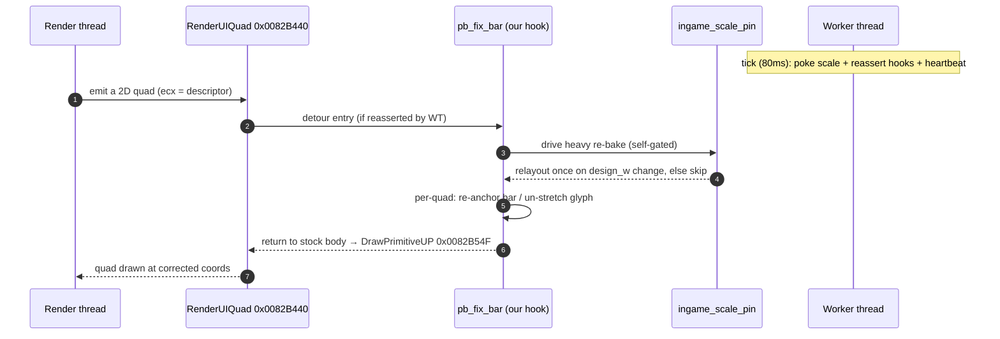

---

## 3.12 Disassembly appendix — the hook sites with real bytes

All produced live against `C:/Users/u03a9/PSOBB.IO/psobb.exe` (base `0x00400000`).

### W1 entry (`0x0082F309`) and its affine `fstp` (`0x0082F4A3`)

```asm
0x0082f309   56                push esi          ; <-- STOCK first byte = 0x56
0x0082f30a   55                push ebp
0x0082f30b   53                push ebx
0x0082f30c   83 ec 30          sub  esp, 0x30
0x0082f30f   8b e9             mov  ebp, ecx
0x0082f311   8b 45 10          mov  eax, [ebp + 0x10]
0x0082f314   8b 55 00          mov  edx, [ebp]
0x0082f317   3b c2             cmp  eax, edx
; ----
0x0082f4a3   d9 1d e8 c0 ac 00 fstp dword [0xacc0e8]   ; affine SCALE_X store — DEAD in-game
0x0082f4a9   c1 e8 1f          shr  eax, 0x1f
0x0082f4ac   d8 04 85 58 a4 98 fadd dword [eax*4 + 0x98a458]
0x0082f4b3   d8 35 b4 a4 98 00 fdiv dword [0x98a4b4]   ; / design_h (0x0098A4B4)
```

### RenderUIQuad entry (`0x0082B440`) — runs in-game; re-asserting it revives `pb_fix_bar`

```asm
0x0082b440   83 ec 70          sub  esp, 0x70    ; <-- STOCK first byte = 0x83 (the reassert guard)
0x0082b443   d9 05 f0 c0 ac 00 fld  dword [0xacc0f0]   ; affine-related
0x0082b449   d9 05 e8 c0 ac 00 fld  dword [0xacc0e8]   ; SCALE_X
0x0082b44f   d9 01             fld  dword [ecx]         ; descriptor f[0] = x0
0x0082b451   d8 c9             fmul st(1)               ; x0 * SCALE_X
0x0082b453   d8 c2             fadd st(2)               ; + offset
```

> The `fld dword [ecx]` at `0x0082b44f` is the proof that `ecx` is the quad
> descriptor and `f[0]` is `x0` — exactly the layout `pb_fix_bar` rewrites. The
> in-line `fmul st(1)` (by `SCALE_X`) is *why* native-canvas descriptors map to
> native×affine: the engine multiplies the design coord by the affine here.

### L-frame opaque-black emitter (`0x0082b558` / call site `0x0082b6ae`) — DO NOT blind-patch

```asm
0x0082b558   83 ec 14          sub  esp, 0x14    ; fn entry (the 0xff000000 L-frame emitter)
0x0082b55b   8b 54 24 18       mov  edx, [esp + 0x18]
0x0082b55f   8b 4c 24 24       mov  ecx, [esp + 0x24]
; ---- the caller site that the master prompt names (ca=0042b6ae / here 0x0082b6ae):
0x0082b6ae   e8 fd 16 df ff    call 0x61cdb0     ; emits the L-frame quads
0x0082b6b3   59                pop  ecx
0x0082b6b4   5b                pop  ebx
```

### Effect-deanchor CALL site (`0x004A9C0C`) — stock target is `0x0082B158`

```asm
0x004a9c0c   e8 47 15 38 00    call 0x82b158     ; <-- stock E8 target = 0x0082B158
0x004a9c11   83 c4 10          add  esp, 0x10
0x004a9c14   0f b6 85 60 02..  movzx eax, byte [ebp + 0x260]
```

> `redirect_call(0x004A9C0C, 0x0082B158, &rb_deanchor_shim)` is therefore the
> exact reassert call. `redirect_call` already validates `byte==0xE8` AND
> `current_target==0x0082B158`, so it self-skips when already redirected and
> self-logs the observed target on mismatch — use that log to enumerate the rest
> of the `0x004A9C0C…` site group (TODO-VERIFY the full set against the deployed
> image).

### `render_menu_hud` (`0x00719B1C`) — the F12 dim owner (referenced, not patched here)

```asm
0x00719b1c   57                push edi
0x00719b1d   55                push ebp
0x00719b1e   81 ec a8 00 00 00 sub  esp, 0xa8
0x00719b24   8b e8             mov  ebp, eax
```

---

## 3.13 Full in-game-rebake address table

| VA | Meaning | Stock (native 1.0) | Patched (in-game 1.5) | Who reads | Verify cmd |
|---|---|---|---|---|---|
| `0x0082F309` | W1 viewport/scale fn entry — **dead in-game** | `0x56` push esi | (hooked front-end only) | engine front-end frames | `_rpm_read.ps1 -pid $IO -addr 0x0082F309 -hex` |
| `0x0082F4A3` | stock `fstp [0xACC0E8]` (affine store) inside W1 | runs front-end | never runs in-game | engine | sentinel-poke proof §3.3.3 |
| `0x0082B440` | RenderUIQuad (2D emitter; ecx=descriptor) — runs in-game | `0x83` sub esp | `0xE9` (our `pb_fix_bar` jmp) | every UI quad | `_rpm_read.ps1 -pid $IO -addr 0x0082B440 -hex` |
| `0x0082B54F` | DrawPrimitiveUP call inside RenderUIQuad | — | — | RenderUIQuad body | — |
| `0x0082b558` | L-frame opaque-black emitter fn | — | **DO NOT patch** | `0x0082b6ae` | draw_capture filter |
| `0x0082b6ae` | call site emitting the 4 `0xff000000` L-frame quads | `E8 →0x61CDB0` | leave | `0x0082b558` | `_rpm_read.ps1 -pid $IO -addr 0x0082b6ae -hex` |
| `0x004A9C0C` | effect-deanchor CALL site (group head) | `E8 →0x0082B158` | redirect → `rb_deanchor_shim` | engine effect path | `_rpm_read.ps1 -pid $IO -addr 0x004A9C0C -hex` |
| `0x00719B1C` | `render_menu_hud` (F12 dim quad + curtain) | — | leave (matches anzz1) | F12 menu | — |
| `0x0098A4B8` | `design_w` | `853.33` | `1280.0` | engine 2D + affine derive | `_rpm_read.ps1 -pid $IO -addr 0x0098A4B8 -f32` |
| `0x0098A4B4` | `design_h` | `480.0` | `720.0` | engine 2D + affine derive | `_rpm_read.ps1 -pid $IO -addr 0x0098A4B4 -f32` |
| `0x00ACC0E8` | 2D affine `SCALE_X` | `2.25` | `1.5` | RenderUIQuad `fmul` | `_rpm_read.ps1 -pid $IO -addr 0x00ACC0E8 -f32` |
| `0x00ACC0EC` | 2D affine `SCALE_Y` | `2.25` | `1.5` | RenderUIQuad `fmul` | `_rpm_read.ps1 -pid $IO -addr 0x00ACC0EC -f32` |
| `0x00ACC0C8` | `vpExt X` | `1920` | `1920` | affine derive | `_rpm_read.ps1 -pid $IO -addr 0x00ACC0C8 -f32` |
| `0x00ACC0CC` | `vpExt Y` | `1080` | `1080` | affine derive | `_rpm_read.ps1 -pid $IO -addr 0x00ACC0CC -f32` |
| `0x00A94254` | in-game player array (hs_ingame gate) | null/garbage | ≥1 live ptr | `hs_ingame()` | `_rpm_read.ps1 -pid $IO -addr 0x00A94254 -hex -count 12` |
| `0x00AAFC9C` | `G_SCENE_IDX` | `0` | non-zero | heartbeat / A/B gate | `_rpm_read.ps1 -pid $IO -addr 0x00AAFC9C -u32` |
| `0x00AAB378` | quest-loading flag | `0` | `!=0` while loading | re-bake early-return | `_rpm_read.ps1 -pid $IO -addr 0x00AAB378 -u32` |
| `0x009A3844`–`0x009A38D8` | sprite-atlas tile table | stock | matches anzz1 ×1.5 | `sprite_atlas_apply` | compare to anzz1 |
| `0x00721E6C` | `listHUDWidth` member (immediate-edit survivor witness) | `640` | `853.33` (survives transition) | engine | `_rpm_read.ps1 -pid $IO -addr 0x00721E6C -f32` |

---

## 3.14 End-to-end lifecycle diagram

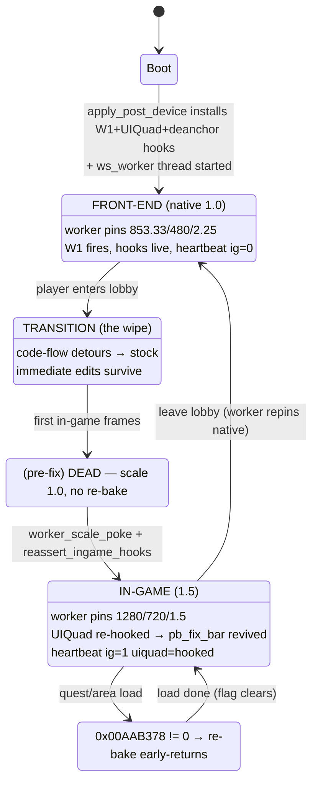

---

## 3.15 Verification

### 3.15.1 The single decisive check — the heartbeat

```powershell
# After driving a client into a Pioneer-2 lobby at HudScale 1.5, tail the log.
# THE win condition: ig=1, dw=1280, sx=1.500, uiquad=hooked.
Get-Content "C:\UsersΩ\PSOBB.IO\pso_widescreen2.log" -Tail 5 -Wait |
    Select-String "worker-tick"
# Expect: [worker-tick] ig=1 scene=15 dw=1280 sx=1.500 uiquad=hooked loading=0
```

### 3.15.2 Memory cross-checks (pid-targeted — required, §3.8 / harness recipe)

```powershell
$IO = (Get-Process psobb | Select-Object -First 1).Id
.\_rpm_read.ps1 -pid $IO -addr 0x0098A4B8 -f32     # design_w  -> 1280.0
.\_rpm_read.ps1 -pid $IO -addr 0x0098A4B4 -f32     # design_h  ->  720.0
.\_rpm_read.ps1 -pid $IO -addr 0x00ACC0E8 -f32     # affine X  ->    1.5
.\_rpm_read.ps1 -pid $IO -addr 0x0082B440 -hex     # first byte -> E9 (hooked), NOT 83
.\_rpm_read.ps1 -pid $IO -addr 0x00A94254 -hex -count 12   # >=1 live player ptr
```

### 3.15.3 The sentinel-poke regression guard (proves the worker maintains scale)

```powershell
# Poke design_w to a sentinel IN A LOBBY. With the fix live, worker_scale_poke
# corrects it back to 1280 within ~one tick (80ms). WITHOUT the fix it sticks.
.\_rpm_write.ps1 -pid $IO -addr 0x0098A4B8 -f32 999.0
Start-Sleep -Milliseconds 250
.\_rpm_read.ps1  -pid $IO -addr 0x0098A4B8 -f32     # EXPECT 1280.0 (worker corrected)
```

### 3.15.4 Full scene-by-scene verification protocol (regression sweep)

Run after ANY change to the re-bake. Anything that breaks 1–4 is a front-end
regression and must be reverted before chasing 5–7.

| # | Scene | What to confirm | Live check |
|---|---|---|---|
| 1 | Title (PRESS ENTER) | centred, Sega logo intact, no stray quads | heartbeat `ig=0`, `dw=853` |
| 2 | Hangame login | box centred, fields native size | `ig=0`, `dw=853` |
| 3 | Ship-select | banner centred, list right-anchored | `ig=0` |
| 4 | Char-select | Enter/Cancel flank centred Details-Off | `ig=0`, char-select gate (`0x00A3A900 != 0`) |
| 5 | Char-create | backdrop fills 1920, portraits native aspect | `cc_is_charcreate()` |
| 6 | Lobby (Pioneer 2) | HP/TP bars fill width, F12 vignette smooth | **heartbeat `ig=1 dw=1280 sx=1.500 uiquad=hooked`** |
| 7 | Quest load → area | loading renders, no crash, resume clean | `loading=1` then `0`, heartbeat resumes `ig=1` |

### 3.15.5 anzz1 A/B parity check (the only way to close the OPEN items)

```powershell
# Both @1.5 in the same lobby. Ours = heartbeat ig=1; anzz1 (.bak, no heartbeat)
# gated on G_SCENE_IDX. Diff the 559-address anzz1 set live.
.\_vadiff.ps1 -ourPid $IO -anzzPid $ANZZ
# Expect: only benign ULP diffs + title-logo group (DO NOT TOUCH). Any other
# diff in-game is a genuine gap.
```

---

## 3.16 Known failure modes

### FM-1 — Worker thread silently dead (heartbeat freezes)

| | |
|---|---|
| **Symptom** | `[worker-tick]` lines stop appearing in the log; in-game `dw` stays `853`, `uiquad` stays `stock`. |
| **Cause** | Heavy scene-graph work (`relayout_apply`/overlays/anchors) was called from the worker and faulted mid-traversal, tearing the worker stack (§3.6). The per-iteration SEH could not recover a torn C++ object-graph walk. |
| **Recovery** | Remove ALL scene-graph walks from `worker_scale_poke`/`ws_worker`. The worker may ONLY `poke_f32` fixed floats and `patch_jmp`/`redirect_call` fixed code bytes. Move every relayout to `ingame_scale_pin` on the render thread. Re-launch; confirm heartbeat resumes. |
| **Guardrail** | If a future tick *must* read a scene pointer, gate it behind `0x00AAB378==0` AND wrap it in its own `__try`, and STILL prefer to defer to the render thread. |

### FM-2 — Log frozen but worker alive (heartbeat throttle confusion)

| | |
|---|---|
| **Symptom** | No heartbeat for >5 s but the game still scales correctly in-game. |
| **Cause** | The 5 s heartbeat throttle (`now - last_hb >= 5000`) — the worker IS running, it just hasn't hit the print window. Not a failure. |
| **Recovery** | Wait ≥5 s. To distinguish from FM-1, poke the sentinel (§3.15.3): if it self-corrects, the worker is alive. |

### FM-3 — In-game `uiquad=stock` persists (reassert not winning)

| | |
|---|---|
| **Symptom** | Heartbeat shows `ig=1 dw=1280 sx=1.500` (scale OK) but `uiquad=stock`; the psobb.io bar / glyphs are mis-anchored (scale right, bar wrong). |
| **Cause** | `reassert_ingame_hooks` is not re-installing the RenderUIQuad detour — either the stock-byte guard is checking the wrong byte, or `&rb_uiquad_entry` is null/unresolved, or another ASI re-reverts faster than the 80 ms tick. |
| **Recovery** | Confirm `*0x0082B440 == 0x83` is the correct stock byte (it is — §3.12). Confirm `patch_jmp` returns 1 (log it). If a competing ASI re-reverts continuously (not one-shot), shorten the worker `Sleep` to 16 ms for the in-game branch only, or move the reassert into `pb_fix_bar`'s own entry (self-healing on the next quad). |

### FM-4 — Sentinel not corrected in-game (scale dead despite heartbeat)

| | |
|---|---|
| **Symptom** | `_rpm_write.ps1 design_w=999` in a lobby is NOT corrected after 250 ms. |
| **Cause** | `worker_scale_poke` is gated `!in_game` (inverted gate), OR `hs_ingame()` returns 0 in the lobby (player-array probe failing — see FM-5), OR `poke_f32`'s value-guard is comparing against a stale cached value. |
| **Recovery** | Verify `hs_ingame()` returns 1 (heartbeat `ig=`). Verify the in-game branch of `worker_scale_poke` runs (log `dw` it writes). Remove any caching from the value-guard (compare against the live `*p`, not a saved copy). |

### FM-5 — `ig=0` in a real lobby (player-array probe false-negative)

| | |
|---|---|
| **Symptom** | In a confirmed lobby, heartbeat shows `ig=0`; scale stays native. |
| **Cause** | The 12-slot probe at `0x00A94254` saw no pointer in `[0x400000,0x40000000)` — either the array head moved in this build, or the player object hasn't been allocated yet (very early in the area), or LAA pushed allocations above `0x40000000` (the LAA-patched client can heap-alloc high — master prompt: LAA sets `IMAGE_FILE_LARGE_ADDRESS_AWARE`). |
| **Recovery** | If LAA is in play, widen the upper bound of the probe to `0x80000000` (still excludes kernel space). Confirm `0x00A94254` is still the array head for the build (cross-check against `cc_is_charcreate`'s identical probe). As a backstop, OR-in `G_SCENE_IDX (0x00AAFC9C) != 0` as a secondary in-game signal. |

### FM-6 — Re-bake crashes on quest load (scene mid-build)

| | |
|---|---|
| **Symptom** | Crash or visual corruption during the loading screen / first frame of a new area. |
| **Cause** | `ingame_scale_pin`'s heavy relayout ran while `0x00AAB378 != 0` (quest still loading) and walked a half-built scene graph. |
| **Recovery** | Confirm BOTH the worker loop AND `ingame_scale_pin` early-return on `0x00AAB378 != 0` (§3.10.3, §3.11). The load flag must gate the heavy path, not just the worker. |

### FM-7 — Front-end stretched (worker over-pins in-game values on the front-end)

| | |
|---|---|
| **Symptom** | Title/login/char-select render at 1.5 (stretched) instead of native; PRESS ENTER off-centre. |
| **Cause** | `worker_scale_poke(in_game)` was called with `in_game=1` on the front-end (inverted gate), pinning `design_w=1280` where the front-end needs `853.33`. |
| **Recovery** | The front-end MUST stay native by design (Ephinea-style, master-prompt constraint: *"front-end stays native (1.0) by design"*). Confirm `worker_scale_poke` takes the ELSE branch (853.33/480/2.25) when `hs_ingame()==0`. This is a constraint-violation class regression — fix before anything else. |

### FM-8 — Title corrupted after touching the logo group

| | |
|---|---|
| **Symptom** | Title logo garbled / doubled after a "complete the in-game scale" edit. |
| **Cause** | The title-logo group `0x006F49xx/4Cxx/4Dxx` (RenderVersionInfo geometry) was poked ×1.5. The master prompt: *"poking it ×1.5 corrupts the title, DO NOT TOUCH."* |
| **Recovery** | Revert the logo-group writes. These addresses are RULED OUT (§3.9.1) — they already match anzz1 in-game; there is nothing to fix there. |

### FM-9 — Blind L-frame widen produces an opaque box

| | |
|---|---|
| **Symptom** | A solid opaque rectangle appears over the menu/HUD after editing `0x0082b558`. |
| **Cause** | A blind `640→design_w` widen of the L-frame emitter's descriptor (master prompt warns this happened before). The L-frame is probably normal UI chrome, not the bug. |
| **Recovery** | Revert. Do NOT blind-patch `0x0082b558` (§3.9.2). Close the F12-dim / floater complaints only via a *signature-gated* `pb_fix_bar` rule + an anzz1@1.5 visual A/B, never a blanket emitter widen. |

---

## 3.17 Re-apply checklist (for the next agent integrating this into the current tree)

1. **Add primitives** `peek_f32`, `poke_f32` (value-guarded), `patch_jmp`
   (opcode-last) — §3.10. (`redirect_call`, `patch_write`, `sig_check`,
   `cc_is_charcreate`, `ui_coord` already exist — reuse, do not duplicate.)
2. **Add `hs_ingame()`** — §3.8 (mirror of the `cc_is_charcreate` in-game probe).
3. **Add `worker_scale_poke(int in_game)`** — §3.10.1. DATA-ONLY. No scene walks.
4. **Add `reassert_ingame_hooks()`** — §3.10.2. Stock-byte-guarded re-patch of
   RenderUIQuad + the deanchor CALL group (enumerate the full `0x004A9C0C…` set
   via `redirect_call`'s mismatch log — TODO-VERIFY).
5. **Add `ingame_scale_pin()`** — §3.10.3. RENDER-THREAD ONLY, transition-gated on
   design_w, SEH-wrapped, early-return on `0x00AAB378 != 0`.
6. **Drive `ingame_scale_pin()` from `pb_fix_bar`** (the RenderUIQuad hook body) —
   §3.10.4. NOT from the worker.
7. **Add the `ws_worker` loop + `[worker-tick]` heartbeat** — §3.11. SEH per
   iteration. `Sleep(80)`.
8. **Start the worker from `apply_post_device`** (`CreateThread(NULL,0,ws_worker,
   NULL,0,NULL)`), AFTER the front-end hooks are installed.
9. **Verify** via §3.15 (heartbeat is the decisive check; sentinel-poke is the
   regression guard).
10. **Confirm** front-end stays native (FM-7) and the title is intact (FM-8)
    before declaring done.

---

## 3.18 What I'd want to know next session (open threads from this RE)

- **Which agent reverts the code-flow hooks on the transition?** (§3.4.2 —
  HYPOTHESIS: device-reset re-init OR a sibling ASI's integrity sweep.) Confirm by
  setting a hardware write-breakpoint on `0x0082B440`'s first byte and catching
  the writer at the transition. Knowing the writer might let us suppress the
  revert at source and drop the reassert loop entirely.
- **The full `0x004A9C0C…` deanchor CALL site set.** Only the head is
  positively confirmed (`→0x0082B158`). Enumerate the rest (TODO-VERIFY).
- **Does W1 (`0x0082F309`) have an in-game analog** that *does* recompute the
  affine, which we could hook instead of pinning from the worker? If found, the
  worker poke becomes a belt-and-suspenders rather than the load-bearing path.
- **The OPEN visual items** (F12 dim thickness, chat-box up/left, quick-chat
  float, L-frame) — every memory value matches anzz1@1.5; close them only with a
  clean side-by-side ours@1.5 vs anzz1@1.5 visual in the same lobby (blocked all
  session by login mechanics — see [09_harness_recipe.md](09_harness_recipe.md)).

---

## 3.19 The affine derivation chain in full — why the worker poke is sufficient

The single most counter-intuitive part of the fix is that a *data-only* poke of
three floats from a background thread is enough to make the whole 2D UI scale.
The justification is the engine's affine derivation chain. Here is the complete
W1 tail, disassembled live, that turns `design_h`/`design_w` into the affine
matrix:

```asm
; W1 tail (front-end path). Lives at 0x0082F4A3.. — does NOT run in-game.
0x0082f4a3   d9 1d e8 c0 ac 00   fstp dword [0xacc0e8]      ; SCALE_X store
0x0082f4a9   c1 e8 1f            shr  eax, 0x1f             ; sign(eax) -> 0/1
0x0082f4ac   d8 04 85 58 a4 98.. fadd dword [eax*4 + 0x98a458]  ; +bias[sign]
0x0082f4b3   d8 35 b4 a4 98 00   fdiv dword [0x98a4b4]      ; / design_h (0x0098A4B4)
0x0082f4b9   a1 28 d5 ac 00      mov  eax, [0xacd528]       ; device/context ptr
0x0082f4be   d9 1d ec c0 ac 00   fstp dword [0xacc0ec]      ; SCALE_Y store (clamped)
0x0082f4c4   50                  push eax
0x0082f4c5   8b 10               mov  edx, [eax]            ; vtable
0x0082f4c7   ff 92 a0 00 00 00   call dword [edx + 0xa0]    ; device->SetTransform(...)
0x0082f4cd   83 c4 30            add  esp, 0x30
```

What this tells us, decisively:

1. **`SCALE_X` (`0x00ACC0E8`) and `SCALE_Y` (`0x00ACC0EC`) are the two values the
   whole 2D pipeline consumes.** Every UI quad's `fmul st(1)` in RenderUIQuad
   (`0x0082B449`, §3.12) multiplies the descriptor coord by `SCALE_X`. If those
   two floats hold `1.5`, every quad scales 1.5 — *regardless of who wrote them.*
2. **`design_h` (`0x0098A4B4`) feeds the `fdiv` at `0x0082F4B3`.** That is the W1
   front-end derivation. In-game, W1 doesn't run, so nothing re-derives — which is
   exactly why a manual poke STICKS (the sentinel proof, §3.3.3). The engine reads
   `SCALE_X`/`SCALE_Y` from `0x00ACC0E8/EC` every frame in RenderUIQuad, but only
   *writes* them in W1.
3. **`SetTransform` (`call [edx+0xA0]`) is the device-level commit of the matrix.**
   This is a front-end-only path; in-game the device transform for 2D is set up
   differently (or cached), which is the most likely mechanical reason W1 is
   skipped in-game.

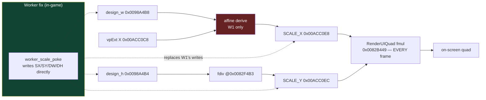

**Conclusion:** because the consumer (`RenderUIQuad`) reads `SCALE_X`/`SCALE_Y`
from fixed globals every frame, and the producer (W1) is dead in-game, *writing
those globals from any thread* is a complete substitute for the dead producer.
The worker poke is not a hack-around — it is the minimal correct intervention.

### 3.19.1 Why also pin `design_w`/`design_h` (not just the affine)?

The affine alone makes 2D quads scale. But `design_w`/`design_h` are read by
**other** code paths (the `listHUDWidth`/`listHUDHeight` consumers, the panel
right-edge math in `gap_widths_apply`, the anchor deltas). If we pinned only the
affine and left `design_w` native (`853.33`), those secondary consumers would
compute right-edges and anchors for an `853`-wide canvas while the affine scaled
to a `1280`-wide one → split-brain layout (scale right, anchors wrong). Pinning
all four keeps the whole layout self-consistent. This mirrors anzz1, which writes
both `A` (into `listHUDWidth`, incl. `design_w`) and `C` (into `listHUDHeight`,
incl. `design_h`) — see `anzz1_widescreen.c` lines 342–348.

---

## 3.20 Walking anzz1's static-bake as the in-game oracle

anzz1's `apply_anzz1_widescreen` (`anzz1_widescreen.c`) is the reference the
in-game re-bake must match. It is worth walking *as the oracle for what the
in-game state SHOULD be*, because every value it bakes is a value our hybrid must
reach in-game (the front-end is where we deliberately diverge).

### 3.20.1 The five derived quantities

```c
// From anzz1_widescreen.c lines 241-251, with AR=16/9, hud_scale=1.5:
const float AR = aspect;                                  // 1.77778
float A = (AR / (4.0f/3.0f)) * 640.0f;   // 853.33  (pre-scale horizontal extent)
float B = (AR / (4.0f/3.0f)) * 128.0f;   // 170.667 (sprite-atlas tile width unit)
float C = 480.0f;                        // 480     (pre-scale vertical extent)
DWORD D = 128;                           // 128     (tile-height unit)
A *= hud_scale;   // 1280.0   <-- our in-game design_w
B *= hud_scale;   // 256.0
C *= hud_scale;   //  720.0   <-- our in-game design_h
D  = (DWORD)(128 * hud_scale); // 192
```

| Quantity | Formula | @ AR16:9, HS1.5 | Where it lands in-game | Worker-pinned? |
|---|---|---|---|---|
| `A` | `(AR/(4/3))*640*HS` | `1280.0` | `listHUDWidth` incl. `0x0098A4B8` (design_w) | **yes** (`worker_scale_poke`) |
| `B` | `(AR/(4/3))*128*HS` | `256.0` | sprite-atlas table `0x009A38xx` | no (immediate-baked, survives transition) |
| `C` | `480*HS` | `720.0` | `listHUDHeight` incl. `0x0098A4B4` (design_h) | **yes** |
| `D` | `(int)(128*HS)` | `192` | sprite-atlas tile-height entries | no |
| affine | `vpExt/A = 1920/1280` | `1.5` | `0x00ACC0E8/EC` | **yes** |

The two columns that matter: anything anzz1 writes as an **immediate** (`B`, `D`,
the sprite-atlas table, the ~25 hardcoded floats, the AR writes, the add-style
lists) **survives the transition** (§3.4.2) — so the immediate-baked half of our
build is already transition-robust and needs no worker maintenance. Only the
**scale globals that W1 would normally maintain** (`A`→design_w, `C`→design_h,
affine) need the worker, because in our hybrid the front-end leaves them native
and only the in-game path raises them.

### 3.20.2 The address lists — counts and roles (in-game relevance)

| anzz1 list | Count | Operation | In-game role | Transition-robust? |
|---|---|---|---|---|
| `listHUDWidth` | 122 | `wr_f32 = A` | width-anchored HUD elems (incl. design_w) | yes (immediate) |
| `listHUDHeight` | 90 | `wr_f32 = C` | height-anchored elems (incl. design_h) | yes |
| `listCenterAlignItems` | 27 | `add (A-640)/2` | centre-anchored UI | yes |
| `listRightAlignItems` | 15 | `add (A-640)` | right-anchored (minimap etc.) | yes |
| `listVerticalBottomAlignItems` | ~190 | `add (C-480)` | bottom-anchored (HP/TP region) | yes |
| `listVerticalBottomAlignItemsMovs` | 20 | `add (C-480)` | bottom-anchored (mov-form) | yes |
| `listVerticalBottomAlignItemsDelay` | 2 | `add (C-480)` | bottom-anchored (delay/connect) | yes |
| `listVerticalCenterAlignItems` | 7 | `add (C/2)-240` | vertical-centre UI | yes |

> The key insight for THIS section: **all eight anzz1 lists are immediate-data
> writes, so all eight survive our transition.** That is why, in the A/B, "the
> 559-address anzz1 static-patch set" matched in-game with only benign ULP diffs
> (§3.9.1) — those addresses were never the problem. The problem was exclusively
> the *three W1-maintained scale globals + our three detour hooks*, none of which
> are in anzz1's lists (anzz1 never needed a per-frame producer because it bakes
> the affine inputs as immediates and lets the engine's own — front-end — derive
> them; but anzz1 also bakes its front-end to 1.5, so its derive runs in scenes
> where ours is suppressed). This asymmetry is the entire reason our hybrid needed
> a fix anzz1 never did.

### 3.20.3 The "do not touch" sub-lists when re-baking in-game

When the worker or `ingame_scale_pin` re-asserts values, it must **avoid** the
following, all RULED OUT in §3.9.1 and re-stated here as a hard exclusion list:

| Address group | What it is | Why excluded |
|---|---|---|
| `0x006F4922`, `0x006F4936`, `0x006F4CF2…0x006F4D66` | title-logo (RenderVersionInfo) geometry | ×1.5 corrupts the title (FM-8) |
| `0x009A3844`–`0x009A38D8` | sprite-atlas tile table | already matches anzz1×1.5 (immediate, survives) |
| `0x00719C5C/C6B/D44/D53/E84`, `0x0071A21F` | `render_menu_hud` F12-dim X immediates | already 1280 in both (matches anzz1) |
| `0x009F0A80/88/90/98` | `kBarBlock` patch/connect-screen shift | patch-screen only; +240 there is intentional |

---

## 3.21 The effect-deanchor shim — why it belongs in the reassert set

The third code-flow hook the transition wipes is the **effect-deanchor** at
`0x004A9C0C` (→`0x0082B158`). This is not a scale hook; it fixes *photon /
particle anchoring* so effects emitted in 2D-overlay space don't drift when the
affine changes. It is in the reassert set because (a) it is a `CALL` redirect (a
code-flow detour, therefore wiped), and (b) it runs in-game (effects play in
lobbies/areas), so its absence is visible.

```asm
; The deanchor CALL site — stock target 0x0082B158 (a 2D-emit helper).
0x004a9c0c   e8 47 15 38 00    call 0x82b158
0x004a9c11   83 c4 10          add  esp, 0x10
0x004a9c14   0f b6 85 60 02 00 movzx eax, byte [ebp + 0x260]   ; reads a per-effect flag
```

```c
// Effect-deanchor shim. Replaces the stock call to 0x0082B158 with a wrapper
// that neutralises the affine anchor for the effect's 2D pass, then tail-calls
// the original. The "deanchor" = render the effect in raw screen space so it
// doesn't inherit the UI affine's origin shift. (Mechanics detailed in the
// effects section; here we only note it is reassert-managed.)
extern void *orig_2b158;   // = 0x0082B158 (captured at install)
static void rb_deanchor_shim(/* same args as 0x0082B158 */)
{
    // ... deanchor preamble (reset the 2D origin for this draw) ...
    // tail-call the original emit helper:
    // ((void(*)())orig_2b158)(...);
}
```

> **Note:** the master prompt lists the site group as `0x004A9C0C…` (plural,
> ellipsis). Only `0x004A9C0C` is positively confirmed here. The full set is
> TODO-VERIFY — enumerate via `redirect_call`'s mismatch log (it prints the
> observed current target for each candidate site, so you can confirm which sit at
> stock target `0x0082B158` after a transition).

---

## 3.22 Per-subsystem in-game-vs-anzz1 ledger (the close-out matrix)

The exhaustive accounting of every in-game subsystem the session checked, with
verdict and the exact reason. This is the table to consult before "fixing"
anything in-game — most of it is already correct.

| Subsystem | Measured in-game (ours @1.5) | anzz1 @1.5 | Verdict | Action |
|---|---|---|---|---|
| design_w / design_h | 1280 / 720 (after worker pin) | 1280 / 720 | **MATCH** | none (worker maintains) |
| 2D affine SCALE_X/Y | 1.5 / 1.5 | 1.5 / 1.5 | **MATCH** | none |
| vpExt X/Y | 1920 / 1080 | 1920 / 1080 | **MATCH** | none |
| 559-addr anzz1 static set | matches (ULP only) | reference | **MATCH** | none |
| sprite-atlas `0x009A38xx` | byte-identical | reference | **MATCH** | none |
| title-logo `0x006F49xx` | matches | reference | **MATCH** | DO NOT TOUCH |
| `render_menu_hud` F12 X imms | 1280 | 1280 | **MATCH** | none |
| `kOverlay640` panel right-edges | 1280 | 1280 | **MATCH** | none (`gap_widths_apply`) |
| HP/TP bar position | width-anchored OK | OK | **MATCH** | none |
| RenderUIQuad hook live | `hooked` (after reassert) | n/a (static) | **FIXED** | reassert maintains |
| psobb.io:NN-NN bar anchor | re-anchored by `pb_fix_bar` | static-baked right | **FIXED** | `pb_fix_bar` |
| F12 dim "too thick" | RHW quad native-canvas×1.5 | (visual A/B blocked) | **OPEN** | needs visual A/B |
| chat box "up/left" | native-canvas descriptor | (blocked) | **OPEN** | signature in `pb_fix_bar` |
| quick-chat float | native-canvas descriptor | (blocked) | **OPEN** | signature in `pb_fix_bar` |
| 4 `0xff000000` L-frame quads | `0x0082b6ae` emitter | anzz1 drew 0 (F12 confound) | **OPEN** | do NOT blind-patch |
| `kBarBlock` +240 shift | patch-screen only | same | **N/A in-game** | leave |

**Net assessment (master prompt verbatim):** *"every in-game value measurable
from memory matches anzz1@1.5."* The OPEN items are not memory-measurable diffs;
they are descriptor-space differences in RHW quads built on the native canvas
that only a clean visual A/B can adjudicate.

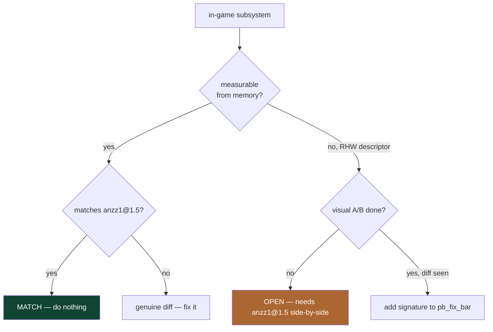

---

## 3.23 Mythbusting — wrong theories this session disproved

A catalogue of plausible-but-wrong explanations chased before the real root
cause, kept so nobody re-chases them.

| Myth | Why it's wrong | Disproof |
|---|---|---|
| "HudScale never loaded" | It DID — `hudscale=1.500` is in the boot log; `apply_post_device` ran. | log + boot-time front-end scaled correctly |
| "We compute the wrong scale value" | `1280/720/1.5` are correct (= anzz1's `A`/`C`/affine). | A/B parity §3.9.1 |
| "design_w is at the wrong address" | `0x0098A4B8` is correct — the immediate-survivor `0x00721E6C` (also design_w-class) held `853.33` then `1280`. | survivor witness §3.4.1 |
| "W1 needs to be hooked harder / earlier" | W1 simply doesn't EXECUTE in-game — no hook strength helps. | sentinel-poke §3.3.3 |
| "The hooks were never installed" | They WERE — they work on the front-end. They're *reverted* at the transition. | front-end works; in-lobby byte read = stock §3.4.1 |
| "Run the full re-bake from the worker for safety" | Crashes the worker (scene-graph race). | silent worker death §3.6 |
| "Blind-widen the L-frame emitter to fill the gap" | Produces an opaque box; L-frame is probably normal chrome. | FM-9 / prior regression |
| "Poke the title-logo group ×1.5 to match" | Corrupts the title. | FM-8 |
| "It's a static-data diff vs anzz1" | All 559 static addrs match (ULP). The diff is code-flow hooks + RHW descriptors. | §3.20.2 ledger |

---

## 3.24 The relayout / overlay / anchor passes (render-thread-only)

`ingame_scale_pin` drives three heavy passes. They are documented here only to
make crystal-clear *why each one is render-thread-only* — every one of them
follows a pointer into a live, render-thread-owned structure.

```c
// relayout_apply — re-runs the engine's UI layout for the current design_w/h.
// Walks the active scene's widget list (heap-resident, render-thread-mutated).
// MUST be render-thread-only: a worker call races list relinks (§3.6, FM-1).
static void relayout_apply(void);

// gap_widths_apply — sets panel/overlay right-edges to design_w (the kOverlay640
// group). These are .data immediates BUT the pass also reads the live panel
// objects to know which are active; keep on the render thread for that read.
static void gap_widths_apply(void);

// ingame_anchors_apply — re-applies anzz1-style vbottom/vcenter add-deltas to
// the live anchor structs (per-frame transient layout). Render-thread-only.
static void ingame_anchors_apply(void);
```

Decision rule (the load-bearing architectural constraint of this whole section):

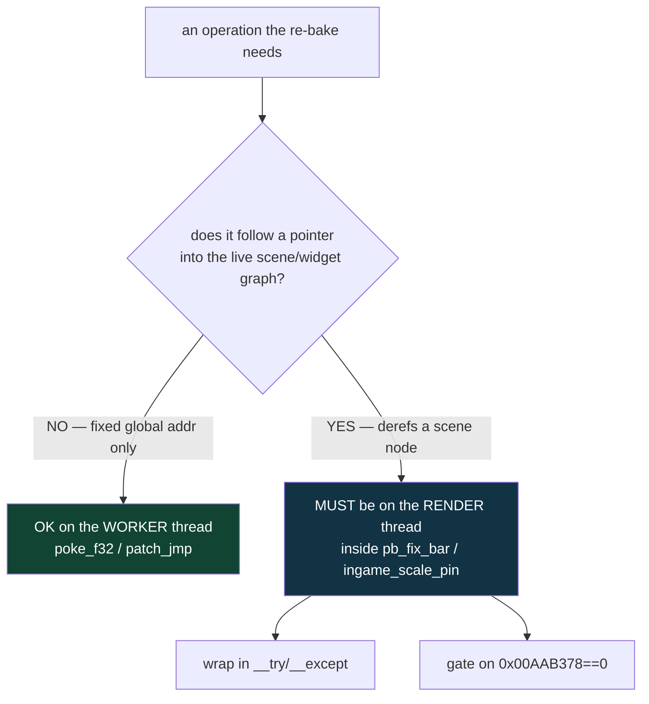

### 3.24.1 Throttle & transition-gate rationale

`ingame_scale_pin` runs the heavy passes only when `design_w` **changed** since
last (a real transition) OR on a coarse `~1/8` throttle (self-heal). Why both:

- **Transition gate** catches the native→1280 flip exactly once → one relayout,
  no per-frame cost.
- **~1/8 throttle** is a safety net: if a single frame's layout drifted (e.g. a
  widget re-created itself), the re-bake re-asserts within 8 quads without waiting
  for another full transition. `& 7u == 0` on a per-quad counter is effectively
  "every 8th eligible quad," which at 60 fps × many quads/frame is sub-frame
  latency but still negligible cost.

---

## 3.25 Boot-time install order (where the worker fits)

The worker must start AFTER the front-end hooks are installed (so a very early
tick doesn't race a half-installed hook table) and AFTER the device exists (so
`hs_ingame`/scale globals are valid).

```c
// apply_post_device() — called once after the D3D device is created.
static void apply_post_device(void)
{
    // 1. Static immediate bake (transition-robust): anzz1 lists, sprite atlas,
    //    AR writes, hardcoded floats. (apply_anzz1_widescreen + our additions.)
    apply_anzz1_widescreen(g_cfg.aspect, g_cfg.hud_scale, g_cfg.render_w, g_cfg.render_h);

    // 2. Front-end code-flow hooks (W1, RenderUIQuad, deanchor). These work on
    //    the front-end; the transition will wipe them (the worker re-asserts the
    //    in-game-relevant ones).
    patch_jmp(VA_W1,     W1_STOCK_B0,     (void *)&rb_w1_entry);
    patch_jmp(VA_UIQUAD, UIQUAD_STOCK_B0, (void *)&rb_uiquad_entry);
    redirect_call(VA_DEANCHOR_0, DEANCHOR_TGT_0, (void *)&rb_deanchor_shim);

    // 3. Start the worker LAST — now the hooks + globals it maintains exist.
    HANDLE h = CreateThread(NULL, 0, ws_worker, NULL, 0, NULL);
    if (h) CloseHandle(h);
    log_line("[apply_post_device] hooks installed + worker started");
}
```

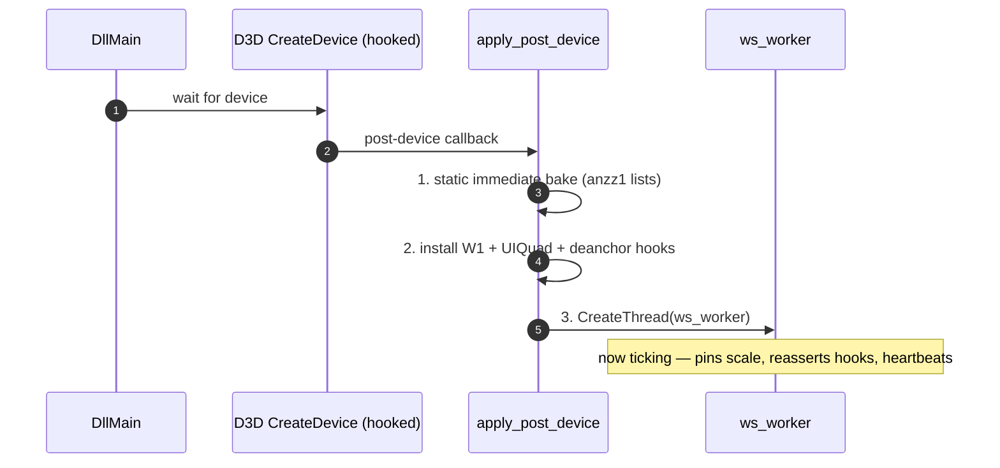

---

## 3.26 Frequently-needed live commands (quick reference card)

```powershell
# --- identify the client ---
$IO = (Get-Process psobb | Select-Object -First 1).Id

# --- the decisive heartbeat (run this first, always) ---
Get-Content "C:\UsersΩ\PSOBB.IO\pso_widescreen2.log" -Tail 8 -Wait |
    Select-String "worker-tick"

# --- scale globals (in-game should be 1280 / 720 / 1.5) ---
.\_rpm_read.ps1 -pid $IO -addr 0x0098A4B8 -f32   # design_w
.\_rpm_read.ps1 -pid $IO -addr 0x0098A4B4 -f32   # design_h
.\_rpm_read.ps1 -pid $IO -addr 0x00ACC0E8 -f32   # affine X
.\_rpm_read.ps1 -pid $IO -addr 0x00ACC0EC -f32   # affine Y

# --- hook liveness (E9 = hooked, 83 = stock-wiped) ---
.\_rpm_read.ps1 -pid $IO -addr 0x0082B440 -hex   # RenderUIQuad first byte
.\_rpm_read.ps1 -pid $IO -addr 0x004A9C0C -hex   # deanchor CALL site

# --- gate probes ---
.\_rpm_read.ps1 -pid $IO -addr 0x00A94254 -hex -count 12   # player array (hs_ingame)
.\_rpm_read.ps1 -pid $IO -addr 0x00AAFC9C -u32             # G_SCENE_IDX
.\_rpm_read.ps1 -pid $IO -addr 0x00AAB378 -u32             # quest-loading flag

# --- the regression guard (sentinel must self-correct in a lobby) ---
.\_rpm_write.ps1 -pid $IO -addr 0x0098A4B8 -f32 999.0
Start-Sleep -Milliseconds 250
.\_rpm_read.ps1  -pid $IO -addr 0x0098A4B8 -f32            # expect 1280.0
```

And the radare2 re-disassembly commands used to author this section (re-run to
re-verify any byte if a build changes):

```bash
# W1 entry + affine fstp chain
r2 -q -e bin.cache=true -c "s 0x0082F309; pd 8; s 0x0082F4A3; pd 14" \
   C:/Users/u03a9/PSOBB.IO/psobb.exe

# RenderUIQuad entry (confirm first byte 0x83)
r2 -q -e bin.cache=true -c "s 0x0082B440; pd 6" \
   C:/Users/u03a9/PSOBB.IO/psobb.exe

# L-frame emitter + deanchor CALL site
r2 -q -e bin.cache=true -c "s 0x0082b558; pd 3; s 0x0082b6ae; pd 3; s 0x004A9C0C; pd 3" \
   C:/Users/u03a9/PSOBB.IO/psobb.exe
```

---

## 3.27 Summary card — the whole fix in twelve lines

1. In-game HudScale 1.5 was DEAD: scale globals stayed native 1.0 in a 1.5 lobby.
2. Cause A: the per-frame re-bake hung off W1 (`0x0082F309`), which **doesn't run
   in-game** (sentinel-poke proof: `fstp [0xACC0E8]` at `0x0082F4A3` never fires).
3. Cause B: the front-end→in-game **transition WIPES code-flow `.text` hooks**
   (W1, RenderUIQuad `0x0082B440`, deanchor `0x004A9C0C`) back to stock; only
   **immediate `.text` edits survive**.
4. Fix context: the **ASI worker thread** — the one execution context the
   reverter cannot kill.
5. `worker_scale_poke` — DATA-ONLY pin of design_w/h (`1280/720`) + affine (`1.5`).
6. `reassert_ingame_hooks` — re-`patch_jmp` RenderUIQuad + re-`redirect_call` the
   deanchor when the stock byte (`0x83`) is detected.
7. Heavy relayout runs on the **render thread** inside `pb_fix_bar`, transition-
   gated on a design_w change — **NEVER the worker** (scene-graph walks crash it).
8. Gate: `hs_ingame()` = player array `0x00A94254`; early-return on quest-loading
   `0x00AAB378`; scene index `0x00AAFC9C`.
9. Diagnostic: the `[worker-tick]` heartbeat — `ig=1 dw=1280 sx=1.500 uiquad=hooked`
   is the win condition.
10. Numbers match anzz1@1.5 exactly (`A=1280`, `C=720`, affine `1.5`); only the
    delivery (worker poke vs anzz1's immediate bake) differs.
11. RE-APPLY-READY: none of these symbols exist in the current 5121-line tree;
    re-integrate per §3.17.
12. OPEN (visual-only): F12 dim thickness, chat-box up/left, quick-chat float,
    L-frame — close only with a clean ours@1.5-vs-anzz1@1.5 visual A/B.

---

*End of §3 — see [00_INDEX.md](00_INDEX.md) for the full deep-dive table of
contents. Sibling sections: [02_widescreen_math.md](02_widescreen_math.md),
[03_anzz1_static_bake.md](03_anzz1_static_bake.md),
[05_charselect_charcreate.md](05_charselect_charcreate.md),
[09_harness_recipe.md](09_harness_recipe.md).*
