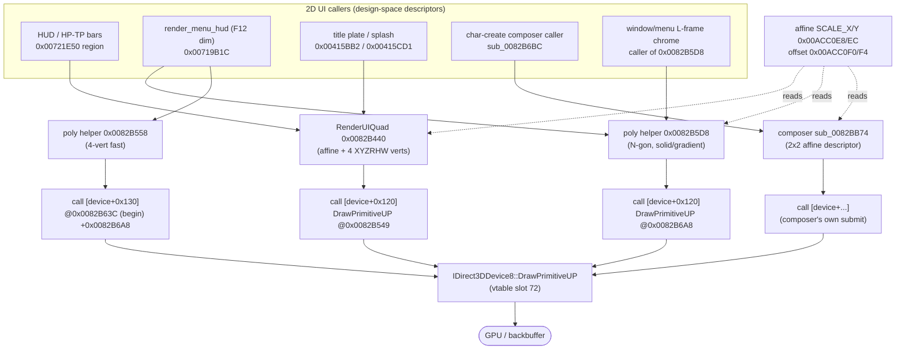
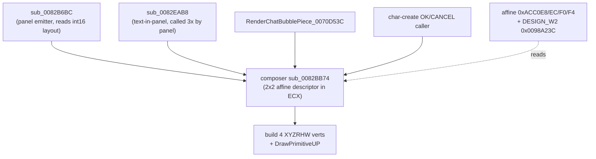
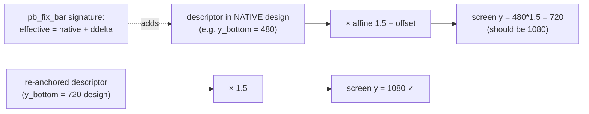
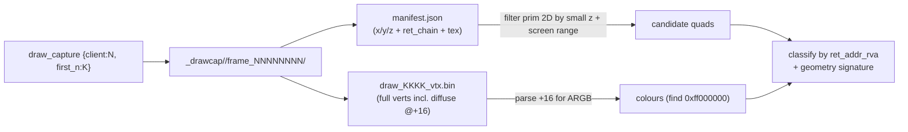

# §3 — 2D Render Pipeline: `RenderUIQuad`, `DrawPrimitiveUP`, poly helper, dim, bar, composer

*Part of the PSOBB QoL Deep Dive — see [00_INDEX.md](00_INDEX.md).*

---

> **Scope.** This section is the function-by-function reverse-engineering of the PSOBB
> Blue Burst (client `MTethVer12513` / 1.25.13, `psobb.io` lineage, image base
> `0x00400000`) **2D UI draw stack** — the chain that turns a *design-space* rectangle
> descriptor in `ECX` into screen-space `XYZRHW` vertices and hands them to D3D8's
> `DrawPrimitiveUP`. Everything here is the substrate the widescreen / HudScale patches
> bend: the affine `(SCALE_X, SCALE_Y)` at `0x00ACC0E8/EC`, the offset pair at
> `0x00ACC0F0/F4`, the design-canvas divisors at `0x0098A4B4/B8`, and the per-element
> coordinate immediates that anzz1 rewrites at boot.
>
> Sibling sections you will want open:
> - [03_widescreen_math.md](03_widescreen_math.md) — the design-canvas / affine / HudScale algebra these functions consume.
> - [04_anzz1_static_bake.md](04_anzz1_static_bake.md) — the 559-address `.data`/`.text` rewrite that pre-positions every descriptor immediate.
> - [06_charcreate_pipeline.md](06_charcreate_pipeline.md) — the composer `sub_0082BB74` as it is used by char-create, and the heap-resident layout tables.
> - [07_ingame_hudscale.md](07_ingame_hudscale.md) — the 2026-06-07/09 in-game-1.5 root cause, why the `.text` detours on `0x0082B440` get reverted on the front-end→in-game transition, and the worker-thread re-assert.
> - [08_harness_drawcapture.md](08_harness_drawcapture.md) — the `draw_capture` workflow that produced every quad table below.

---

## 3.0 Orientation — the whole stack on one screen

PSOBB's 2D UI is **not** drawn through a scene graph. Every HUD element, menu panel,
text glyph, bar, portrait, and the title plate is ultimately a **2-triangle (6-index)
triangle list or a fan** emitted directly to the device via `DrawPrimitiveUP`. There is
**one** universal 2D-quad transform function — `RenderUIQuad` at `0x0082B440` — and a
**generic N-gon helper** at `0x0082B5D8` (with a 4-vertex fast variant at `0x0082B558`)
used by the solid-colour / gradient drawers. Both consume a **design-space** descriptor
and apply the same affine.

| Layer | VA | Role | Coordinate space in | Coordinate space out |
|---|---|---|---|---|
| Caller (HUD/menu/title/bar) | many | Builds a descriptor (rect + UV + colour) in *design* coords | — | design |
| **`RenderUIQuad`** | `0x0082B440` | Apply affine `SCALE·x + OFFSET`, build 4 `XYZRHW` verts, call device | **design** | screen (RHW) |
| **poly helper (N-gon)** | `0x0082B5D8` | Same affine, variable vertex count, solid/gradient colour | **design** | screen (RHW) |
| **poly helper (4-vert fast)** | `0x0082B558` | Tail-called fast path of the helper for quads | **design** | screen (RHW) |
| Internal device call | `0x0082B54F` (in `RenderUIQuad`) · `0x0082B6A8` (in helper) | `vtbl[0x120] = DrawPrimitiveUP` | screen (RHW) | GPU |
| Device vtable slot | `[device+0x120]` → `DrawPrimitiveUP` | D3D8 submission | screen (RHW) | framebuffer |



**The single most important fact in this section:** every one of these functions reads
the *same* affine pair `0x00ACC0E8` (`SCALE_X`) / `0x00ACC0EC` (`SCALE_Y`) and the *same*
offset pair `0x00ACC0F0` (`OFFSET_X`) / `0x00ACC0F4` (`OFFSET_Y`). The screen position of
a quad is therefore:

```
screen_x = design_x * SCALE_X + OFFSET_X
screen_y = design_y * SCALE_Y + OFFSET_Y
```

At HudScale 1.0 widescreen the engine derives `SCALE_Y = vpExtY / DESIGN_H = 1080/480 =
2.25` and the scaleX-clamp hook forces `SCALE_X = SCALE_Y`. In-game at HudScale 1.5,
`DESIGN_H = 480/1.5 = 320`-equivalent path lands the affine at `1920/1280 = 1.5`. See
[03_widescreen_math.md](03_widescreen_math.md) for the full derivation. **A quad lands in
the wrong place only if its *design descriptor* is wrong**, not because the affine is
wrong — the affine is shared and correct. This is why anzz1's whole strategy is
"rewrite the descriptor immediates and let the affine do the rest" — see
[04_anzz1_static_bake.md](04_anzz1_static_bake.md).

### 3.0.1 The shared globals (memorise these)

| VA | Name (this doc) | Meaning | Stock | WS 1.0 | In-game 1.5 | Who reads |
|---|---|---|---|---|---|---|
| `0x00ACC0E8` | `SCALE_X` | 2D affine X scale | `1.0` (4:3) | `2.25` | `1.5` | `RenderUIQuad`, poly helper, composer |
| `0x00ACC0EC` | `SCALE_Y` | 2D affine Y scale | `1.0` | `2.25` | `1.5` | same |
| `0x00ACC0F0` | `OFFSET_X` | 2D affine X translate | `0.0` | `0.0`* | `0.0`* | same |
| `0x00ACC0F4` | `OFFSET_Y` | 2D affine Y translate | `0.0` | `0.0`* | `0.0`* | same |
| `0x0098A4B8` | `DESIGN_W` | design-canvas width divisor | `640` | `853.33` | `1280` | viewport-setup `W1` (`0x0082F309`) |
| `0x0098A4B4` | `DESIGN_H` | design-canvas height divisor | `480` | `480` | `720` | `W1` |
| `0x00ACC0C8` | `vpExtX` | viewport extent X | — | `1920` | `1920` | `W1` |
| `0x00ACC0CC` | `vpExtY` | viewport extent Y | — | `1080` | `1080` | `W1` |
| `0x0098A23C` | `DESIGN_W2` | composer's right-edge ref (`853.33`/`1280`) | `640` | `853.33` | `1280` | composer `sub_0082BB74` |
| `0x0098A254` | `clampHiX` | poly-helper X clamp upper | `1.0` | `1.0` | `1.0` | poly helper `0x0082B5D8` |
| `0x0098A258` | `clampLoX` | poly-helper X clamp lower | `-1.0` | `-1.0` | `-1.0` | poly helper |
| `0x0098A264` | `clampHiY` | poly-helper Y clamp upper | `1.0` | `1.0` | `1.0` | poly helper (4-vert) |
| `0x0098A268` | `clampLoY` | poly-helper Y clamp lower | `-1.0` | `-1.0` | `-1.0` | poly helper (4-vert) |
| `0x0098A274` | `zNear?` | RenderUIQuad Z bias source | `1.0` | `1.0` | `1.0` | `RenderUIQuad` |
| `0x00ACBA2C` | `g_uiColorDefault` | default diffuse (ARGB) | runtime | runtime | runtime | `RenderUIQuad`, composer |
| `0x00ACD528` | `g_pDevice` | `IDirect3DDevice8*` slot ptr-ptr | runtime | runtime | runtime | all submitters |
| `0x00ACD52C` | `g_vtxScratch` | scratch vertex buffer base | runtime | runtime | runtime | poly helper |

\* `OFFSET_X/Y` are `0.0` in the pure-scale widescreen path; some HudScale / minimap
bake paths poke them transiently. Confirm live with `_rpm_read.ps1` — never assume.

> **Static-read caveat.** `r2 pf f @ 0xacc0e8` on the on-disk image returns `0` for the
> affine and offset globals — they are **runtime-initialised** by the viewport-setup
> function `W1` (`0x0082F309`, `fstp [0xACC0E8]` at `0x0082F4A3`). To see live values you
> MUST read from a running client (`read_memory {pid:N, addr:0x00ACC0E8, size:4}`). The
> divisors `0x0098A4B4/B8` *do* hold their patched immediates on disk after the boot
> bake because they are written by `apply_anzz1_widescreen`. See
> [07_ingame_hudscale.md](07_ingame_hudscale.md) for why `W1` does **not** re-run in-game.

---

## 3.1 `RenderUIQuad` — `0x0082B440`

The universal 2D textured-quad emitter. Every HUD sprite, every menu icon, every title
texture tile, the psobb.io:NN-NN bar fill, and the char-select footer buttons go through
here (directly or via the helper). **This is the one render-side function the in-game
HudScale fix re-asserts a `.text` JMP on** (`pb_fix_bar`), because it is the one 2D path
proven to still execute in-game after the transition reverts the boot hooks.

### 3.1.1 Signature & convention

```c
// __thiscall-ish: descriptor pointer in ECX, no stack args.
// Stack discipline: `sub esp,0x70` at entry, `add esp,0x70; ret 4` at exit.
// The `ret 4` means ONE 4-byte stack arg is consumed by the callee even though
// the body never reads [esp+0x74+] except as the Z/RHW source (0x0082B481
// `fsub dword [esp+0x74]`). Callers push that Z just before the call.
//
// Descriptor layout (floats unless noted), base = ECX:
//   ecx[0x00] = x0   (design)         ecx[0x10] = diffuse ARGB (u32) for vtx0
//   ecx[0x04] = y0   (design)         ecx[0x14] = diffuse ARGB (u32) for vtx1
//   ecx[0x08] = x1   (design, width)  ecx[0x18] = diffuse ARGB (u32) for vtx2
//   ecx[0x0C] = y1   (design, height) ecx[0x1C] = diffuse ARGB (u32) for vtx3
//   ecx[0x10..0x1C] dual-purpose: also the per-vertex diffuse colours
//   (UVs are constant 0/1 here — this is the *solid/textured-rect* variant;
//    the UV-bearing variant is the composer sub_0082BB74, §3.6)
void __fastcall RenderUIQuad(/*ecx*/ float *desc /*, pushed Z*/);
```

> **NOTE / HYPOTHESIS.** The exact split of `ecx[0x10..0x1C]` between "second-corner
> coords" and "per-vertex ARGB" is read two ways in the body: as `mov edx,[ecx+0x10]`
> (copied verbatim into the vertex's diffuse slot at `[esp+0x14]`) **and** the rect comes
> from `ecx[0]/[4]/[8]/[0xC]`. So `[0x00..0x0C]` = rect `(x0,y0,x1,y1)`, `[0x10..0x1C]` =
> four ARGB diffuse values. UVs are emitted as the constant `1.0f` (`0x3f800000`) seen
> stored at `[esp+0x0C]`, `[esp+0x28]`, `[esp+0x44]`, `[esp+0x60]`. Mark the precise UV
> source **TODO-VERIFY** with a `draw_capture` of a known-UV element.

### 3.1.2 What it reads / writes

| Reads | For |
|---|---|
| `ECX[0x00..0x0C]` | rect `(x0,y0,x1,y1)` design coords |
| `ECX[0x10..0x1C]` | 4 × diffuse ARGB |
| `0x00ACC0F0` (`OFFSET_X`) | affine translate X (`fld` first) |
| `0x00ACC0E8` (`SCALE_X`) | affine scale X |
| `0x00ACC0F4` (`OFFSET_Y`) | affine translate Y |
| `0x00ACC0EC` (`SCALE_Y`) | affine scale Y |
| `0x00ACBA2C` (`g_uiColorDefault`) | fallback colour `eax` copied into RHW `w`? (see disasm) |
| `0x0098A274` | Z/RHW bias (`fld [0x98a274]`, `fsub [esp+0x74]`) |
| `0x00ACD528` (`g_pDevice`) | device for the submit |

| Writes | Where |
|---|---|
| 4 × `XYZRHW` vertices (stride 0x1C = 28 bytes) | `[esp+0x00 .. esp+0x6C]` (scratch) |
| `[esp+0x0C]=1.0`, `[esp+0x28]=1.0`, `[esp+0x44]=1.0`, `[esp+0x60]=1.0` | RHW = 1.0 per vertex |
| submit | `call [ecx_dev+0x120]` (DrawPrimitiveUP) at `0x0082B549` |

### 3.1.3 Disassembly (verbatim, `r2`)

```asm
; ---- RenderUIQuad 0x0082B440 (psobb.io image, base 0x400000) ----
0x0082b440  83 ec 70              sub   esp, 0x70
0x0082b443  d9 05 f0 c0 ac 00     fld   dword [0xacc0f0]   ; OFFSET_X
0x0082b449  d9 05 e8 c0 ac 00     fld   dword [0xacc0e8]   ; SCALE_X
0x0082b44f  d9 01                 fld   dword [ecx]        ; x0 (design)
0x0082b451  d8 c9                 fmul  st(1)              ; x0 * SCALE_X
0x0082b453  d8 c2                 fadd  st(2)              ; + OFFSET_X  -> screen x0
0x0082b455  d9 05 f4 c0 ac 00     fld   dword [0xacc0f4]   ; OFFSET_Y
0x0082b45b  d9 05 ec c0 ac 00     fld   dword [0xacc0ec]   ; SCALE_Y
0x0082b461  a1 2c ba ac 00        mov   eax, [0xacba2c]    ; g_uiColorDefault
0x0082b466  d9 41 04              fld   dword [ecx+4]      ; y0
0x0082b469  d8 c9                 fmul  st(1)              ; y0 * SCALE_Y
0x0082b46b  d8 c2                 fadd  st(2)              ; + OFFSET_Y  -> screen y0
0x0082b46d  d9 41 08              fld   dword [ecx+8]      ; x1
0x0082b470  de cd                 fmulp st(5)             ; x1 * SCALE_X
0x0082b472  d9 cc                 fxch  st(4)
0x0082b474  de c5                 faddp st(5)             ; + OFFSET_X  -> screen x1
0x0082b476  d9 41 0c              fld   dword [ecx+0xc]    ; y1
0x0082b479  de c9                 fmulp st(1)             ; y1 * SCALE_Y
0x0082b47b  d9 05 74 a2 98 00     fld   dword [0x98a274]   ; Z/RHW bias source
0x0082b481  d8 64 24 74          fsub  dword [esp+0x74]   ; bias - pushedZ
;  ... emits 4 verts (XYZRHW), RHW=1.0 each, diffuse from ecx[0x10..0x1C] ...
0x0082b49a  c7 44 24 0c 00 00 80 3f   mov dword [esp+0xc], 0x3f800000  ; vtx0.rhw = 1.0
0x0082b4a2  89 44 24 10          mov   [esp+0x10], eax      ; vtx0.diffuse default
0x0082b4a6  8b 51 10             mov   edx, [ecx+0x10]      ; per-vtx diffuse override
0x0082b4a9  89 54 24 14          mov   [esp+0x14], edx
;  ... (vtx1/2/3 built the same way, ecx+0x14/0x18/0x1c) ...
0x0082b51c  8b 15 28 d5 ac 00    mov   edx, [0xacd528]      ; g_pDevice (ptr-ptr)
0x0082b53c  8d 04 24             lea   eax, [esp]           ; &verts
0x0082b53f  6a 1c                push  0x1c                 ; stride = 28 (XYZRHW)
0x0082b541  8b 0a                mov   ecx, [edx]           ; device*
0x0082b543  50                   push  eax                  ; vertex ptr
0x0082b544  6a 02                push  2                    ; primCount = 2 tris
0x0082b546  6a 06                push  6                    ; primType = 6 (TRIANGLEFAN? see note)
0x0082b548  52                   push  edx                  ; this (device slot)
0x0082b549  ff 91 20 01 00 00    call  dword [ecx+0x120]    ; DrawPrimitiveUP  <-- 0x0082B54F is the RET-addr label
0x0082b54f  83 c4 70             add   esp, 0x70
0x0082b552  c2 04 00             ret   4
```

> **`0x0082B54F` clarification.** The master-prompt note "internal DrawPrimitiveUP call
> `0x0082B54F`" points at the **instruction immediately after** the `call [ecx+0x120]`;
> the call itself is at `0x0082B549`. `0x0082B54F` is the **return address** the
> `draw_capture` `ret_chain` reports for a `RenderUIQuad`-submitted quad — that is the
> address you filter on. The push of `0x06` is the D3D8 `D3DPRIMITIVETYPE` (`6` =
> `D3DPT_TRIANGLEFAN`); `2` is the primitive count; `0x1C`=28 is the `XYZRHW` stride.
> The `XYZRHW` FVF means the verts are **pre-transformed screen-space** — the affine in
> this function *is* the entire 2D transform; there is no view/projection matrix
> downstream.

### 3.1.4 Pseudocode

```c
void __fastcall RenderUIQuad(float *d /*ecx*/, float pushedZ) {
    float sx = SCALE_X, ox = OFFSET_X, sy = SCALE_Y, oy = OFFSET_Y;
    uint32_t defcol = g_uiColorDefault; // 0xACBA2C

    Vtx v[4]; // XYZRHW: {x,y,z,rhw,diffuse}
    float sx0 = d[0]*sx + ox, sy0 = d[1]*sy + oy;   // top-left
    float sx1 = d[2]*sx + ox, sy1 = d[3]*sy + oy;   // bottom-right
    float z   = *(float*)0x98A274 - pushedZ;        // depth bias

    // 4 corners (fan order), rhw = 1.0, diffuse = d[0x10..0x1C] (per-vertex ARGB)
    v[0] = (Vtx){ sx0, sy0, z, 1.0f, ((uint32_t*)d)[4] };  // d+0x10
    v[1] = (Vtx){ sx1, sy0, z, 1.0f, ((uint32_t*)d)[5] };  // d+0x14
    v[2] = (Vtx){ sx1, sy1, z, 1.0f, ((uint32_t*)d)[6] };  // d+0x18
    v[3] = (Vtx){ sx0, sy1, z, 1.0f, ((uint32_t*)d)[7] };  // d+0x1c

    IDirect3DDevice8 *dev = *(void**)0xACD528;
    dev->lpVtbl->DrawPrimitiveUP(dev, D3DPT_TRIANGLEFAN, 2, v, 28 /*sizeof Vtx*/);
}
```

### 3.1.5 The `pb_fix_bar` hook on this function

The widescreen ASI installs an inline JMP at `0x0082B440` (`patch_jmp`) whose stub
calls into C (`pb_fix_bar` / the legacy `splash_quad_rewrite_c`, §3.5.5 below). The stub
is `__declspec(naked)`, does `pushad/pushfd`, passes `ecx` (the descriptor) and the
caller-VA (read from `[esp+0x28]` after pushad), runs the C classifier, then
`jmp [g_tramp_82b440]` back into the relocated stock prologue.

```asm
; stub_82b440_phase3 (from pso_widescreen.c) — schematic
pushad
pushfd
push  ecx                       ; arg2 = descriptor ptr
push  dword ptr [esp + 0x28]    ; arg1 = caller_va (return addr above pushad/pushfd frame)
call  splash_quad_rewrite_c     ; (or pb_fix_bar)
popfd
popad
jmp   [g_tramp_82b440]           ; relocated `sub esp,0x70` + continue
```

> **Why this hook and not `W1`.** Proven live 2026-06-07: the viewport-setup hook `W1`
> (`0x0082F309`) **does not run in-game** — pokes to `DESIGN_W` are not corrected in a
> lobby, and a manual affine poke *sticks* (the stock `fstp [0xACC0E8]` at `0x0082F4A3`
> never executes). `RenderUIQuad` **does** run in-game. Therefore the render-side
> re-anchor must live in *this* hook, and it must be **re-asserted** by the worker thread
> whenever the front-end→in-game transition reverts the JMP to its stock first byte
> (`0x83` = `sub esp,..`). Full mechanism in [07_ingame_hudscale.md](07_ingame_hudscale.md).

### 3.1.6 Verification

```powershell
# 1) Confirm the stock prologue / our hook on disk vs live.
#    Stock first byte = 0x83 (sub esp,0x70). If our JMP is installed it's 0xE9.
.\_rpm_read.ps1 -pid <PID> -addr 0x0082B440 -size 1     # 0x83 = stock, 0xE9 = hooked

# 2) Confirm the affine the function will consume (must be 1.5 in a lobby @1.5).
.\_rpm_read.ps1 -pid <PID> -addr 0x00ACC0E8 -size 4 -type f32   # expect 1.5 in-game
.\_rpm_read.ps1 -pid <PID> -addr 0x00ACC0EC -size 4 -type f32   # expect 1.5 in-game

# 3) draw_capture, then grep the manifest for ret_addr_rva = 0x0082B54F
#    (the RET label after the internal DrawPrimitiveUP call).
```

```bash
# r2: re-disassemble to confirm the call target is the device vtbl[0x120].
r2 -q -e bin.cache=true -c "s 0x0082b549; pd 1" /c/Users/u03a9/PSOBB.IO/psobb.exe
# expect: call dword [ecx + 0x120]
```

### 3.1.7 Known failure modes

| Symptom | Cause | Recovery |
|---|---|---|
| HUD sprites vanish in-game after entering a lobby | front-end→in-game transition reverted our JMP (`0x0082B440[0]` back to `0x83`); `pb_fix_bar` stops running | worker `reassert_ingame_hooks()` re-`patch_jmp` when first byte == `0x83` (see [07](07_ingame_hudscale.md)) |
| Crash / NULL-refcount on a non-target quad | `pb_fix_bar` classifier ran a rewrite on a quad whose descriptor wasn't readable, or rewrote a shared-emitter quad | strict caller-VA gate + `__try/__except` around the descriptor read; never rewrite without a signature match |
| Bar maps to native×1.5 (bottom at 720 not 1080) | descriptor built from native design canvas; affine 1.5 maps native→native×1.5 | re-anchor in the hook: `effective = native + ddelta` (the bar fix, §3.5) |
| `ret_chain` depth-1, no caller VA | RHW emitter's caller frame already torn down; can't filter by caller | filter by quad geometry signature (x0/x1/y0/y1 + small z) instead |

---

## 3.2 The internal `DrawPrimitiveUP` call — `0x0082B549` (label `0x0082B54F`) & the device vtable

`RenderUIQuad` and the poly helper both submit through the device's vtable. PSOBB targets
**D3D8**; the function is `IDirect3DDevice8::DrawPrimitiveUP`. In the *engine's* indirect
call it is reached as **`[device + 0x120]`** (`call dword [ecx+0x120]` at `0x0082B549`).
The widescreen ASI's own D3D8 wrapper hooks the **vtable slot 72** of the device
interface (NOT slot 53 — that is `EndStateBlock`).

| Fact | Value | Source |
|---|---|---|
| Engine indirect-call offset | `[device+0x120]` → DrawPrimitiveUP | `0x0082B549` disasm |
| Engine indirect-call offset (poly helper begin) | `[device+0x130]` | `0x0082B63C` disasm |
| D3D8 vtable index (ASI wrapper hook) | **72** | `pso_widescreen.c:1306,1319` |
| `0x120 / 4` | 72 | confirms the two agree (`0x120`=288, `288/4`=72) |
| Stride passed | `0x1C` = 28 (`XYZRHW`) | `push 0x1c` @ `0x0082B53F` |
| PrimType | `6` = `D3DPT_TRIANGLEFAN` | `push 6` @ `0x0082B546` |
| PrimCount | `2` | `push 2` @ `0x0082B544` |

```c
// IDirect3DDevice8::DrawPrimitiveUP — slot 72 (vtbl[72]).
typedef HRESULT (STDMETHODCALLTYPE *DrawPrimitiveUP_t)(
    IDirect3DDevice8 *self,
    D3DPRIMITIVETYPE  PrimitiveType,    // 6 = TRIANGLEFAN for UI quads
    UINT              PrimitiveCount,   // 2 for a quad
    const void       *pVertexStreamZeroData,
    UINT              VertexStreamZeroStride); // 28 = XYZRHW {x,y,z,rhw,diffuse}
```

> **Why the wrapper hooks slot 72 and not the engine's `+0x120`.** The engine indexes the
> *concrete* device object's vtable; our ASI's wrapper sits in front of the real device
> and intercepts the call at the COM-interface level. Slot 72 is the standard
> `IDirect3DDevice8` ordinal for `DrawPrimitiveUP`. The ASI uses this seam for an
> optional **HUD-compress** scale on RHW 2D draws (`g_cfg.hud_compress`) — a *separate*
> lever from the affine. **Keep these unconflated** (constraint: no HudScale math in the
> "no post-scaling" affine path).

### 3.2.1 Verification

```bash
# Confirm 0x120/4 == 72, and that the engine's indirect call is the UP submit.
r2 -q -e bin.cache=true -c "s 0x0082b549; pd 1" /c/Users/u03a9/PSOBB.IO/psobb.exe
```

```powershell
# Live: log a DrawPrimitiveUP frame via the ASI hook (Hook_DrawPrimitiveUP) and
# confirm stride=28, primType=6 for a UI quad (gameplay HUD visible).
```

### 3.2.2 Known failure modes

| Symptom | Cause | Recovery |
|---|---|---|
| Hooking slot 53 does nothing / crashes | slot 53 is `EndStateBlock`, not `DrawPrimitiveUP` | hook slot **72** |
| HUD-compress also squashes 3D | applied the compress to the wrong FVF / all UP draws | gate compress to RHW (`XYZRHW`) FVF only |

---

## 3.3 The generic poly / N-gon helper — `0x0082B5D8` (4-vert fast path `0x0082B558`, tail `0x0082B6AE`)

This is the **solid-colour / gradient** draw helper, used by `render_menu_hud` (the F12
dim curtain) and the menu/chat **L-frame chrome**. Unlike `RenderUIQuad` (one fixed quad,
textured), the helper takes a **vertex count** and a colour array, builds N `XYZRHW`
verts, and submits a list/fan. It applies the **same affine** at `0x0082B652`.

`0x0082B558` is the **`vertexCount <= 4` fast path**; `0x0082B5D8` is the **general
N-vertex path** (`cmp edi,2 / jle`). The two share globals and both fall through to the
device submit. `0x0082B6AE` is the **return-address label** the `draw_capture` `ret_chain`
reports for the opaque-black L-frame quads, i.e. it is the `call 0x61cdb0`
(cleanup/return-thunk) immediately after the `DrawPrimitiveUP` at `0x0082B6A8` — *that* is
why captures attribute the black quads to `ca=0042b6ae` / `ca=0082b6ae` depending on the
frame's call depth.

### 3.3.1 Signature & convention

```c
// __cdecl, stack args. Two entries share one body region:
//   0x0082B558 : 4-vertex fast path.  sub esp,0x14 ; ret (cdecl, caller cleans)
//   0x0082B5D8 : N-vertex general.    push edi/esi/ebp/ebx ; ... ; ret
//
// 0x0082B5D8 args (observed from callers render_menu_hud @0x00719C98 and the
// bar drawer @0x00721EB9):
//   [esp+0x18]  ptr to {coord array} (esi := [arg]; reads [esi], [esi+4], +8 each vtx)
//   [esp+0x1C]  vertexCount (edi)              ; `cmp edi,2 / jle skip`
//   [esp+0x20]  divisor      (the `[0x98a258]/arg` term — a normalise/clamp)
//   [esp+0x24]  flags (ecx, `and ecx,0x40`)   ; 0x40 = some render-state bit
//   pushed just before call: { 0x62 ('b'), colorPtr/imm, primCount(4), vtxPtr }
void __cdecl poly_helper_N(void *coords, int vtxCount, float divisor, uint32_t flags);
```

### 3.3.2 What it reads / writes

| Reads | For |
|---|---|
| `0x0098A258` (`clampLoX`) `/ [esp+0x20]` | X normalise/clamp numerator over caller divisor |
| `0x0098A254` (`clampHiX`) | X clamp upper (compared via `fcom`, `fnstsw`, `sahf`, `jae`) |
| `0x0098A268` (`clampLoY`) | (4-vert path) Y normalise |
| `0x0098A264` (`clampHiY`) | (4-vert path) Y clamp upper |
| `0x00ACC0E8` (`SCALE_X`) | **affine X** — `fmul [0xacc0e8]` at `0x0082B652` |
| `0x00ACC0EC` (`SCALE_Y`) | **affine Y** — `fmul [0xacc0ec]` at `0x0082B663` |
| `0x00ACC0F0/F4` | affine offsets — `fadd` at `0x0082B658 / 0x0082B669` |
| `0x00ACD528` (`g_pDevice`), `0x00ACD52C` (`g_vtxScratch`) | submit target + scratch verts |
| per-vertex `[esi+0]/[esi+4]` (coords, +8 each), `[ebp]` (colour, +4 each) | the polygon |

| Writes | Where |
|---|---|
| N × `XYZRHW` verts (stride 0x14 = 20 bytes here — note **20**, not 28) | `[g_vtxScratch + i*0x14]` |
| `vtx.x = coord.x * SCALE_X + OFFSET_X` | `0x0082B650..0x0082B65E` |
| `vtx.y = coord.y * SCALE_Y + OFFSET_Y` | `0x0082B660..0x0082B676` |
| `vtx.rhw = 1.0` (`mov eax,0x3f800000` → `[edx+0xc]`) | `0x0082B64B / 0x0082B67C` |
| `vtx.diffuse = [ebp]` (per-vertex ARGB) | `0x0082B67F..0x0082B682` |
| submit `DrawPrimitiveUP`, primType=6, count=`vtxCount-2` (`ebx-2`) | `0x0082B6A8` |

> **Stride note.** The poly helper writes a **20-byte** vertex (`add edx,0x14`), while
> `RenderUIQuad` writes **28** (`push 0x1c`). Both are `XYZRHW`; the difference is whether
> a texture-coord pair is carried. The helper's verts are `{x,y,z,rhw,diffuse}` = 20 bytes
> (no UV — these are untextured solid/gradient polys). `RenderUIQuad`'s 28 carries the
> UV. When parsing a `.bin` from `draw_capture`, **the diffuse ARGB is at byte +16 for
> the 20-byte stride** and also +16 for the 28-byte stride (RHW is +12, UV would be +20).

### 3.3.3 Disassembly — the affine loop (verbatim)

```asm
; ---- poly helper N-vertex, the per-vertex transform loop (0x0082B5D8 body) ----
0x0082b5d8  57                   push  edi
0x0082b5d9  56                   push  esi
0x0082b5da  55                   push  ebp
0x0082b5db  53                   push  ebx
0x0082b5dc  56                   push  esi
0x0082b5dd  8b 7c 24 1c          mov   edi, [esp+0x1c]      ; vertexCount
0x0082b5e1  83 ff 02             cmp   edi, 2
0x0082b5e4  0f 8e c9 00 00 00    jle   0x82b6b3             ; <2 verts -> bail
0x0082b5ea  d9 05 58 a2 98 00    fld   dword [0x98a258]     ; clampLoX (-1.0)
0x0082b5f0  d8 74 24 20          fdiv  dword [esp+0x20]     ; / caller divisor
0x0082b5f4  d9 05 54 a2 98 00    fld   dword [0x98a254]     ; clampHiX (+1.0)
0x0082b5fa  d8 d1                fcom  st(1)
0x0082b5fc  df e0                fnstsw ax
0x0082b5fe  8b df                mov   ebx, edi
0x0082b600  9e                   sahf
0x0082b601  73 02                jae   0x82b605
0x0082b603  dd d1                fst   st(1)
0x0082b605  de e1                fsubrp st(1)               ; clamp delta
0x0082b607  d9 1c 24             fstp  dword [esp]
0x0082b60a  e8 9d 25 00 00       call  0x82dbac             ; begin (state setup)
0x0082b60f  8b 4c 24 24          mov   ecx, [esp+0x24]      ; flags
0x0082b613  83 e1 40             and   ecx, 0x40
0x0082b616  e8 71 ac 00 00       call  0x83628c
0x0082b61b  e8 80 a6 00 00       call  0x835ca0
0x0082b620  e8 d7 f8 00 00       call  0x83aefc
0x0082b625  8b 74 24 18          mov   esi, [esp+0x18]      ; coords ptr
0x0082b629  8b 6c 24 18          mov   ebp, [esp+0x18]
0x0082b62d  a1 28 d5 ac 00       mov   eax, [0xacd528]      ; g_pDevice
0x0082b632  6a 44                push  0x44
0x0082b634  8b 36                mov   esi, [esi]
0x0082b636  50                   push  eax
0x0082b637  8b 6d 04             mov   ebp, [ebp+4]
0x0082b63a  8b 10                mov   edx, [eax]
0x0082b63c  ff 92 30 01 00 00    call  dword [edx+0x130]    ; (begin draw / lock)
0x0082b642  8b 15 2c d5 ac 00    mov   edx, [0xacd52c]      ; g_vtxScratch
0x0082b648  d9 04 24             fld   dword [esp]
0x0082b64b  b8 00 00 80 3f       mov   eax, 0x3f800000      ; rhw = 1.0
;   ===== per-vertex affine loop (edi = count down) =====
0x0082b650  d9 06                fld   dword [esi]          ; coord.x
0x0082b652  d8 0d e8 c0 ac 00    fmul  dword [0xacc0e8]     ; * SCALE_X
0x0082b658  d8 05 f0 c0 ac 00    fadd  dword [0xacc0f0]     ; + OFFSET_X
0x0082b65e  d9 1a                fstp  dword [edx]          ; vtx.x
0x0082b660  d9 46 04             fld   dword [esi+4]        ; coord.y
0x0082b663  d8 0d ec c0 ac 00    fmul  dword [0xacc0ec]     ; * SCALE_Y
0x0082b669  d8 05 f4 c0 ac 00    fadd  dword [0xacc0f4]     ; + OFFSET_Y
0x0082b66f  d9 c9                fxch  st(1)
0x0082b671  d9 52 08             fst   dword [edx+8]        ; vtx.z
0x0082b674  d9 c9                fxch  st(1)
0x0082b676  d9 5a 04             fstp  dword [edx+4]        ; vtx.y
0x0082b679  83 c6 08             add   esi, 8               ; next coord (+8)
0x0082b67c  89 42 0c             mov   [edx+0xc], eax       ; vtx.rhw = 1.0
0x0082b67f  8b 4d 00             mov   ecx, [ebp]           ; colour
0x0082b682  89 4a 10             mov   [edx+0x10], ecx      ; vtx.diffuse (+0x10 = +16)
0x0082b685  83 c5 04             add   ebp, 4               ; next colour (+4)
0x0082b688  83 c2 14             add   edx, 0x14            ; next vtx (stride 20)
0x0082b68b  83 c7 ff             add   edi, 0xffffffff      ; count--
0x0082b68e  75 c0                jne   0x82b650
0x0082b690  dd d8                fstp  st(0)
0x0082b692  a1 28 d5 ac 00       mov   eax, [0xacd528]      ; g_pDevice
0x0082b697  6a 14                push  0x14                 ; stride = 20
0x0082b699  8b 10                mov   edx, [eax]
0x0082b69b  83 c3 fe             add   ebx, 0xfffffffe      ; primCount = vtxCount-2
0x0082b69e  ff 35 2c d5 ac 00    push  dword [0xacd52c]     ; vtx ptr
0x0082b6a4  53                   push  ebx                  ; primCount
0x0082b6a5  6a 06                push  6                    ; primType = TRIANGLEFAN
0x0082b6a7  50                   push  eax
0x0082b6a8  ff 92 20 01 00 00    call  dword [edx+0x120]    ; DrawPrimitiveUP
0x0082b6ae  e8 fd 16 df ff       call  0x61cdb0             ; <-- the ret label captures attribute to ca=0082b6ae
0x0082b6b3  59                   pop   ecx
0x0082b6b4  5b                   pop   ebx
0x0082b6b5  5d                   pop   ebp
0x0082b6b6  5e                   pop   esi
0x0082b6b7  5f                   pop   edi
0x0082b6b8  c3                   ret
```

### 3.3.4 Pseudocode

```c
void __cdecl poly_helper_N(const float (*coords)[2] /*[esp+0x18]*/,
                           int   vtxCount            /*[esp+0x1c]*/,
                           float divisor             /*[esp+0x20]*/,
                           uint32_t flags            /*[esp+0x24]*/) {
    if (vtxCount <= 2) return;                       // 0x0082B5E4
    float clampDelta = clampHiX - (clampLoX / divisor);  // normalise/clamp seed
    begin_state(flags & 0x40);                       // 0x82dbac / 0x83628c / ...

    IDirect3DDevice8 *dev = *(void**)0xACD528;
    Vtx20 *out = (Vtx20*)*(void**)0xACD52C;          // g_vtxScratch
    for (int i = 0; i < vtxCount; i++) {
        out[i].x = coords[i][0] * SCALE_X + OFFSET_X;  // 0x0082B650
        out[i].y = coords[i][1] * SCALE_Y + OFFSET_Y;  // 0x0082B660
        out[i].z = clampDelta;                         // [edx+8]
        out[i].rhw = 1.0f;                             // 0x0082B67C
        out[i].diffuse = colourArray[i];               // 0x0082B682 (+0x10)
    }
    dev->lpVtbl->DrawPrimitiveUP(dev, D3DPT_TRIANGLEFAN,
                                 vtxCount - 2, out, 20 /*stride*/);
    // 0x61cdb0 cleanup (the ca=0082b6ae label)
}
```

### 3.3.5 The four opaque-black `0xFF000000` L-frame quads

When the menu/chat chrome draws, captures show **4 solid-black quads** (`diffuse =
0xff000000`, `tex = null`) attributed to `ca=0082b6ae` (this helper). At HudScale 1.5
in-game they form an **L-frame**: a left column `x0..120` full height plus a bottom band
`x120..1920, y720..1080`. At HudScale 1.0 widescreen the same emitter draws a **left
column `0..180`** and the user reports 1.0 as *fine*. Because the geometry differs between
1.0 and 1.5, and **anzz1@1.5 drew zero large black quads** in two captures (a possible
F12-state confound), the working hypothesis is:

> **HYPOTHESIS (UNVERIFIED at session boundary):** the L-frame is normal chat/menu
> background chrome — *not* the in-game-1.5 bug — and the bug the user sees ("black layer
> too thick", "chat boxes up/left", "quick-chat floats") is a **floater-anchoring**
> problem in `RenderUIQuad`, not a poly-helper problem. **A prior blind `640→DESIGN_W`
> widen of `0x0082B558`'s descriptor produced an opaque box** — so do NOT blind-patch the
> poly helper. Only act here after a clean anzz1@1.5-vs-ours@1.5 visual A/B isolates the
> frame as the culprit. See [07_ingame_hudscale.md](07_ingame_hudscale.md) §"STILL OPEN".

Geometry observed in `draw_capture`:

| Frame state | Quad | x0 | y0 | x1 | y1 | tex | diffuse | ret |
|---|---|---|---|---|---|---|---|---|
| ours @1.5 in-game | left column | 0 | 0 | 120 | 1080 | null | `0xff000000` | `0082b6ae` |
| ours @1.5 in-game | bottom band | 120 | 720 | 1920 | 1080 | null | `0xff000000` | `0082b6ae` |
| ours @1.0 WS | left column | 0 | 0 | 180 | 1080 | null | `0xff000000` | `0082b6ae` |
| anzz1 @1.5 in-game | (none observed) | — | — | — | — | — | — | — |

### 3.3.6 Verification

```bash
# Confirm the affine multiply site inside the helper.
r2 -q -e bin.cache=true -c "s 0x0082b652; pd 2" /c/Users/u03a9/PSOBB.IO/psobb.exe
# expect: fmul dword [0xacc0e8] ; fadd dword [0xacc0f0]

# Confirm the ±1 clamp bounds the helper reads (static = 1.0 / -1.0).
r2 -q -e bin.cache=true -c "pf f @ 0x98a254 ; pf f @ 0x98a258 ; pf f @ 0x98a264 ; pf f @ 0x98a268" /c/Users/u03a9/PSOBB.IO/psobb.exe
# expect: 1 ; -1 ; 1 ; -1
```

```powershell
# Live: draw_capture in a lobby, filter manifest for ret_addr_rva 0x0082B6AE and
# diffuse 0xFF000000 to enumerate the L-frame quads.
```

### 3.3.7 Known failure modes

| Symptom | Cause | Recovery |
|---|---|---|
| Opaque box over the menu | blind `640→DESIGN_W` descriptor widen on `0x0082B558` | revert; the helper's descriptor is *content*, not a fill stripe — don't widen it |
| Black L-frame "too thick" @1.5 | possibly normal chrome; possibly the floaters bleeding | isolate via anzz1@1.5 A/B before patching (do not blind-patch) |
| Gradient curtain banding | the helper's per-vertex ARGB interpolated across too-wide a quad after a stretch | leave colour array; only re-anchor position |

---

## 3.4 `render_menu_hud` — `0x00719B1C` (the F12 dim curtain)

The F12 "menu dim" is two draws: an **opaque-black backplate** and a **gradient curtain**
on top, both emitted through the poly helper (`call 0x82b5d8` at `0x00719C98`). It gates
on the **old discriminator** `0x00A9C4F4` (a sub-call `0x00718E88` returns nonzero → early
return without drawing).

### 3.4.1 Signature & gate

```c
// __thiscall-ish: object in EAX (`mov ebp, eax`).
// Early-out gate: if 0x00718E88( *0x00A9C4F4 ) != 0  -> return (no dim).
// Second gate: if obj[+8] (a fade alpha) <= [0x96FFB4] -> return.
void render_menu_hud(/*eax*/ MenuHud *self);
```

```asm
0x00719b1c  57                   push  edi
0x00719b1d  55                   push  ebp
0x00719b1e  81 ec a8 00 00 00    sub   esp, 0xa8
0x00719b24  8b e8                mov   ebp, eax
0x00719b26  ff 35 f4 c4 a9 00    push  dword [0xa9c4f4]    ; old discriminator
0x00719b2c  e8 57 f3 ff ff       call  0x718e88            ; gate fn
0x00719b31  59                   pop   ecx
0x00719b32  85 c0                test  eax, eax
0x00719b34  74 09                je    0x719b3f             ; ==0 -> proceed
0x00719b36  81 c4 a8 00 00 00    add   esp, 0xa8            ; !=0 -> bail (no dim)
0x00719b3c  5d                   pop   ebp
0x00719b3d  5f                   pop   edi
0x00719b3e  c3                   ret
0x00719b3f  8b c5                mov   eax, ebp
0x00719b41  e8 1a fe ff ff       call  0x719960            ; -> layout obj (edi)
0x00719b46  8b f8                mov   edi, eax
0x00719b48  d9 47 08             fld   dword [edi+8]        ; fade alpha
0x00719b4b  d8 15 b4 ff 96 00    fcom  dword [0x96ffb4]     ; vs threshold
0x00719b54  77 0b                ja    0x719b61             ; > -> draw
;   ... else bail ...
```

### 3.4.2 The opaque backplate (4 black verts)

```asm
0x00719bba  b9 00 00 00 ff       mov   ecx, 0xff000000      ; opaque black
0x00719bbf  8d 54 24 34          lea   edx, [esp+0x34]
0x00719bc3  89 54 24 08          mov   [esp+8], edx         ; colour array ptr
0x00719bc7  89 4c 24 34          mov   [esp+0x34], ecx      ; vtx0.diffuse = 0xff000000
0x00719bcb  ba 04 00 00 00       mov   edx, 4               ; vtxCount = 4
0x00719bd0  89 54 24 10          mov   [esp+0x10], edx
0x00719bd4  89 4c 24 38          mov   [esp+0x38], ecx      ; vtx1..3 = 0xff000000
0x00719bd8  89 4c 24 3c          mov   [esp+0x3c], ecx
0x00719bdc  89 4c 24 40          mov   [esp+0x40], ecx
```

### 3.4.3 The gradient curtain (the `call 0x82b5d8`)

```asm
0x00719c58  c7 44 24 2c 00 00 20 44   mov dword [esp+0x2c], 0x44200000  ; 640.0 (right X)
0x00719c67  c7 44 24 34 00 00 20 44   mov dword [esp+0x34], 0x44200000  ; 640.0
0x00719c75  c7 44 24 38 00 00 f0 43   mov dword [esp+0x38], 0x43f00000  ; 480.0 (bottom Y)
0x00719c86  c7 44 24 40 00 00 f0 43   mov dword [esp+0x40], 0x43f00000  ; 480.0
0x00719c8e  6a 62                push  0x62                 ; 'b' marker
0x00719c90  68 00 00 20 c1       push  0xc1200000           ; -10.0 (left bleed)
0x00719c95  6a 04                push  4                    ; vtxCount = 4
0x00719c97  52                   push  edx
0x00719c98  e8 3b 19 11 00       call  0x82b5d8             ; poly helper
```

> **The G2 immediates.** The `0x44200000` (= `640.0`) and `0x43f00000` (= `480.0`)
> immediates baked into the curtain's stack descriptor are the **design-canvas extents**
> the F12 curtain spans. anzz1 rewrites the X-extent ones to `A` (the widescreen
> horizontal extent, e.g. `1280` at HudScale 1.5) via **`listHUDWidth`** — the relevant
> entries are `0x00719C5C, 0x00719C6B, 0x00719D44, 0x00719D53, 0x00719E84, 0x0071A21F`
> (all in `listHUDWidth` in [04_anzz1_static_bake.md](04_anzz1_static_bake.md)), and the
> Y-extent ones via **`listHUDHeight`** (`0x00719C08, 0x00719C16, 0x00719C79, 0x00719C8A,
> 0x0071A226`). On disk these are the **operands of `mov dword [esp+N], imm32`** setup
> instructions — exactly the imm32-in-instruction pattern anzz1's `wr_f32(addr, A)` targets
> (the addr points at the 4-byte immediate, not the opcode).

```asm
; Confirm: 0x0071A21F is an imm32 operand inside a mov (reads 1280.0 when patched).
; r2 mis-decodes it as data because the addr lands mid-instruction — that is expected
; for a list entry that points at the immediate field, not the opcode boundary.
0x0071a21f  00 00 20 44          <imm operand 0x44200000 = 640.0 stock / 1280.0 patched>
0x00719e84  00 00 20 44          <imm operand 0x44200000 = 640.0 stock / 1280.0 patched>
```

| `render_menu_hud` imm site | Stock | WS-patched (HudScale 1.5) | List | Meaning |
|---|---|---|---|---|
| `0x00719C5C` | 640.0 | 1280.0 | `listHUDWidth` | curtain right X |
| `0x00719C6B` | 640.0 | 1280.0 | `listHUDWidth` | curtain right X |
| `0x00719D44` | 640.0 | 1280.0 | `listHUDWidth` | curtain right X |
| `0x00719D53` | 640.0 | 1280.0 | `listHUDWidth` | curtain right X |
| `0x00719E84` | 640.0 | 1280.0 | `listHUDWidth` | curtain right X |
| `0x0071A21F` | 640.0 | 1280.0 | `listHUDWidth` | curtain right X |
| `0x00719C08` | 480.0 | 720.0 | `listHUDHeight` | curtain bottom Y |
| `0x00719C16` | 480.0 | 720.0 | `listHUDHeight` | curtain bottom Y |
| `0x00719C79` | 480.0 | 720.0 | `listHUDHeight` | curtain bottom Y |
| `0x00719C8A` | 480.0 | 720.0 | `listHUDHeight` | curtain bottom Y |
| `0x0071A226` | 480.0 | 720.0 | `listHUDHeight` | curtain bottom Y |

> **RULED OUT as the in-game bug.** The session A/B proved `render_menu_hud`'s X
> immediates equal `1280` in **both** ours and anzz1 in-game — the dim spans the full
> canvas in both. So the "F12 black layer too thick" complaint is **not** a missing
> `render_menu_hud` patch. The likely culprits are the **floaters through `RenderUIQuad`**
> (§3.7) and/or the poly-helper L-frame (§3.5/§3.3.5). Do not re-patch this function.

### 3.4.4 Sequence diagram of an F12 frame

```mermaid
sequenceDiagram
    participant App as game loop
    participant RMH as render_menu_hud 0x00719B1C
    participant Gate as gate 0x00718E88 (reads 0xA9C4F4)
    participant Poly as poly helper 0x0082B5D8
    participant Dev as DrawPrimitiveUP (vtbl[72])

    App->>RMH: render_menu_hud(self)
    RMH->>Gate: gate(*0xA9C4F4)
    alt gate != 0 (menu not up)
        Gate-->>RMH: nonzero
        RMH-->>App: return (no dim)
    else gate == 0 (menu up)
        Gate-->>RMH: 0
        RMH->>RMH: fade = self.layout[+8]; if fade <= 0x96FFB4 return
        RMH->>RMH: build opaque backplate verts (0xff000000 x4)
        RMH->>Poly: poly_helper(black quad, count=4)
        Poly->>Dev: DrawPrimitiveUP(FAN, 2, verts20, stride20)
        RMH->>RMH: build gradient curtain verts (X=640→A, Y=480→C)
        RMH->>Poly: poly_helper(gradient quad, count=4)
        Poly->>Dev: DrawPrimitiveUP(FAN, 2, verts20, stride20)
        Dev-->>App: composited dim + curtain
    end
```

### 3.4.5 Verification

```bash
# Confirm the gate global and the poly-helper call site.
r2 -q -e bin.cache=true -c "s 0x00719b26; pd 6" /c/Users/u03a9/PSOBB.IO/psobb.exe
r2 -q -e bin.cache=true -c "s 0x00719c98; pd 1" /c/Users/u03a9/PSOBB.IO/psobb.exe   # call 0x82b5d8
```

```powershell
# Live: confirm the X-extent immediate is 1280.0 in-game @1.5 (parity with anzz1).
.\_rpm_read.ps1 -pid <PID> -addr 0x00719C5C -size 4 -type f32   # expect 1280.0
.\_rpm_read.ps1 -pid <PID> -addr 0x0071A21F -size 4 -type f32   # expect 1280.0
```

### 3.4.6 Known failure modes

| Symptom | Cause | Recovery |
|---|---|---|
| F12 dim is a hard box, not a smooth gradient | gradient curtain (`0x00719C98` call) suppressed or its per-vertex alpha clobbered | leave the gradient verts; only the backplate is opaque-black by design |
| Dim covers too much / wrong width | X immediate NOT patched (still 640) — only on a build where `listHUDWidth` didn't run | re-run `apply_anzz1_widescreen` (boot bake); confirm `0x00719C5C==1280` |
| Re-patching `render_menu_hud` makes 1.5 worse | it already matches anzz1@1.5; you patched a non-bug | revert — the bug is in the floaters, not here |

---

## 3.5 The psobb.io `NN-NN` bar / list emitter — `0x00721E50` / `0x00722010` region (entry `0x0072202C`)

The "psobb.io:NN-NN" connection bar (and the adjacent list rows) is built by a function
whose entry is **`0x0072202C`** (`push esi; sub esp,0x44`), with the bar-position math in
the block disassembled at `0x00721E50..0x00721F76` and the `RenderUIQuad` call at
`0x00721F5A`. The defining computation is:

```
bar_pos = (float)[edi+0xA8] * (-33.3333) + 476.0      ; stock (476 on disk)
                                                       ; master-prompt records the
                                                       ; *effective* +679 after WS bake
```

### 3.5.1 The bar-position formula (disasm)

```asm
0x00721ee5  db 87 a8 00 00 00     fild  dword [edi+0xa8]      ; integer field (slot/index)
0x00721eeb  d8 0d 3c 06 97 00     fmul  dword [0x97063c]      ; * -33.3333 (0xc2055555)
0x00721ef1  d8 05 38 06 97 00     fadd  dword [0x970638]      ; + 476.0 (stock)
0x00721ef7  d8 15 48 06 97 00     fcom  dword [0x970648]      ; vs 480.0
0x00721efd  df e0                 fnstsw ax
0x00721eff  9e                   sahf
0x00721f00  0f 83 1c 01 00 00    jae   0x722022               ; >=480 -> different path
;   ... builds the bar quad descriptor on the stack ...
0x00721f4e  57                   push  edi
0x00721f4f  d9 44 24 08          fld   dword [esp+8]
0x00721f53  d9 1c 24             fstp  dword [esp]
0x00721f56  8d 4c 24 4c          lea   ecx, [esp+0x4c]        ; ecx = descriptor
0x00721f5a  e8 e1 94 10 00       call  0x82b440               ; RenderUIQuad
```

| Const VA | Value (stock) | Meaning | Bake |
|---|---|---|---|
| `0x0097063C` | `-33.3333321` (`0xc2055555`) | per-slot Y stride | left native |
| `0x00970638` | `476.0` | base Y (stock); master-prompt cites **679** as the WS-effective anchor | `listVerticalBottom`-class add or `pb_fix_bar` |
| `0x00970648` | `480.0` | clamp / wrap threshold | `listHUDHeight` → `C` |

> **ERRATUM (2026-06-09 static sweep, T1 — RESOLVED).** The `679` is **not** tied to this
> primary emitter's `476.0`. It is the sibling `FUN_0072202C` base `439.0` (@ `0x0097061C`)
> plus the `(C − 480) = 240` vbottom bake at 1.5: `439 + 240 = 679`. See §3.13 item 4.
| `0x0072202C` | code entry (`push esi; sub esp,0x44`) | function prologue | — |
| `0x00721E6C` | `640.0` | bar HUD width (`listHUDWidth` entry → `A`) | `listHUDWidth` |
| `0x00721E7A` | `640.0` | bar HUD width (`listHUDWidth` entry → `A`) | `listHUDWidth` |
| `0x00721F2A` | `640.0` | bar width (`listHUDWidth` entry → `A`) | `listHUDWidth` |
| `0x00721FC0` | `640.0` | bar width (`listHUDWidth` entry → `A`) | `listHUDWidth` |

> **Width baking.** `0x00721E6C` and `0x00721E7A` are in anzz1's **`listHUDWidth`** (see
> [04_anzz1_static_bake.md](04_anzz1_static_bake.md), entries at offsets ~30–34 of the
> list), so the bar's *width* is correctly widened to `A` by the boot bake. The unsolved
> piece is the bar's **horizontal anchor** (it sits at far-right and the canvas only fills
> 1280 of 1920 in some captures). `pb_fix_bar` re-anchors it render-side: native →
> effective by `+ddelta`. The `[edi+0xA8]` field is the **slot/row index**, not a coord —
> do NOT scale it.

### 3.5.2 Pseudocode

```c
void io_bar_emit(/*ecx*/ BarCtx *self) {
    float y = (float)self->slotIndex /*[edi+0xA8]*/ * -33.3333f + 476.0f;
    if (y >= 480.0f) { /* wrap path 0x722022 */ }
    // build quad descriptor on stack at [esp+0x4c]:
    //   [+0x4c]=x0, [+0x50]=y0 ... UVs 0x3d980000/0x3f6f0000/... (texture sub-rect)
    float desc[8];
    desc[0] = /*x0*/; desc[1] = y; /* ... */;
    RenderUIQuad(/*ecx=*/desc /*, pushed z*/);   // 0x00721F5A
}
```

### 3.5.3 The `pb_fix_bar` re-anchor (render-side, in the `RenderUIQuad` hook)

The widescreen ASI's `RenderUIQuad` hook (`pb_fix_bar`) carries a **bar signature** and
shifts the descriptor by `ddelta = effective_right - native_right` so the bar lands at the
true widescreen right edge instead of `native×affine`. This is the same hook slot that the
worker thread re-asserts in-game (§3.1.5). The floaters (§3.7) "just lack a signature
there" — they would be fixed by adding their geometry signature to the same classifier.

### 3.5.4 Verification

```bash
r2 -q -e bin.cache=true -c "pf f @ 0x97063c ; pf f @ 0x970638 ; pf f @ 0x970648" /c/Users/u03a9/PSOBB.IO/psobb.exe
# expect: -33.3333321 ; 476 ; 480   (stock on disk)
r2 -q -e bin.cache=true -c "s 0x00721f5a; pd 1" /c/Users/u03a9/PSOBB.IO/psobb.exe   # call 0x82b440
```

```powershell
# Live: confirm bar width baked (listHUDWidth), and observe the bar quad in capture.
.\_rpm_read.ps1 -pid <PID> -addr 0x00721E6C -size 4 -type f32   # expect A (e.g. 1280.0)
```

### 3.5.5 Known failure modes

| Symptom | Cause | Recovery |
|---|---|---|
| Bar floats far-right, canvas fills only 1280 of 1920 | bar anchor not re-baked; only width widened | `pb_fix_bar` signature shifts descriptor by ddelta |
| Bar rows overlap / wrong stride | scaled `[edi+0xA8]` (it's an index, not a coord) | never multiply the slot index by affine |
| `draw_capture` slot-bound, breaks on respawn | the bar's client respawned; capture target stale | use a single fresh `launch_client {index:0}`; re-arm capture |

---

## 3.6 The char-create composer — `sub_0082BB74`

The **2D-UI composer**. Unlike `RenderUIQuad` (an axis-aligned rect with a fixed affine),
the composer reads a **2×2 affine sub-matrix** *inside* the descriptor (`ecx[0x0C], [0x10],
[0x14], [0x18]`) and composes it with the global affine — so it can draw **rotated /
skewed / transposed** quads. anzz1 leaves it **passthrough**. It is the char-create
button / panel / chat-bubble draw path. (Full char-create usage in
[06_charcreate_pipeline.md](06_charcreate_pipeline.md).)

### 3.6.1 Descriptor layout (from disasm)

| Offset | Field | Used as |
|---|---|---|
| `ecx[0x00]` | `f[0]` x0 | `f[0]*SCALE_X + OFFSET_X` |
| `ecx[0x04]` | `f[1]` y0 | `f[1]*SCALE_Y + OFFSET_Y` |
| `ecx[0x08]` | `f[2]` | subtracted from `0x0098A23C` (`DESIGN_W2`, right-edge ref) — `fsub [ecx+8]` |
| `ecx[0x0C]` | `f[3]` | **2×2 affine a** (`fmul` with x extents) |
| `ecx[0x10]` | `f[4]` | **2×2 affine b** |
| `ecx[0x14]` | `f[5]` | **2×2 affine c** |
| `ecx[0x18]` | `f[6]` | **2×2 affine d** |
| `ecx[0x10]` (u32) | diffuse default `eax` from `0xACBA2C` | copied to vtx |
| `ecx[0x20], [0x24]` | second-corner / UV | `mov edx,[ecx+0x20]` → `[esp+0x14]` |
| `ecx[0x20]+[ecx+0x28]`, `ecx[0x24]+[ecx+0x2c]` | far corner = origin + size | `fadd` at `0x0082BC1D / 0x0082BC27` |

```asm
0x0082bb74  83 ec 70             sub   esp, 0x70
0x0082bb77  d9 05 e8 c0 ac 00    fld   dword [0xacc0e8]      ; SCALE_X
0x0082bb7d  d9 05 ec c0 ac 00    fld   dword [0xacc0ec]      ; SCALE_Y
0x0082bb83  d9 01                fld   dword [ecx]           ; f[0] x0
0x0082bb85  d8 ca                fmul  st(2)                 ; x0 * SCALE_X
0x0082bb87  d8 05 f0 c0 ac 00    fadd  dword [0xacc0f0]      ; + OFFSET_X
0x0082bb8d  d9 05 3c a2 98 00    fld   dword [0x98a23c]      ; DESIGN_W2 (right ref)
0x0082bb93  d8 61 08             fsub  dword [ecx+8]         ; ref - f[2]
0x0082bb96  a1 2c ba ac 00       mov   eax, [0xacba2c]       ; default colour
0x0082bb9b  d9 41 04             fld   dword [ecx+4]         ; f[1] y0
0x0082bb9e  d8 cb                fmul  st(3)                 ; y0 * SCALE_Y
0x0082bba0  d8 05 f4 c0 ac 00    fadd  dword [0xacc0f4]      ; + OFFSET_Y
0x0082bba6  d9 41 0c             fld   dword [ecx+0xc]       ; f[3] affine a
0x0082bba9  d8 cd                fmul  st(5)
0x0082bbab  d8 c3                fadd  st(3)
0x0082bbad  d9 41 14             fld   dword [ecx+0x14]      ; f[5] affine c
0x0082bbb0  de ce                fmulp st(6)
0x0082bbb2  d9 41 10             fld   dword [ecx+0x10]      ; f[4] affine b
0x0082bbb5  d8 cd                fmul  st(5)
0x0082bbb7  d8 c2                fadd  st(2)
0x0082bbb9  d9 41 18             fld   dword [ecx+0x18]      ; f[6] affine d
0x0082bbbc  de ce                fmulp st(6)
;   ... composes the 2x2 with the global affine, builds 4 verts ...
0x0082bc1d  d9 41 20             fld   dword [ecx+0x20]      ; far-corner.x = origin
0x0082bc20  d8 41 28             fadd  dword [ecx+0x28]      ;   + size.x
0x0082bc27  d9 41 24             fld   dword [ecx+0x24]      ; far-corner.y = origin
0x0082bc2a  d8 41 2c             fadd  dword [ecx+0x2c]      ;   + size.y
```

### 3.6.2 The two size conventions (char-create gotcha)

From the harness memory ([charcreate-button-pin-composer]): the composer decodes **two
size conventions** depending on the quad kind:

- **Backdrop / panel:** size in `f[4]` / `f[5]` (`ecx[0x10] / ecx[0x14]`).
- **Buttons (OK / CANCEL / BACK):** **TRANSPOSED** — size in `f[3]` / `f[6]`
  (`ecx[0x0C] / ecx[0x18]`).

The char-create button-pin (`sub_0082BB74` hook, `CCOK_HOOK_VA 0x0082BB74`) decodes the
descriptor, detects a small quad in the top/bottom band with `baseX > 340`, and pins it
far-right by `f[0] += 250`. The background already fills (no fix). **Verify by screenshot,
not by the `[ccq]` log.** See [06_charcreate_pipeline.md](06_charcreate_pipeline.md) for
the full char-create treatment, gating, and the "fat character" stride solution.

### 3.6.3 Composer call-graph



### 3.6.4 Verification

```bash
r2 -q -e bin.cache=true -c "s 0x0082bb74; pd 30" /c/Users/u03a9/PSOBB.IO/psobb.exe
# Confirm: fld [0xacc0e8] at entry, fsub [ecx+8] vs DESIGN_W2 0x98a23c at 0x0082bb8d.
r2 -q -e bin.cache=true -c "pf f @ 0x98a23c" /c/Users/u03a9/PSOBB.IO/psobb.exe   # 640 stock / 853.33 WS / 1280 ig
```

### 3.6.5 Known failure modes

| Symptom | Cause | Recovery |
|---|---|---|
| Button-pin moves the wrong quad | decoded the WRONG size convention (backdrop vs transposed-button) | check `baseX>340` + top/bottom band; verify by screenshot |
| Char-create text doesn't follow the panel | text path is NOT the composer (it's a different caller, `ca=0082bb20`) | see [06](06_charcreate_pipeline.md) — discovery hook, not this fn |
| Title plate stretch via composer | the title plate emits via `0x0082BB74`, NOT `0x0082B440` | handle in the composer path, not the RenderUIQuad path |

---

## 3.7 The "floaters" — RHW quads anchored to native design

> **ERRATUM (2026-06-09 static sweep, see `_p1_static_sweep_2026-06-09.json` T4).** The
> mechanism described below — floaters "bypassing" the affine via the `0x0082B54F` ret
> label inside `RenderUIQuad` — is **WRONG as stated**. `RenderUIQuad` (`0x0082B440`) has a
> SINGLE entry; `0x0082B54F` is merely the return-address label of its **internal**
> `DrawPrimitiveUP` call (`0x0082B549`), so a prologue hook on `0x0082B440` catches EVERY
> emit, including the lobby bar (`0x00721F5A`) and the F12 dim. Nothing tail-calls
> mid-body. The **real** affine-escape path is a set of **raw vertex blitters** —
> `FUN_0082b1c8` / `FUN_0082b284` (stride 0x10 untextured) / `FUN_0082b2f0` /
> `FUN_0082b3c4` (stride 0x18 textured) / glyph blitter `FUN_0082bcb4` — which copy a
> caller-supplied **pre-transformed** vertex array into the scratch buffer (`0x00ACD52C`)
> and call `DrawPrimitiveUP` WITHOUT reading the affine globals `0xACC0E8/EC/F0/F4`
> (66 `call [reg+0x120]` sites censused in `.text`). A `pb_fix_bar`-style descriptor
> re-anchor inside the `RenderUIQuad` hook therefore CANNOT see quads emitted via these
> blitters. Treat the "fix vector" below as superseded — the correct surface is the blitter
> call sites / their caller-built vertex arrays. Original narrative retained below.

The user's open in-game-1.5 complaints ("chat boxes render up/left", "quick-chat floats")
are **RHW quads built from the NATIVE design canvas**. At affine 1.5 they map to
**native×1.5** — bottom at 720 not 1080, text off-screen right — because their descriptor
was authored in the *native* (640×480 / 853×480) space and the engine's per-element
right/bottom anchor immediates for these specific elements were **not** in any of anzz1's
lists (or were, but the element re-emits its descriptor at runtime from a heap source the
boot bake can't reach).



**The fix vector (not yet shipped):** add each floater's geometry signature to the
`pb_fix_bar` classifier in the `RenderUIQuad` hook, then shift the descriptor's bottom/right
from native to effective. This is identical in shape to the bar fix (§3.5.3) — the bar
already has a signature; the floaters just need theirs. The risk is **shared-emitter
false positives** (the same `RenderUIQuad` draws legitimate native-anchored elements too),
so the signature must be tight (exact x/y/w/h band per floater) and gated behind
`hs_ingame()`.

> **Constraint reminder.** Per the project constraints, this re-anchor must live **inside
> the in-game gate** (`hs_ingame()` = player array `0x00A94254` is a heap ptr) so it never
> touches the front-end (which is native by design). And it must NOT fold HudScale math
> into the affine path — it only corrects the *descriptor's design coords*, letting the
> shared affine do the scaling.

### 3.7.1 Verification

```powershell
# In a lobby @1.5, draw_capture and look for quads with y1 == 720 (native*1.5)
# that visually should reach 1080 — those are the floaters.
# After a signature fix, the same quad's descriptor y should read ~720 (design)
# so it maps to 1080 screen.
```

### 3.7.2 Known failure modes

| Symptom | Cause | Recovery |
|---|---|---|
| A legit native element gets shoved | signature too loose, matched a non-floater | tighten the x/y/w/h band; add caller-VA if available |
| Floater fix works on front-end too (breaks title) | not gated by `hs_ingame()` | gate the classifier on `0x00A94254` heap-ptr |
| Floater "fixed" then reverts | the `RenderUIQuad` JMP got reverted by the transition | worker `reassert_ingame_hooks()` (see [07](07_ingame_hudscale.md)) |

---

## 3.8 Catalogue: every quad observed in `draw_capture`

These tables are the **ground-truth geometry** from `draw_capture` runs (see
[08_harness_drawcapture.md](08_harness_drawcapture.md) for the workflow). Coordinates are
the **descriptor design-space** values where known, else the **screen-space** verts from
the `.bin`. `tex.ptr=0` means untextured (solid/gradient).

### 3.8.1 Char-create class-select (1920-wide backbuffer, HudScale path)

| # | x0 | y0 | x1 | y1 | w | h | tex | diffuse | ret (`ca=`) | classification |
|---|---|---|---|---|---|---|---|---|---|---|
| 1 | 0 | 0 | 512 | 512 | 512 | 512 | nonzero | — | `0070d9b7` | backdrop tile |
| 2 | 512 | 0 | 1024 | 512 | 512 | 512 | nonzero | — | `0070d9b7` | backdrop tile |
| 3 | 1024 | 0 | 1440 | 512 | 416 | 512 | nonzero | — | `0070d9b7` | backdrop tile |
| 4 | 0 | 512 | 512 | 1024 | 512 | 512 | nonzero | — | `0070d9b7` | backdrop tile |
| 5 | 512 | 512 | 1024 | 1024 | 512 | 512 | nonzero | — | `0070d9b7` | backdrop tile |
| 6 | 1024 | 512 | 1440 | 1024 | 416 | 512 | nonzero | — | `0070d9b7` | backdrop tile |
| 7 | 315 | 0 | 864 | 1350 | 549 | 1350 | **0** | solid | `0042b6ae` | solid bar (right gap fill) |
| 8 | 864 | 0 | 1920 | 1350 | 1056 | 1350 | **0** | solid | `0042b6ae` | solid bar (right gap fill) |
| 9 | 173 | -61 | 429 | 195 | 256 | 256 | nonzero | — | (portrait) | portrait (stride mode) |
| 10 | 429 | -61 | 685 | 195 | 256 | 256 | nonzero | — | (portrait) | portrait (stride mode) |
| 11 | 173 | 195 | 429 | 451 | 256 | 256 | nonzero | — | (portrait) | portrait (stride mode) |
| 12 | 429 | 195 | 685 | 451 | 256 | 256 | nonzero | — | (portrait) | portrait (stride mode) |

> **The "fat character" trap.** Quads 7–8 are the thick black bars. Quads 9–12 are the
> portraits. A naive `bx *= 4/3, w *= 4/3` fills the backdrop (good for 1–6) but stretches
> the portraits (9–12) → fat. Use **stride mode** for content tiles:
> `f[0] = cx + (f[0]-cx)*(4/3)` with `f[2] = f[0] + originalW`. See
> [06_charcreate_pipeline.md](06_charcreate_pipeline.md) §4.2 for the full predicate.

### 3.8.2 In-game lobby @1.5 (the L-frame + bar)

| # | x0 | y0 | x1 | y1 | tex | diffuse | ret (`ca=`) | classification |
|---|---|---|---|---|---|---|---|---|
| A | 0 | 0 | 120 | 1080 | 0 | `0xff000000` | `0082b6ae` | L-frame left column |
| B | 120 | 720 | 1920 | 1080 | 0 | `0xff000000` | `0082b6ae` | L-frame bottom band |
| C | (bar) | — | — | — | nonzero | — | `0082b54f` | psobb.io:NN-NN bar (RenderUIQuad) |
| D | (chat) | ~native | — | ~720 | nonzero | — | `0082b54f` | chat box (floater — native×1.5) |

> **ERRATUM (2026-06-09 static sweep, T4).** The `ca=0082b54f` ret label on rows C/D does
> **not** mean "bypasses the affine." `0x0082B54F` is the ret addr of `RenderUIQuad`'s own
> internal `DrawPrimitiveUP` (`0x0082B549`); these rows are normal `RenderUIQuad` emits that
> DO read the affine. The genuinely affine-escaping floaters surface with a ret label inside
> the raw vertex blitters (`FUN_0082b1c8/284/2f0/3c4` / glyph `FUN_0082bcb4`), not
> `0x0082B54F`. TODO-CAPTURE: re-run the lobby `draw_capture` and re-attribute rows C/D by
> their blitter ret label.

### 3.8.3 Splash / title (Phase-3 fill stripe)

| # | x0 (x1 stock) | y0 | x1 (x2 stock) | y1 | tex | note | ret (`ca=`) |
|---|---|---|---|---|---|---|---|
| S1 | 1023 | 0..784 | 1278 | — | nonzero | fill stripe (rewritten x1=1022, x2=`g_phase3_target_x2`) | `0082b54f` |
| S2 | <1023 | — | <1278 | — | nonzero | content tile (NOT rewritten — fails fill discriminant) | `0082b54f` |

> Phase-3 (`splash_quad_rewrite_c`) rewrites only the **fill-stripe** quad (`x1≈1023,
> x2≈1278`) emitted from the two splash callers `0x00415BB2 / 0x00415CD1`, with a **UV
> collapse** (`q[6]=q[4]`) so the over-stretched stripe samples a single texel column →
> flicker-free solid bar. Every other `0x0082B440` caller returns immediately (strict
> caller-VA gate). See §3.1.5 and the source at `pso_widescreen.c:2467`.

---

## 3.9 The `draw_capture` `.bin` format

`draw_capture {client:N, first_n:K}` writes, per frame, a directory
`PSOBB.IO/_drawcap/<slot>/frame_NNNNNNNN/` containing a `manifest.json` and one
`*_vtx.bin` per captured draw. (Full workflow + harness recipe:
[08_harness_drawcapture.md](08_harness_drawcapture.md).)

### 3.9.1 `manifest.json` (per draw)

```json
{
  "draws": [
    {
      "index": 0,
      "prim_type": 6,
      "prim_type_name": "TRIANGLEFAN",
      "prim_count": 2,
      "vertex_count": 4,
      "stride": 28,
      "ret_addr_rva": "0x0082B54F",
      "ret_chain": ["0x0082B54F", "0x00721F5F", "..."],
      "texture": { "ptr": "0x12345678", "width": 256, "height": 256 },
      "vertex_buffer": {
        "file": "draw_0000_vtx.bin",
        "sample": [
          { "x": 1278.0, "y": 0.0,    "z": 0.001 },
          { "x": 1920.0, "y": 0.0,    "z": 0.001 },
          { "x": 1920.0, "y": 1080.0, "z": 0.001 },
          { "x": 1278.0, "y": 1080.0, "z": 0.001 }
        ]
      }
    }
  ]
}
```

> **Crucial parsing caveat.** The manifest `sample` carries **only x/y/z** — the **diffuse
> ARGB is NOT in the JSON**. To read colours (e.g. to find the `0xff000000` L-frame quads)
> you MUST parse the `*_vtx.bin` directly: **float x @ +0, float y @ +4, float z @ +8,
> float rhw @ +12, u32 diffuse ARGB @ +16**. This offset (`+16`) holds for both the
> 20-byte poly-helper stride and the 28-byte `RenderUIQuad` stride (UV, if present, is at
> +20).

### 3.9.2 `.bin` vertex layout

```c
// stride 20 (poly helper, untextured) OR stride 28 (RenderUIQuad, textured):
#pragma pack(push,1)
typedef struct {
    float    x;        // +0   screen-space (already affine-transformed)
    float    y;        // +4
    float    z;        // +8   small (~0.0..0.01) for 2D
    float    rhw;      // +12  == 1.0 for UI
    uint32_t diffuse;  // +16  ARGB  <-- parse THIS for colour (0xff000000 = opaque black)
    // float u;        // +20  (only if stride==28)
    // float v;        // +24
} DrawVtxRHW;
#pragma pack(pop)
```



### 3.9.3 Parsing helper

```python
import struct, json, glob, os

def parse_frame(frame_dir):
    man = json.load(open(os.path.join(frame_dir, "manifest.json")))
    for d in man["draws"]:
        stride = d["stride"]
        n = d["vertex_count"]
        binf = os.path.join(frame_dir, d["vertex_buffer"]["file"])
        with open(binf, "rb") as f:
            raw = f.read()
        verts = []
        for i in range(n):
            base = i * stride
            x, y, z, rhw = struct.unpack_from("<ffff", raw, base)
            diffuse, = struct.unpack_from("<I", raw, base + 16)   # ARGB @ +16
            verts.append((x, y, z, rhw, diffuse))
        yield d["ret_addr_rva"], d["texture"]["ptr"], verts
```

### 3.9.4 Verification

```powershell
# Confirm the capture produced manifests + bins, then sanity-check stride.
Get-ChildItem "C:\UsersΩ\PSOBB.IO\_drawcap" -Recurse -Filter manifest.json |
    Select-Object -First 1 | ForEach-Object { Get-Content $_.FullName -TotalCount 40 }
```

### 3.9.5 Known failure modes

| Symptom | Cause | Recovery |
|---|---|---|
| `ret_chain` is depth-1 | RHW emitter's caller frame already torn down | filter by geometry signature, not caller |
| All quads look 1.0 / front-end | captured a stale frame after slot respawn, or captured the front-end | make the lobby client active slot-0; re-capture after `ig=1` heartbeat |
| Colours all zero in `sample` | reading colours from the manifest (it has no colour) | parse `+16` of the `.bin` instead |
| Capture breaks mid-session | `draw_capture` is slot-bound; the client respawned | single fresh `launch_client {index:0}`, re-arm |

---

## 3.10 Whole-stack sequence — an in-game HUD frame @1.5

```mermaid
sequenceDiagram
    participant Loop as game loop
    participant W1 as W1 0x0082F309 (viewport setup)
    participant Worker as ASI worker (~80ms)
    participant RUQ as RenderUIQuad 0x0082B440 (+pb_fix_bar)
    participant Poly as poly helper 0x0082B5D8
    participant Dev as DrawPrimitiveUP vtbl[72]

    Note over W1: runs on FRONT-END only — NOT in-game
    Worker->>Worker: worker_scale_poke(): pin DESIGN_W=1280, affine SCALE=1.5 (DATA-only)
    Worker->>RUQ: reassert_ingame_hooks(): if [0x0082B440]==0x83 re-patch_jmp
    Loop->>RUQ: emit HUD sprite (descriptor in ECX, design coords)
    RUQ->>RUQ: pb_fix_bar: if bar/floater signature -> re-anchor descriptor
    RUQ->>RUQ: x' = x*1.5 + ox ; y' = y*1.5 + oy (shared affine)
    RUQ->>Dev: DrawPrimitiveUP(FAN, 2, verts28, stride28)
    Loop->>Poly: emit menu chrome / L-frame (colour array)
    Poly->>Poly: x' = x*1.5 + ox ; y' = y*1.5 + oy
    Poly->>Dev: DrawPrimitiveUP(FAN, count-2, verts20, stride20)
    Dev-->>Loop: composited HUD
```

---

## 3.11 Master address table (this section)

| VA | Symbol | Conv | Role | Stock 1st byte / value | Patched | Who reads / hooks |
|---|---|---|---|---|---|---|
| `0x0082B440` | `RenderUIQuad` | `__fastcall(ecx)` | universal textured 2D quad; affine + 4 XYZRHW | `83 EC 70` (`sub esp,0x70`) | `E9` JMP (pb_fix_bar) | HUD/title/bar callers; ASI hook |
| `0x0082B549` | (call site) | — | `call [ecx+0x120]` = DrawPrimitiveUP | `FF 91 20 01 00 00` | — | — |
| `0x0082B54F` | (ret label) | — | RET-addr after the internal UP call | `83 C4 70` (`add esp,0x70`) | — | `draw_capture` ret filter |
| `0x0082B558` | `poly_helper_4` | `__cdecl` | 4-vert fast solid/gradient | `83 EC 14` | — | menu chrome |
| `0x0082B5D8` | `poly_helper_N` | `__cdecl` | N-vert solid/gradient; affine @0x82B652 | `57 56 55 53` | — | render_menu_hud, bar drawer |
| `0x0082B652` | (affine mul) | — | `fmul [0xacc0e8]` in helper | `D8 0D E8 C0 AC 00` | — | — |
| `0x0082B6A8` | (call site) | — | `call [edx+0x120]` = DrawPrimitiveUP | `FF 92 20 01 00 00` | — | — |
| `0x0082B6AE` | (ret label) | — | `call 0x61cdb0` (cleanup) — capture `ca=` | `E8 FD 16 DF FF` | — | L-frame `draw_capture` filter |
| `0x0082BB74` | `composer` | `__thiscall(ecx)` | 2×2-affine quad (rot/skew/transpose) | `83 EC 70` | hooked for char-create button-pin | char-create/chat/title |
| `0x00719B1C` | `render_menu_hud` | `__thiscall(eax)` | F12 dim: opaque backplate + gradient curtain | `57 55 81 EC ..` | — | menu system; gates on `0xA9C4F4` |
| `0x00718E88` | (dim gate fn) | — | reads `0xA9C4F4`, returns nonzero → no dim | — | — | render_menu_hud |
| `0x00719C98` | (call site) | — | `call 0x82b5d8` (gradient curtain) | `E8 3B 19 11 00` | — | — |
| `0x0072202C` | `io_bar_emit` | `__thiscall(ecx)` | psobb.io:NN-NN bar/list | `56 83 EC 44` | — | connect screen |
| `0x00721F5A` | (call site) | — | `call 0x82b440` (bar quad) | `E8 E1 94 10 00` | — | — |
| `0x0097063C` | bar Y stride | data | `-33.3333` | `C2 05 55 55` | left native | io_bar_emit |
| `0x00970638` | bar base Y | data | `476.0` (stock) / `679` (WS-effective) | `00 00 EE 43` | VBottom add | io_bar_emit |
| `0x00970648` | bar wrap thresh | data | `480.0` | `00 00 F0 43` | `→C` | io_bar_emit |
| `0x00ACC0E8` | `SCALE_X` | data | affine X | `0` on disk (rt-set) | `2.25`/`1.5` | all 2D submitters; W1 sets |
| `0x00ACC0EC` | `SCALE_Y` | data | affine Y | `0` on disk | `2.25`/`1.5` | all |
| `0x00ACC0F0` | `OFFSET_X` | data | affine translate X | `0` | `0`* | all |
| `0x00ACC0F4` | `OFFSET_Y` | data | affine translate Y | `0` | `0`* | all |
| `0x0098A4B8` | `DESIGN_W` | data | design width divisor | `640` | `853.33`/`1280` | W1 |
| `0x0098A4B4` | `DESIGN_H` | data | design height divisor | `480` | `480`/`720` | W1 |
| `0x0098A23C` | `DESIGN_W2` | data | composer right-edge ref | `640` | `853.33`/`1280` | composer |
| `0x0098A254/258` | `clampHi/LoX` | data | poly-helper X clamp | `1.0` / `-1.0` | unchanged | poly helper |
| `0x0098A264/268` | `clampHi/LoY` | data | poly-helper Y clamp | `1.0` / `-1.0` | unchanged | poly helper (4-vert) |
| `0x0098A274` | Z bias src | data | RenderUIQuad depth | `1.0` | unchanged | RenderUIQuad |
| `0x00ACD528` | `g_pDevice` | data | device ptr-ptr | rt | rt | all submitters |
| `0x00ACD52C` | `g_vtxScratch` | data | scratch vertex base | rt | rt | poly helper |
| `0x00ACBA2C` | `g_uiColorDefault` | data | default diffuse ARGB | rt | rt | RenderUIQuad, composer |
| `0x00A94254` | in-game player array | data | `hs_ingame()` gate (heap ptr) | `0` front-end | heap ptr in-game | worker, classifier |
| `0x00A9C4F4` | old discriminator | data | render_menu_hud gate input | rt | rt | render_menu_hud |
| `0x00415BB2 / 0x00415CD1` | splash callers | code | the two strict-VA splash emit sites | — | — | Phase-3 gate |
| `0x00A3B080` | splash state | data | splash-alive flag (Phase-3) | rt | rt | Phase-3 (diagnostic) |

\* `OFFSET_X/Y` are normally `0.0`; confirm live before relying on it.

---

## 3.12 Cross-cutting verification protocol (this section)

Run these in order on a **single client at HudScale 1.5**, gated on the worker heartbeat
`ig=1` (or anzz1's `G_SCENE_IDX 0x00AAFC9C != 0`). Anything that breaks the front-end is a
regression — revert before chasing in-game items.

```powershell
# 0) Hooks installed?  (front-end: expect 0xE9; in-game after transition: re-asserted)
.\_rpm_read.ps1 -pid <PID> -addr 0x0082B440 -size 1            # 0x83 stock / 0xE9 hooked

# 1) Shared affine correct in a lobby @1.5?
.\_rpm_read.ps1 -pid <PID> -addr 0x00ACC0E8 -size 4 -type f32  # 1.5
.\_rpm_read.ps1 -pid <PID> -addr 0x00ACC0EC -size 4 -type f32  # 1.5

# 2) Design divisors baked?
.\_rpm_read.ps1 -pid <PID> -addr 0x0098A4B8 -size 4 -type f32  # 1280
.\_rpm_read.ps1 -pid <PID> -addr 0x0098A4B4 -size 4 -type f32  # 720

# 3) Bar width baked? (listHUDWidth)
.\_rpm_read.ps1 -pid <PID> -addr 0x00721E6C -size 4 -type f32  # 1280 (A)

# 4) F12 dim X-extent baked? (listHUDWidth) — parity with anzz1, do NOT re-patch
.\_rpm_read.ps1 -pid <PID> -addr 0x00719C5C -size 4 -type f32  # 1280
```

```bash
# r2 structural confirmations (on-disk, base 0x400000):
r2 -q -e bin.cache=true -c "s 0x0082b440; pd 1" /c/Users/u03a9/PSOBB.IO/psobb.exe  # sub esp,0x70
r2 -q -e bin.cache=true -c "s 0x0082b652; pd 1" /c/Users/u03a9/PSOBB.IO/psobb.exe  # fmul [0xacc0e8]
r2 -q -e bin.cache=true -c "s 0x0082bb74; pd 1" /c/Users/u03a9/PSOBB.IO/psobb.exe  # sub esp,0x70 (composer)
r2 -q -e bin.cache=true -c "s 0x00721f5a; pd 1" /c/Users/u03a9/PSOBB.IO/psobb.exe  # call 0x82b440
```

---

## 3.13 Open questions / what to resolve next session

1. **Floater signatures (§3.7).** The exact x/y/w/h band per floater (chat box,
   quick-chat columns) for the `pb_fix_bar` classifier. Needs an in-lobby `draw_capture`
   with our build *actually in-game* (heartbeat `ig=1`). UNVERIFIED.
   > **ERRATUM (2026-06-09 static sweep, T4):** the `pb_fix_bar`-in-`RenderUIQuad` classifier
   > CANNOT reach true floaters — they emit via the raw vertex blitters
   > `FUN_0082b1c8/284/2f0/3c4` / glyph `FUN_0082bcb4` (pre-transformed verts, no affine
   > read), not through `RenderUIQuad`. Restate this open item as: identify which blitter
   > each floater uses and which caller builds its vertex array.
2. **L-frame (§3.3.5).** Is the `ca=0082b6ae` opaque-black L-frame the bug or normal
   chrome? Blocked on a clean anzz1@1.5-vs-ours@1.5 visual A/B in the same lobby. Do **not**
   blind-patch `0x0082B558`.
3. **`RenderUIQuad` UV source (§3.1.1).** Confirm whether `ecx[0x20..0x24]` are UVs or a
   second corner for the textured variant — TODO-VERIFY with a known-UV capture.
4. **Bar base-Y discrepancy (§3.5).** On-disk `0x00970638 = 476.0`, master-prompt cites
   `679` as the WS-effective anchor — confirm whether the delta is a `listVerticalBottom`
   add or a `pb_fix_bar` render-side shift. UNVERIFIED.
   > **ERRATUM (2026-06-09 static sweep, T1 — RESOLVED):** the discrepancy reconciles
   > arithmetically. The `679` is the `vbottom + (C − 480)` bake evaluated at 1.5:
   > `439.0 + 240 = 679` (sibling `FUN_0072202C` uses base `439.0` @ `0x0097061C`; the
   > `+240` is the `(720 − 480)` vbottom delta at the widened canvas). On-disk `476.0`
   > @ `0x00970638` is the *primary* emitter's stock base; no separate `pb_fix_bar` shift is
   > implied. No live capture needed to close this item.
5. **Composer button transposition (§3.6.2).** Re-confirm the `f[3]/f[6]` transposed size
   convention holds across all char-create class-select pages (the button-pin gate has
   historically missed pages). See [06_charcreate_pipeline.md](06_charcreate_pipeline.md).

---

*End of §3 — 2D render pipeline. Continue to
[06_charcreate_pipeline.md](06_charcreate_pipeline.md) for the composer's char-create usage
and the "fat character" stride solution, or [07_ingame_hudscale.md](07_ingame_hudscale.md)
for why the `.text` hooks on these functions get reverted in-game and how the worker thread
re-asserts them.*
