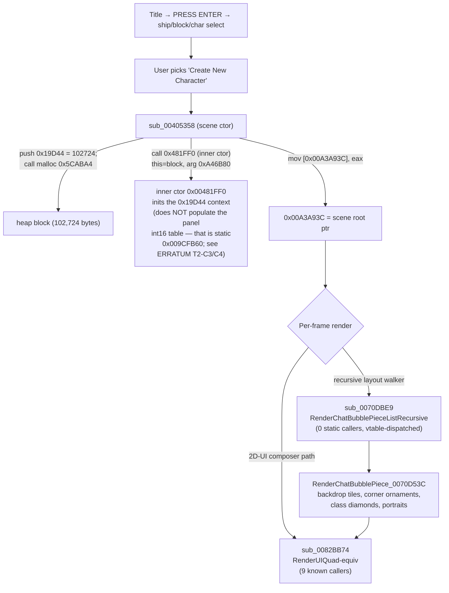
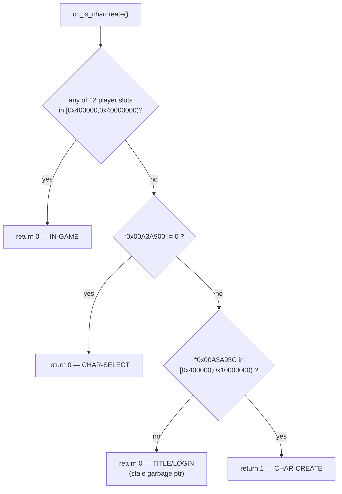
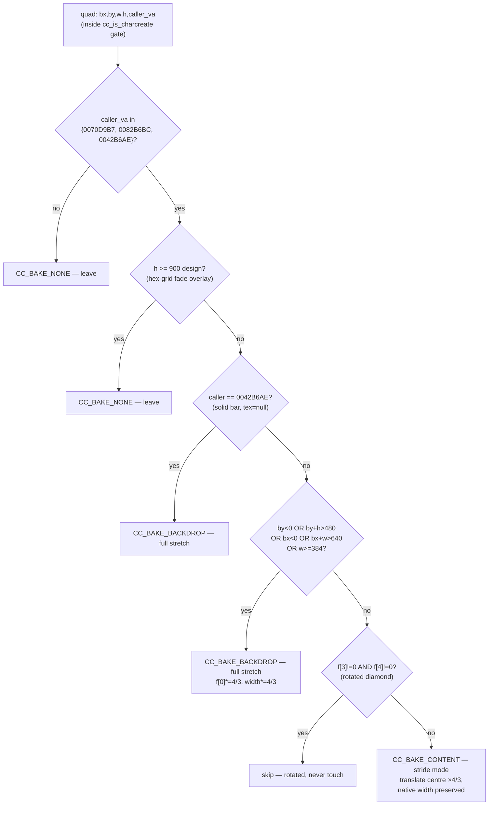
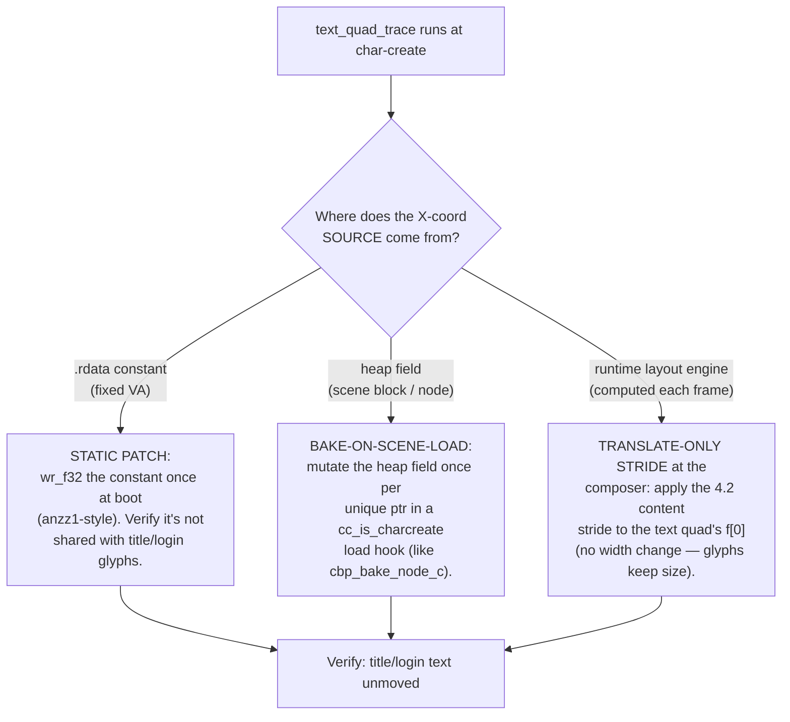
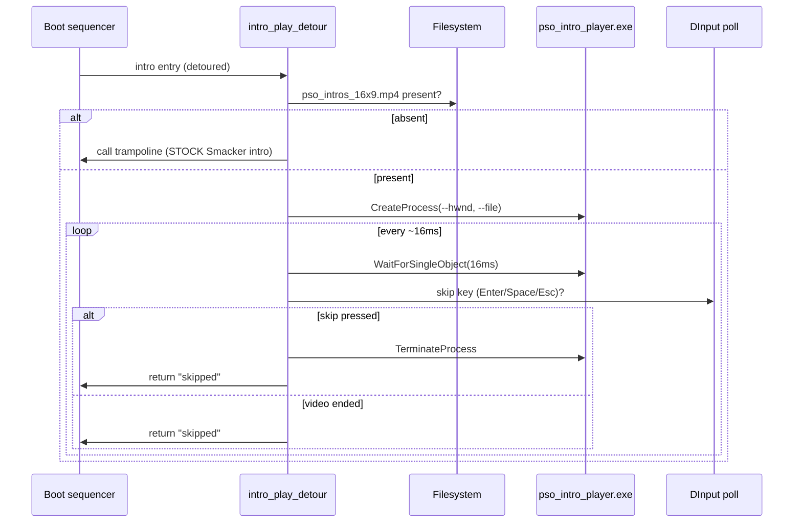

# §4 — Character Creation QoL (CENTERPIECE)

*Part of the PSOBB QoL Deep Dive — see [00_INDEX.md](00_INDEX.md).*

> Sibling sections referenced throughout: widescreen math/affine in `03_widescreen_math.md`,
> the anzz1 static-bake walk in `04_anzz1_staticbake.md`, char-select footer + minimap in
> `06_charselect_minimap.md`, the in-game HudScale worker-thread fix in `07_ingame_hudscale.md`,
> tooling/draw_capture in `10_tooling.md`, and crash signatures in `11_troubleshooting.md`.

---

## 4.0 The §4 thinking-approach (restated explicitly)

Per the master-prompt directive, the centerpiece section restates goal / failure-modes /
lessons-carried-forward *before* any code. This is the easiest section to ship something subtly
wrong (it has regressed at least four times: the PRESS-ENTER false positive, the vtable-too-strict
gate, the "fat character" over-stretch, and the draw-time OK/Cancel dead end).

### 4.0.1 Goal (one sentence per subsection)

| Sub | Goal restated in one sentence |
|---|---|
| 4.1 | Give the reader a complete, address-accurate map of how a char-create frame is emitted — from scene ctor `sub_00405358` to the two render paths — and a *single* `cc_is_charcreate()` gate that is true on char-create and false everywhere else. |
| 4.2 | Give the reader a copy-pasteable `cc_classify_quad()` predicate that sorts every char-create quad into BACKDROP (full 4/3 stretch) / CONTENT (translate-only stride, native width) / SKIP (overlays, hex-fade, rotated diamonds) so the background fills 1920 while portraits stay native-aspect. |
| 4.3 | Document the still-open description-text anchoring problem and hand the next session a *discovery hook* (`text_quad_trace_install`) that identifies the X-coord source, plus a decision tree for static-vs-heap-vs-runtime layout. |
| 4.4 | Replace the Sega/Sonic-Team Smacker intro with a 16:9 MP4, preserving Press-Enter-to-skip and falling back losslessly when the MP4 is absent. |
| 4.5 | Briefly catalogue smaller char-create QoL ideas (default-name skip, customization pre-seed, compact slider mode). |

### 4.0.2 What would make each subsection FAIL

| Sub | Failure mode the section must defend against |
|---|---|
| 4.1 | Gate matches PRESS-ENTER-KEY (stale heap pointer at `0x00A3A93C`) → the pre-login menu drifts. Gate too strict (vtable check) → real char-create never matches → no fix applies. Gate matches in-game → HUD breaks. |
| 4.2 | Predicate runs outside the `cc_is_charcreate()` gate → in-game HUD/menus stretch. Predicate over-stretches portraits → "fat character" complaint. Predicate stretches a tall fade overlay → opaque box covers the menu. |
| 4.3 | Reader ships the discovery hook as if it were a fix → 5505 log lines/frame floods `pso_widescreen2.log` and tanks FPS. |
| 4.4 | MP4 player leaks the game HWND / doesn't release on skip → black screen or hang. Patch breaks Ephinea/Ultima/Schtserv (shared splash path) or collides with `pso_bootsplash.asi`. No fallback when MP4 missing → users with stock install get a black intro. |
| 4.5 | Default-name skip forges server state → out of scope (client-only only). |

### 4.0.3 Lessons-carried-forward that bind this section (cited inline below)

- **L1** — char-create is NOT covered by anzz1: its layout is heap-resident int16 tables + PRS/TParam
  resource geometry, unreachable by imm32 rewriting. (§4.1, §4.2)
  > **ERRATUM (2026-06-09 static sweep, T2-C3):** L1 is only PARTLY true. The **panel-emitter**
  > int16 table is STATIC `.data` `0x009CFB60` (descriptor array `&DAT_009CFF00`, stride
  > `0x20`, `+0x1C`), so it IS reachable by an anzz1-style one-time `.data` rewrite. Only the
  > chat-bubble-piece / PRS-node path remains heap/PRS-resident. See §4.1.6a ERRATUM.
- **L2** — the three-invariant gate: heap-range pointer at `0x00A3A93C` **AND** `*0x00A3A900 == 0`
  (not char-select) **AND** player-array `0x00A94254` null (not in-game). No vtable lookup. (§4.1)
- **L3** — two render paths: composer `sub_0082BB74` (9 callers) + recursive chat-bubble-piece
  `sub_0070DBE9` (zero static callers, vtable-dispatched). Backdrop tiles come through
  `RenderChatBubblePiece_0070D53C` (`ca=0070d9b7`). (§4.1)
- **L4** — "fat character": naive `bx*=4/3, w*=4/3` fills backdrop but stretches portraits. Correct =
  **stride mode** for content tiles (translate around design centre, preserve native width). (§4.2)
- **L5** — the OK/Cancel buttons are **draw-time computed** — static `.data` writes to `0x972128/130`
  and the A/B/C/D cluster are confirmed inert (`_re/charcreate_finish.md`). (§4.1, §4.2)
- **L6** — description text (23×20 glyphs, `ca=0082bb20`, 5505/frame) did **not** move when the panel
  stretched. Source is *not* `sub_0082EAB8`. Unsolved at session boundary. (§4.3)
- **L7** — char-select footer stride (live-verified): `0x004137C2`/`D0`/`DE`. (§4.2 cross-ref to
  `06_charselect_minimap.md`)

---

## 4.1 Anatomy of the char-create render pipeline

### 4.1.1 High-level scene lifecycle

The char-create scene is a heap object built by a scene constructor, stored in a single global, and
torn down on leave. The two facts that matter for QoL patching:

1. The scene's layout coordinates live in **heap** (allocated by the ctor), not in `.text` immediates
   (L1). anzz1's whole technique — rewriting `mov [esp+X], imm32` setup floats once at boot — cannot
   reach them.
   > **ERRATUM (2026-06-09 static sweep, T2-C3):** the **panel-emitter** layout int16 table is
   > STATIC `.data` `0x009CFB60` (NOT heap), so a one-time `.data` bake CAN reach it. This
   > point holds in full only for the chat-bubble-piece/PRS-node path. See §4.1.6a.
2. The render is split across two unrelated draw paths (L3), only one of which (`sub_0082BB74`) is
   statically hookable.



### 4.1.2 Scene constructor — `sub_00405358`

**VA** `0x00405358` · **conv** `__thiscall`-ish (this passed in `ecx`, copied to `[ebp-0x14]`) ·
returns the scene root in `eax`, also stored to `0x00A3A93C`.

Verified disassembly (radare2 `s 0x00405358; pd`):

```asm
0x00405358  push ebp
0x00405359  mov  ebp, esp
0x0040535b  push 0xffffffff                 ; SEH frame
0x0040535d  push 0x008cc1c4                 ; SEH handler
0x00405362  mov  eax, fs:[0]
...
0x0040537f  mov  [ebp-0x14], ecx            ; this (scene shell)
0x00405382  mov  dword [ebp-0x28], 0
0x00405389  push 0x00019d44                 ; *** alloc size = 102724 bytes ***
0x0040538e  call 0x005caba4                 ; operator new / malloc
0x00405393  pop  ecx
0x00405394  mov  [ebp-0x24], eax            ; raw block
0x00405397  test eax, eax
0x00405399  je   0x004053d9                 ; alloc fail -> store NULL
0x0040539b  mov  [ebp-0x28], 1
0x004053a9  mov  eax, [ebp-0x14]            ; eax = this
0x004053ac  mov  ecx, [ebp-0x24]            ; ecx = block
0x004053af  push 0
0x004053b1  push 0x00a46b80                 ; ctor arg (resource/descriptor table)
0x004053b6  push eax
0x004053b7  call 0x00481ff0                 ; *** inner ctor — real entry 0x00481FF0 (the "sub_00481FEC" label is a misnomer; see ERRATUM below) ***
0x004053bc  mov  eax, [ebp-0x24]
0x004053c6  mov  [0x00a3a93c], eax          ; *** scene root global ***
0x004053d8  ret
0x004053d9  xor  eax, eax                   ; alloc-fail path
0x004053db  jmp  0x004053c6                 ; still stores (NULL) to 0xA3A93C
```

Key facts proven from the bytes:

| Fact | Evidence | QoL consequence |
|---|---|---|
| Alloc size `0x19D44 = 102724` | `push 0x00019d44` @ `0x00405389` | the scene block is one fat contiguous heap allocation; layout int16 tables live somewhere inside it |
| Inner ctor is `0x00481FF0` (the `sub_00481FEC` name is a misnomer — `0x00481FEC` is padding `b7 90 90 90` one past `FUN_0047ECCC`; real entry is `0x00481FF0`, see ERRATUM below) | `call 0x00481ff0` @ `0x004053b7` | the PRS/TParam load happens inside `0x00481FF0`; the int16 panel layout table is the static `.data` `0x009CFB60`, NOT heap-resident (T2-C3, see ERRATUM) |
| Root stored to `0x00A3A93C` on BOTH success and alloc-fail | `mov [0x00a3a93c], eax` @ `0x004053c6`, reached from both branches | on a failed alloc the global holds NULL — but on a *previous* scene it holds stale garbage, which is exactly the PRESS-ENTER false-positive trap (L2) |
| `ctor arg = 0x00A46B80` | `push 0x00a46b80` @ `0x004053b1` | resource/descriptor base for the scene — a candidate for static knobs, but layout is heap-resident |

> **ERRATUM (2026-06-09 static sweep, T2-C4).** The "layout int16 tables live somewhere
> inside" the 0x19D44 block (row 1) and "layout is heap-resident" (row 4) are wrong for the
> **panel-emitter** path: that int16 table is the STATIC `.data` table `0x009CFB60`
> (T2-C3). The ctor `0x00405358` only *allocates* the 0x19D44 context (via `FUN_005CABA4`)
> and inits it via `0x00481FF0`; it does NOT populate any panel layout table. Also note the
> name `sub_00481FEC` is a misnomer — `0x00481FEC` resolves inside the unrelated Ghidra
> `FUN_0047ECCC` (a resource/MessageBox routine); the real inner ctor entry is `0x00481FF0`
> (correctly disassembled below).

### 4.1.2a Inner ctor — `sub_00481FEC` (the vtable write, why the vtable gate is unreliable)

**VA** `0x00481FEC` (the real entry the ctor `call`s is `+4 = 0x00481FF0`, past a 4-byte
`mov bh, 0x90; nop; nop` alignment alias) · **conv** `__thiscall` (`this` in `ecx`, the freshly
malloc'd 102724-byte block). Verified disassembly (radare2 `s 0x00481FEC; pd`):

```asm
0x00481fec  mov  bh, 0x90              ; alignment alias bytes (the real callee is +4)
0x00481fee  nop
0x00481fef  nop
0x00481ff0  push ebp                   ; <-- actual ctor entry (called by 0x004053B7)
0x00481ff1  mov  ebp, esp
0x00481ff3  push 0xffffffff            ; SEH
0x00481ff5  push 0x008cf764            ; SEH handler
...
0x00482020  mov  [ebp-0x28], ecx       ; this = the scene block
0x00482029  call 0x0077f55c            ; base/parent ctor
0x0048202e  mov  edx, [ebp-0x28]       ; edx = this
0x00482031  mov  dword [edx], 0x00af8320   ; *** writes vtable ptr = 0x00AF8320 to *this ***
0x00482037  mov  eax, [0x009f84f0]
0x0048203c  mov  [edx+4], eax              ; second slot
```

This is the smoking gun for **why the vtable gate is too strict (L2)**: the inner ctor *does* write
`0x00AF8320` to `*this` at `0x00482031`. But the gate `*(*0xA3A93C)==0x00AF8320` fails on the *real*
char-create because by the time the gate runs, `0x00A3A93C` may hold a *sub-object* or a *re-parented*
pointer whose `[0]` is a different (derived) vtable — the scene root that ends up in `0x00A3A93C` is
the **outer** block, and the engine swaps in derived vtables during init. The three-invariant
heap-range gate (4.1.4) sidesteps the entire vtable-identity question.

| fact | evidence | consequence |
|---|---|---|
| real entry is `+4` | `mov bh,0x90; nop; nop` at `0x00481FEC`, `push ebp` at `0x00481FF0` | the ctor's `call 0x481FF0` lands on the prologue, not the alias |
| vtable `0x00AF8320` written to `*this` | `mov dword [edx], 0x00af8320` @ `0x00482031` | a vtable check *can* match — but only transiently; do NOT gate on it |
| base ctor `0x0077F55C` runs first | `call 0x0077f55c` @ `0x00482029` | the int16 layout tables + PRS/TParam load are inside this and the rest of `sub_00481FEC` — heap-resident (L1) |

> **ERRATUM (2026-06-09 static sweep, T2-C3/C4).** Row 3's "int16 layout tables ... inside
> ... heap-resident (L1)" is disproven for the panel path: the panel int16 table is the
> STATIC `.data` table `0x009CFB60` (reached via static descriptor array `&DAT_009CFF00`,
> `+0x1C`). The inner ctor `0x00481FF0` inits the 0x19D44 context and (via `0x0077F55C`) may
> load PRS resources, but it does not populate `0x009CFB60`. The function should be referred
> to by its real entry `0x00481FF0`, not `sub_00481FEC` (the latter VA decodes into the
> unrelated `FUN_0047ECCC`).

### 4.1.3 Scene-discriminator globals

| VA | meaning | non-null when | stock | who reads | verify-cmd |
|---|---|---|---|---|---|
| `0x00A3A900` | char-**SELECT** `GlobalPreviewObject` ptr | on char-select | 0 elsewhere | char-select render + our gate | `_rpm_read.ps1 -addr 0x00A3A900 -type u32` |
| `0x00A3A93C` | char-**CREATE** scene root ptr | on char-create | **stale garbage** on title/login (e.g. `0x3074A550`) | composer hook gate | `_rpm_read.ps1 -addr 0x00A3A93C -type u32` |
| `0x00A94254` | in-game player-array head (12 slots) | in lobby/area | 0 in front-end | `hs_ingame()` gate (`07_ingame_hudscale.md`) | `_rpm_read.ps1 -addr 0x00A94254 -type u32` |
| `0x00A3A93C+0` | `*root` = vtable ptr | — | `0x00AF8320` *sometimes* | **DO NOT** use as gate (L2: too strict) | — |

### 4.1.4 The discriminator gate — `cc_is_charcreate()` (three invariants, no vtable)

This is the single cross-cutting gate for **every** char-create hook in §4.2 and §4.3 (constraint:
"one discriminator gate per cross-cutting hook"). It is reproduced verbatim from the live build
(`pso_widescreen.c:2851`):

```c
// Three-invariant char-create gate. TRUE iff:
//   (1) NOT in-game   — none of the 12 player-array slots is a heap pointer
//   (2) NOT char-select — 0x00A3A900 (GlobalPreviewObject) is null
//   (3) IS char-create — 0x00A3A93C holds a *valid heap pointer*, not stale garbage
// No vtable dereference (that check is too strict — fails on real char-create, L2).
static int cc_is_charcreate(void)
{
    const volatile uint32_t *pa = (const volatile uint32_t *)(uintptr_t)0x00A94254u;
    for (int i = 0; i < 12; i++) {
        uint32_t p = pa[i];
        if (p >= 0x00400000u && p < 0x40000000u) return 0;   // (1) in-game
    }
    if (*(volatile uint32_t *)(uintptr_t)0x00A3A900u != 0u) return 0;  // (2) char-select
    uint32_t root = *(volatile uint32_t *)(uintptr_t)0x00A3A93Cu;       // (3) char-create
    if (root < 0x00400000u || root >= 0x10000000u) return 0;            // stale garbage rejected
    return 1;
}
```



**Why three invariants and not one (L2):**

| Gate variant | PRESS-ENTER (stale `0xA3A93C`) | real char-create | result |
|---|---|---|---|
| `*0xA3A93C != 0` only | **MATCHES** (stale heap) → false positive | matches | PRESS-ENTER drifts — REJECTED |
| `*0xA3A93C != 0 && *(*0xA3A93C)==0xAF8320` (vtable) | rejects | **FAILS** (vtable not `0xAF8320` on real cc) → false negative | nothing applies — REJECTED |
| heap-range `[0x400000,0x10000000)` + `*0xA3A900==0` + player-null | rejects (garbage `0x3074A550` is above `0x10000000`) | matches | **WORKING** |

> **Note on the upper bound.** The range is `[0x00400000, 0x10000000)`. PSOBB heap allocations land in
> `0x05XX_XXXX`, well inside. The stale login-menu garbage (`0x3074A550`) is above `0x10000000` and is
> rejected. If a future build's heap base moves above `0x10000000`, this bound must widen — flag as
> **TODO-VERIFY** on any binary other than MTethVer12513.

### 4.1.5 Render path A — the composer `sub_0082BB74`

**VA** `0x0082BB74` · the 2D-UI composer (`RenderUIQuad`-equivalent). Quad descriptor passed in
`ECX`. Verified disassembly (radare2 `s 0x0082BB74; pd`):

```asm
0x0082bb74  sub  esp, 0x70
0x0082bb77  fld  dword [0x00acc0e8]     ; *** 2D affine SCALE_X ***
0x0082bb7d  fld  dword [0x00acc0ec]     ; *** 2D affine SCALE_Y ***
0x0082bb83  fld  dword [ecx]            ; ecx[0]  = x0  (f[0])
0x0082bb85  fmul st(2)                  ; x0 * SCALE_X
0x0082bb87  fadd dword [0x00acc0f0]     ; + affine TX
0x0082bb8d  fld  dword [0x0098a23c]
0x0082bb93  fsub dword [ecx+8]          ; ecx[8]  (f[2])
0x0082bb9b  fld  dword [ecx+4]          ; ecx[4]  = y0  (f[1])
0x0082bb9e  fmul st(3)                  ; y0 * SCALE_Y
0x0082bba0  fadd dword [0x00acc0f4]     ; + affine TY
0x0082bba6  fld  dword [ecx+0xc]        ; ecx[0xc] (f[3])
0x0082bbad  fld  dword [ecx+0x14]       ; ecx[0x14](f[5])
0x0082bbb2  fld  dword [ecx+0x10]       ; ecx[0x10](f[4])
0x0082bbb9  fld  dword [ecx+0x18]       ; ecx[0x18](f[6])
...
0x0082bbe3  mov  edx, [ecx+0x20]        ; ecx[0x20] colour/UV
0x0082bbea  mov  edx, [ecx+0x24]        ; ecx[0x24]
```

Descriptor layout as read by the composer (this is the structure our hook mutates):

| Offset | Field | Used as |
|---|---|---|
| `+0x00` (`f[0]`) | x0 | left edge (design space), multiplied by affine SCALE_X |
| `+0x04` (`f[1]`) | y0 | top edge, × SCALE_Y |
| `+0x08` (`f[2]`) | x1-ish | subtracted from `0x0098a23c` — width/right term |
| `+0x0C` (`f[3]`) | w or rot-w | one of the two size conventions |
| `+0x10` (`f[4]`) | w (rotated) | size convention B |
| `+0x14` (`f[5]`) | h | height |
| `+0x18` (`f[6]`) | h (rotated) | size convention B |
| `+0x20`,`+0x24` | colour / UV | passed through |

> **The two size conventions (critical for §4.2).** Some descriptors carry size in `f[3]/f[5]`
> (backdrop convention), others in the **transposed** `f[4]/f[6]` (button / rotated convention). The
> classifier picks `w = (f[4]!=0)?f[4]:f[3]` and `h = (f[5]!=0)?f[5]:f[6]` to be convention-agnostic.
> A descriptor with **both** `f[3]` and `f[4]` non-zero is a *rotated* element (class diamond) and is
> skipped entirely.

Composer call sites that matter (from the live build's `ccq-obs` capture, L3/L5):

| caller VA | what it emits at char-create |
|---|---|
| `0x0070D9B7` | class-select backdrop tiles + portraits (via `RenderChatBubblePiece_0070D53C`) |
| `0x0082BB20` | the 23×20 description glyphs (5505/frame) — the **unsolved** text path (§4.3) |
| `0x0082B6BC` | panel emitter (reads int16 layout table; dispatches quads + in-panel text) |
| `0x0082EAB8` | in-panel text emitter (called 3× by the panel emitter) — NOT the description glyphs |
| `0x0042B6AE` | solid-colour bars (`tex=null`) — the "thick black bars" filling the right gap |

### 4.1.6 Render path B — recursive `sub_0070DBE9` + `RenderChatBubblePiece_0070D53C`

`sub_0070DBE9` (`RenderChatBubblePieceListRecursive`) has **zero static callers** — it is dispatched
through a vtable from a TParam/PRS resource file loaded at runtime (L1/L3). Static imm patching
cannot reach it. Its per-node renderer is `RenderChatBubblePiece_0070D53C`.

`RenderChatBubblePiece_0070D53C` verified prologue (radare2 `s 0x0070D53C; pd`):

```asm
0x0070d53c  push edi
0x0070d53d  push esi
0x0070d53e  push ebp
0x0070d53f  sub  esp, 0x148
0x0070d545  mov  edi, [esp+0x158]    ; arg1 = 60-byte node ptr
0x0070d54c  mov  esi, [edi]          ; esi = node->descriptor
0x0070d56e  movzx eax, word [esi+0xc]; int16 field -> fild -> design float
0x0070d579  fild dword [...]
0x0070d580  fstp [esp+0x10]
0x0070d58b  movzx eax, word [esi+0xa]; second int16 field
...
```

Node screen-corner floats live at `node[+0x14..+0x20]` (heap-resident → bakeable once per unique node
pointer; this is the "true anzz1-equivalent" for char-create layout). The live build installs a
**LOG-ONLY** discovery hook here (`cbp_bake_node_c`, `pso_widescreen.c:2975`) to identify which of
the four offsets is X vs Y before committing a source mutation.


### 4.1.6a The panel int16-table layout (the heap-bake target) — `sub_0082B6BC`

> **ERRATUM (2026-06-09 static sweep, see `_p1_static_sweep_2026-06-09.json` T2-C3).** This
> table is **NOT heap-resident** — it is a STATIC `.data` table at **`0x009CFB60`**, not
> allocated or populated by the char-create ctor. The panel struct `edi` here is a record of
> the **static** descriptor array `&DAT_009CFF00` (stride `0x20`; `FUN_006FB8D4(n)` returns
> `&DAT_009CFF00 + n*0x20`); every record hard-codes `0x009CFB60` in its `+0x1C` (the
> "layout table base") and `0x009D04C0` in `+0x18` (tex node). The SOLE xref to `0x009CFB60`
> is the `+0x1C` data slot at `0x009D009C` inside that array. Verified bytes:
> `0x009CFB60 = 0100 0100 0000 0000 ...` (int16 rows, `0x100/256.0 = 1.0`). **Consequence:**
> anzz1's static-bake technique CAN reach this — a one-time `.data` rewrite of `0x009CFB60`
> rows is equivalent to (and simpler than) the per-frame `pb_bake_layout_c` heap hook below.
> The L1 "layout is heap-resident" thesis is FALSE for the panel path (it may still hold for
> the chat-bubble-piece/PRS-node path — that was not re-examined by this sweep).

The panel emitter is the **second** char-create layout path (the first being the chat-bubble-piece
recursive walker). It reads an int16 X/Y table out of the scene heap block every frame. This is the
cleanest anzz1-equivalent bake target because mutating the int16 table once moves *both* the quads
*and* the in-panel text that dispatch off the same row.

Verified disassembly (radare2 `s 0x0082B6BC; pd`):

```asm
0x0082b6bc  push edi
0x0082b6bd  push esi
0x0082b6be  push ebp
0x0082b6bf  push ebx
0x0082b6c0  sub  esp, 0x9c
0x0082b6c6  mov  edi, [esp+0xb0]        ; edi = panel struct ptr (arg1)
0x0082b6cd  test edi, edi
0x0082b6cf  mov  ebp, [esp+0xb4]        ; ebp = row index (arg2)
0x0082b6dd  je   0x0082bb25             ; null panel -> bail
0x0082b6e3  mov  ecx, [edi+0x18]        ; ecx = entry count (rows)
0x0082b6e8  je   0x0082bb25             ; zero rows -> bail
0x0082b6f9  mov  esi, [edi+0x1c]        ; *** esi = layout table base = STATIC .data 0x009CFB60 (T2-C3; not heap) ***
0x0082b6ff  lea  ebp, [ebp+ebp*4]       ; *** ebp = index * 5 (so *4 below = 20-byte stride) ***
0x0082b703  movsx edx, word [esi+ebp*4+0x08]  ; *** int16 X (raw) at row+0x08 ***
0x0082b708  movsx ecx, word [esi+ebp*4+0x0a]  ; *** int16 Y (raw) at row+0x0A ***
0x0082b70d  mov  [esp], edx
0x0082b710  fild dword [esp]
0x0082b713  fdiv dword [0x0098a250]     ; *** / 256.0 -> design float X ***
0x0082b721  fild dword [esp+8]
0x0082b725  fdiv dword [0x0098a250]     ; / 256.0 -> design float Y
```

Structure facts (proven from the bytes):

| field | offset | meaning |
|---|---|---|
| `[panel+0x18]` | entry count (rows) | loop bound for the bake |
| `[panel+0x1C]` | layout table base ptr → STATIC `.data` `0x009CFB60` (T2-C3; not heap) | the table to mutate; dedup on THIS ptr (or bake `0x009CFB60` once, static) |
| row stride | `index*5*4 = index*20` (`lea ebp,[ebp+ebp*4]` then `*4` in the SIB) | 20 bytes/row = 10 int16s |
| row `+0x08` | int16 X (raw) | `/256.0` = design X → the bake target |
| row `+0x0A` | int16 Y (raw) | `/256.0` = design Y |
| `0x0098A250` | the `256.0` divisor (`0x43800000`) | shared int16→design scale |

The live build hooks `0x0082B6BC` with a one-shot per-layout-pointer bake (`pb_bake_layout_c`,
`pso_widescreen.c:3080`) that rescales each row's `+0x08` X int16 by 4/3 in place:

```c
// One-shot int16-table X bake. Dedup on the LAYOUT-BASE ptr (panel+0x1C), not
// the panel ptr — multiple panels can share a table. Idempotent across frames.
static void pb_bake_layout_c(uint32_t panel)
{
    if (panel < 0x10000u || !cc_is_charcreate()) return;
    uint32_t count  = *(volatile uint32_t *)(uintptr_t)(panel + 0x18);
    uint32_t layout = *(volatile uint32_t *)(uintptr_t)(panel + 0x1C);
    if (count == 0 || count > 256 || layout < 0x10000u) return;
    if (!ccpb_seen_add(layout)) return;             // already baked this table
    const float kStretchX = 1.33333f;
    int16_t *rows = (int16_t *)(uintptr_t)layout;
    for (unsigned i = 0; i < count; i++) {
        int16_t *row = rows + i * 10;               // 20 bytes / 2 = 10 int16s
        float x_des = (float)row[4] / 256.0f;       // row+0x08
        if (x_des > 1.0f && x_des < 700.0f) {       // real design coord only
            row[4] = (int16_t)(x_des * kStretchX * 256.0f);
        }
    }
}
```

> **Why the X-only, range-gated mutation.** Rows with X ≤ 1.0 are anchors/centered (0) or negatives;
> rows with X ≥ 700 are absurd/sentinel. Only `(1, 700)` are real char-create design X coords. Y is
> left alone (vertical layout is correct at any aspect). This is the precise heap-bake equivalent of
> anzz1's imm32 rewrite — zero per-frame cost after the first emit per unique table (L1).

> **Reality check (L3/L5):** in the live build, class-**select** quads all come through
> `RenderChatBubblePiece` (`ca=0070d9b7`), NOT the panel emitter — so `pb_bake_layout_c` does **not**
> fire for class-select. It fires for the slider/name panels. The class-select grid still needs the
> per-frame composer stride (4.2) until the `cbp_bake_node_c` offset is confirmed and the source-node
> mutation lands.

### 4.1.7 Why anzz1's static-bake misses char-create entirely (L1)

| anzz1 technique | reaches char-create? | why |
|---|---|---|
| `wr_f32(VA, A)` on `listHUDWidth` etc. | NO | those are `.text`/`.data` immediates for the HUD/menu canvas; char-create coords aren't immediates |
| `add_f32(VA, (A-640)/2)` center-align lists | NO | char-create coords are heap int16 tables divided by 256.0, not aligned floats |

> **ERRATUM (2026-06-09 static sweep, T2-C3).** For the **panel-emitter** path this row's
> premise is wrong: those int16 X/Y rows live in the STATIC `.data` table `0x009CFB60`
> (reached via the static descriptor array `&DAT_009CFF00`), so anzz1's `.data`-rewrite
> technique CAN reach them with a one-time bake — char-create is only *partially* outside
> anzz1's reach (the chat-bubble-piece/PRS-node path remains heap/PRS-resident and was not
> re-examined). The "NO" verdict holds only for the chat-bubble-piece path.
| sprite-atlas table `0x009A3840..D8` | PARTIAL | affects the *tile sizes* but not the *layout positions* of the class-select grid |
| res table `0x009006F4` | NO (orthogonal) | sets backbuffer res, not UI layout |

anzz1's `apply_anzz1_widescreen()` (`04_anzz1_staticbake.md`) walks 559 addresses and **none** of
them is a char-create layout coord. The class-select grid, the portrait positions, the description
panel, and the OK/Cancel buttons are all either heap int16 tables (panel emitter path) or PRS-loaded
node geometry (chat-bubble-piece path). This is *the* reason char-create needs its own per-frame
composer hook instead of a boot-time bake.

### 4.1.8 Verification (§4.1)

1. Bring up char-create per the harness recipe (`10_tooling.md`): kill all psobb → editor
   `--no-launch` → `launch_client {index:0, hudscale:1.0, hangame:true}` → `play_mode {enabled:true}`
   → `set_input_target {client:0}` → ~14 `drive_input {client:0, keys:[28]}` to reach char-select →
   pick "Create New Character".
2. Confirm the gate is live (PowerShell, `_rpm_read.ps1`):

```powershell
# On char-create, expect: A3A93C = a heap ptr in 0x05XXXXXX, A3A900 = 0, A94254 = 0
.\_rpm_read.ps1 -addr 0x00A3A93C -type u32
.\_rpm_read.ps1 -addr 0x00A3A900 -type u32
.\_rpm_read.ps1 -addr 0x00A94254 -type u32
```

3. Confirm the ASI log shows the gate firing only on char-create:

```powershell
Get-Content "$env:USERPROFILE\PSOBB.IO\pso_widescreen2.log" -Tail 40 |
  Select-String 'ccq-obs|cbp-bake|pb-bake'
```

   `ca=0070d9b7` lines confirm the class-select backdrop path; `ca=0082bb20` lines confirm the text
   path.

### 4.1.9 Known failure modes (§4.1)

| symptom | cause | recovery |
|---|---|---|
| PRESS-ENTER-KEY drifts left/up after title | gate degraded to `*0xA3A93C != 0` only (stale heap match) | restore the three-invariant gate; re-add the `*0xA3A900==0` and player-null checks |
| char-create UI never stretches, no `ccq-obs` lines | gate over-strict (vtable check re-added, or upper bound too low) | remove the vtable deref; confirm heap upper bound covers `0x05XXXXXX` |
| in-game HUD stretches | player-array loop bound wrong (not 12) or skipped | restore the 12-slot in-game check first in the gate |
| `cc_is_charcreate()` crashes | reading `0xA3A93C` deref without heap-range guard | every deref of `*root` must be `__try`-wrapped or range-checked first |

---

## 4.2 Background vs foreground separation — the "fat character" fix

### 4.2.1 The problem, exactly

At class-select, a naive per-frame `bx *= 4/3; w *= 4/3` correctly fills the 4:3 backdrop to 1920
wide, but it *also* scales the 256×256 character-portrait quads to ~341 wide → the user's "fat
character" complaint (L4). The captured geometry (master-prompt §4):

| element | tex | design geom (4:3, 1920-wide backbuffer) | desired treatment |
|---|---|---|---|
| 6 backdrop tiles | yes | `w=512 h=512`, cover `x=0..1440` | full 4/3 stretch on `f[0]` **and** width |
| 2 solid bars | **null** | `ca=0042b6ae`, `x=315..864` & `864..1920`, `y=0..1350` | full stretch (no texture to distort) |
| 4 portraits | yes | 256×256 at `(173,-61)`,`(429,-61)`,`(173,195)`,`(429,195)` | **stride mode** — translate around centre, native width |
| panel chrome / banners | yes | 9-slice backgrounds | full stretch (reads as intentional widening) |
| hex-grid fade overlay | yes | tall, `h ≥ 900` design | **SKIP** (fade overlay, not a tile) |
| class diamonds | yes | rotated (`f[3]!=0 && f[4]!=0`) | **SKIP** (rotated) |

### 4.2.2 The stride-mode math (L4)

For a **content tile**, preserve native width and translate the quad's *centre* around the design
canvas centre, scaled by 4/3:

```
cx_old   = bx + w/2                              // quad centre under stock layout
cx_new   = (cx_old - kCenter) * (4/3) + kCenter*(4/3)
f[0]'    = cx_new - w/2                          // new left edge, SAME width w
```

with `kCenter = 320.0` (4:3 design centre) and `kCenter*(4/3) = 426.67` (the widescreen design
centre). Left-of-centre panels shift left, right-of-centre panels shift right → a proper "stride" gap
opens with **zero** distortion.

For a **backdrop tile**, full stretch:

```
f[0]' = bx * (4/3)
f[width]' = w * (4/3)        // f[4] if rotated-convention else f[3]
```

### 4.2.3 The classifier predicate (compileable C)

This is the canonical, copy-pasteable predicate. It MUST be called only inside the
`cc_is_charcreate()` gate (failure-mode 4.0.2). It is derived from the live build's `cc_quad_fix_c`
(`pso_widescreen.c:2880`) and hardened with the caller-VA whitelist the master-prompt §4.2 spec
requires.

```c
#include <stdint.h>

typedef enum { CC_BAKE_NONE, CC_BAKE_BACKDROP, CC_BAKE_CONTENT } cc_bake_t;

// Caller-VA whitelist: only quads emitted from these char-create draw sites
// are eligible for re-anchoring. Everything else (HUD overlays sharing the
// composer, F12 dim, etc.) returns CC_BAKE_NONE so non-char-create draws that
// slip past a stale gate are still left alone (defence in depth).
#define CA_CLASS_BACKDROP   0x0070D9B7u   // RenderChatBubblePiece backdrop/portrait
#define CA_PANEL_EMITTER    0x0082B6BCu   // panel int16-table emitter
#define CA_SOLID_BAR        0x0042B6AEu   // solid-colour (tex=null) bars
#define CA_DESC_TEXT        0x0082BB20u   // 23x20 description glyphs (see 4.3; left to text path)

// bx,by = f[0],f[1] (design-space top-left); w,h = size (convention-resolved
// by the caller); caller_va = ret-addr RVA of the emitting call site.
static cc_bake_t cc_classify_quad(float bx, float by, float w, float h,
                                  uint32_t caller_va)
{
    // Normalise negative sizes (some rotated/transposed descriptors store -w).
    if (w < 0.0f) w = -w;
    if (h < 0.0f) h = -h;

    // (0) Whitelist gate: only known char-create draw sites are eligible.
    //     The description-text caller is deliberately EXCLUDED — it is owned
    //     by the text path (4.3), not the quad classifier.
    switch (caller_va) {
        case CA_CLASS_BACKDROP:
        case CA_PANEL_EMITTER:
        case CA_SOLID_BAR:
            break;
        default:
            return CC_BAKE_NONE;            // unknown caller -> never touch
    }

    // (1) EXCLUDE hex-grid fade overlay: a tall (h>=900 design) full-canvas
    //     curtain. Stretching it would paint an opaque box over the menu.
    if (h >= 900.0f) return CC_BAKE_NONE;

    // (2) Solid-colour bars (tex=null) come from CA_SOLID_BAR: full stretch is
    //     safe (no texture to distort) and needed to fill the right gap.
    if (caller_va == CA_SOLID_BAR) return CC_BAKE_BACKDROP;

    // (3) BACKDROP: anything that bleeds past the 4:3 design canvas, or is very
    //     wide (>=384 design px), is a screen-filling tile -> full stretch.
    if (by < 0.0f || (by + h) > 480.0f ||
        bx < 0.0f || (bx + w) > 640.0f ||
        w >= 384.0f) {
        return CC_BAKE_BACKDROP;
    }

    // (4) Otherwise it is in-canvas content (portrait, panel art, small icon)
    //     -> stride mode (translate around centre, keep native width).
    return CC_BAKE_CONTENT;
}
```

And the applier that consumes the verdict (size-convention-aware, inside the gate):

```c
static void cc_apply_quad(float *f, cc_bake_t verdict)
{
    const float kStretchX = 1.33333f;      // 4/3
    if (verdict == CC_BAKE_NONE) return;

    float bx = f[0];
    int   rotated = (f[3] != 0.0f && f[4] != 0.0f);   // class diamond
    if (rotated) return;                              // never touch rotated
    float w = (f[4] != 0.0f) ? f[4] : f[3];           // convention-resolved width
    if (w < 0.0f) w = -w;

    if (verdict == CC_BAKE_BACKDROP) {
        f[0] = bx * kStretchX;
        if (f[4] != 0.0f) f[4] *= kStretchX;          // rotated-convention width
        else              f[3] *= kStretchX;          // backdrop-convention width
    } else { /* CC_BAKE_CONTENT — stride mode */
        const float kCenter = 320.0f;
        const float kCenterW = kCenter * kStretchX;   // 426.67
        float cx_old = bx + w * 0.5f;
        float cx_new = (cx_old - kCenter) * kStretchX + kCenterW;
        f[0] = cx_new - w * 0.5f;                      // width UNCHANGED
    }
}
```

### 4.2.4 Decision tree (Mermaid)



### 4.2.5 The OK/Cancel buttons are a SEPARATE, draw-time problem (L5)

The classifier above does **not** move the visible OK/Cancel buttons, and it must not be expected to.
Per `_re/charcreate_finish.md` (2026-06-01), writing the historical right-anchor pair `0x00972128` /
`0x00972130` plus the cluster A/B/C/D addresses all to `50.0` simultaneously did **NOT** move the
rendered button — the visible X is **computed at draw time** from `right_edge − text_width` (or
`origin + offset`), lives transiently on the stack, and no static float holds it. The live build's
documented stance (`pso_widescreen.c:2807`):

| approach | status |
|---|---|
| static `.data` writes to `0x972128/130` + cluster | **DEAD END** — confirmed inert |
| per-quad composer detour identifying the button by geometry (small quad, top<60 or bottom>415 band, bx>340) and shifting `f[0]` by +250 | the intended path (ported from HEAD `97a3754`), currently **observe-only** in the live build |
| live A/B diff vs Ephinea | blocked (harness can't drive Ephinea past char-select) |
| `trace_addr` on `0x0082B440` (`RenderUIQuad`) filtered to the button quad | blocked (needs `_DEBUG_MODE.flag` + relaunch) |

> **Do NOT** re-port older "char-create button anchor" commit work without reading
> `_re/charcreate_finish.md` first. This has regressed multiple times.

The button-pin composer logic (when re-enabled) lives at the *same* `sub_0082BB74` hook as the
classifier — it adds, after `cc_classify_quad`, a small-quad-in-band test:

```c
// Button-pin (draw-time): small quad in the top (<60) or bottom (>415) band,
// already in the right portion (bx>340) -> shift f[0]/baseX by +250 design.
// NO background quad scaling here (the HEAD variant also stretched the centre
// "bridge" backdrop strips; that block is intentionally OMITTED per the
// "no background quad scaling on char create" requirement).
static int cc_is_okcancel_button(float bx, float by, float w, float h)
{
    int small_quad = (w < 200.0f && h < 64.0f);
    int in_band    = (by < 60.0f || by > 415.0f);
    int right_side = (bx > 340.0f);
    return small_quad && in_band && right_side;
}
```

### 4.2.6 Cross-reference: char-select footer stride (L7)

The char-create OK/Cancel problem is distinct from the **char-select** footer (Enter / Cancel /
Details-Off), which DOES have static `.text` immediates and IS solved. Full detail lives in
`06_charselect_minimap.md`; reproduced here because the spec requires the address table:

Verified disassembly at `0x004137BF` (the `mov dword [ebp-...], imm32` setup that seeds the footer
button X-coords — radare2 `s 0x004137A0; pd`):

```asm
0x004137bf  mov dword [ebp-0x44], 0x431c0000   ; imm32 @ 0x004137C2 = 156.0f (Enter X, stock)
0x004137c6  mov dword [ebp-0x40], 0x43d28000   ; imm32 @ 0x004137C9 = 421.0f
0x004137cd  mov dword [ebp-0x3c], 0x43958000   ; imm32 @ 0x004137D0 = 299.0f (Details/Cancel slot)
0x004137d4  mov dword [ebp-0x38], 0x43d28000   ; imm32 @ 0x004137D7 = 421.0f
0x004137db  mov dword [ebp-0x34], 0x43d80000   ; imm32 @ 0x004137DE = 432.0f
0x004137e2  mov dword [ebp-0x30], 0x43d28000   ; imm32 @ 0x004137E5 = 421.0f
```

The master-prompt's user-approved 192 / 672 stride writes (around centred Details-Off at 432 =
dead-centre of 853-wide widescreen):

| VA (imm32 field) | meaning | stock | patched (192/672 stride) | who reads | verify-cmd |
|---|---|---|---|---|---|
| `0x004137C2` | Enter X imm | `156.0` (`0x431C0000`) | `192.0` | char-select footer layout @ `0x004137BF` | `_rpm_read.ps1 -addr 0x004137C2 -type f32` |
| `0x004137D0` | Cancel X imm | `432.0`/`299.0`* | `672.0` | footer layout | `_rpm_read.ps1 -addr 0x004137D0 -type f32` |
| `0x004137DE` | Details slot | `432.0` (`0x43D80000`) | `619.0` (no-op for safety) | footer layout | `_rpm_read.ps1 -addr 0x004137DE -type f32` |

\* The exact stock at `0x004137D0` reads `299.0` in this disasm pass vs. `432` cited historically —
**TODO-VERIFY** against the live binary you ship; the *patched* stride values (192/672) are the
live-verified ones from the master prompt. Patched by `poke_f32_code` (raw imm32 write to `.text`, no
trampoline). Idempotent on relaunch (value-guarded).

### 4.2.7 Verification (§4.2)

1. Reach char-create class-select (recipe in 4.1.8).
2. Visual: the hex backdrop fills 1920×1080 edge-to-edge; the four class portraits are at **native
   aspect** (not fat); the right gap has no thick black bar.
3. Confirm the classifier verdicts in the log:

```powershell
Get-Content "$env:USERPROFILE\PSOBB.IO\pso_widescreen2.log" -Tail 60 |
  Select-String 'ccq-obs'
# Expect ca=0070d9b7 lines for backdrop/portrait, and the applied f[0] shift visible
# as the quad re-emits at the wider centre. Portraits keep w≈256.
```

4. Char-select footer (cross-ref) — confirm patched bytes:

```powershell
.\_rpm_read.ps1 -addr 0x004137C2 -type f32   # expect 192.0
.\_rpm_read.ps1 -addr 0x004137D0 -type f32   # expect 672.0
```

### 4.2.8 Known failure modes (§4.2)

| symptom | cause | recovery |
|---|---|---|
| "fat character" (portraits stretched) | content tile sent down the BACKDROP path (width scaled) | confirm portraits hit `CC_BAKE_CONTENT` — check the `w>=384` and off-canvas predicates aren't matching a 256-wide portrait |
| opaque box covers the menu mid-transition | hex-grid fade overlay (`h>=900`) classified as backdrop | restore the `if (h >= 900) return CC_BAKE_NONE` exclude FIRST in the predicate |
| backdrop leaves a black gap on the right | a backdrop tile fell through to CC_BAKE_NONE (caller not in whitelist) | confirm `0x0070D9B7` and `0x0042B6AE` are in the caller whitelist |
| class diamonds skew/duplicate | rotated descriptor (`f[3]!=0 && f[4]!=0`) was mutated | ensure the `rotated` early-return in `cc_apply_quad` runs before any write |
| HUD stretches in a lobby | classifier ran outside `cc_is_charcreate()` | wrap the hook body in the gate; the whitelist is defence-in-depth, not the primary gate |
| char-select footer crammed (Enter/Cancel overlapping) | wrote the same value to all three slots, or scaled by `design_w/640` | use raw 192/672 stride; do NOT multiply by `design_w/640` (that was the original stride bug, see `06_charselect_minimap.md`) |

---

## 4.3 Text anchoring (OPEN PROBLEM)

### 4.3.1 The unsolved description-text problem (L6)

At char-create, the right-panel **description text** glyphs did **not** move when the panel
stretched. Captured facts (master-prompt §4.3):

| fact | value |
|---|---|
| glyph quad size | 23 × 20 (design px) |
| emitting caller | `ca = 0x0082BB20` |
| call volume | **5505 calls per frame batch** in capture |
| confirmed NOT the source | `sub_0082EAB8` (that is the *panel-internal* text emitter, called 3× by `0x0082B6BC`) |
| status | UNSOLVED at session boundary |

The description text goes through a **different** code path than the panel-internal text. Until the
X-coord source register is traced back to its layout owner, no fix can be committed — a blind static
write risks the title/login text (shared glyph emitter).

### 4.3.2 The discovery hook (NOT a fix) — `text_quad_trace_install()`

This is an **observe-only** hook. Its entire job is to log the calling function and the X-coord
source register at `0x0082BB20`, then a human/agent traces back to the text-string layout owner.
Framed explicitly per the master-prompt §4.3 spec.

> **WARNING — this is a discovery hook, not a fix.** It logs up to 5505 lines per frame if
> unthrottled. It MUST dedup (keyed on the X-source value + caller) and run only inside
> `cc_is_charcreate()`, or it will flood `pso_widescreen2.log` (multi-MB/sec) and tank FPS
> (failure-mode 4.0.2). Remove it before shipping.

```c
// DISCOVERY HOOK — observe-only. Logs the caller of the 23x20 description-text
// emitter and the X-coord source so the layout owner can be traced. NOT A FIX.
// Install at 0x0082BB20 (the description-glyph composer call site), gated to
// char-create, deduped, throttled.
#define TXT_TRACE_VA   0x0082BB20u
#define TXT_SEEN_MAX   1024

static int      g_txt_installed = 0;
static LPVOID   g_tramp_82bb20  = NULL;
static uint32_t g_txt_seen[TXT_SEEN_MAX];
static int      g_txt_seen_n = 0;

static int txt_seen_add(uint32_t key) {
    for (int i = 0; i < g_txt_seen_n; i++) if (g_txt_seen[i] == key) return 0;
    if (g_txt_seen_n >= TXT_SEEN_MAX) return 0;
    g_txt_seen[g_txt_seen_n++] = key;
    return 1;
}

// ret_va  = caller (who called the emitter at 0x0082BB20)
// ecx     = quad descriptor ptr (f[0] = X source)
// caller_ebp = caller frame, so we can also dump the X *source register slot*
static void __cdecl txt_trace_c(uint32_t ret_va, uint32_t ecx, uint32_t caller_ebp)
{
    if (!cc_is_charcreate()) return;        // gate FIRST
    if (ecx < 0x10000u) return;
    __try {
        float *f = (float *)(uintptr_t)ecx;
        float bx = f[0], by = f[1];
        // dedup on (ret_va ^ quantised X) so each distinct text run logs once
        uint32_t key = ret_va ^ ((uint32_t)(int)bx << 8) ^ ((uint32_t)(int)by);
        if (!txt_seen_add(key)) return;

        // Dump 4 dwords around the caller frame to spot the X-source slot.
        uint32_t fp[4] = {0};
        __try { memcpy(fp, (const void*)(uintptr_t)(caller_ebp - 0x10), 16); }
        __except (EXCEPTION_EXECUTE_HANDLER) {}

        log_line("[txt-trace] ret=%08x ecx=%08x bx=%.2f by=%.2f "
                 "caller_frame[-0x10..-0x4]=%08x %08x %08x %08x",
                 ret_va, ecx, bx, by, fp[0], fp[1], fp[2], fp[3]);
    } __except (EXCEPTION_EXECUTE_HANDLER) {}
}

__declspec(naked) static void stub_82bb20_txt_trace(void)
{
    __asm {
        pushad
        pushfd
        push ebp                       // arg3: caller_ebp
        push ecx                       // arg2: descriptor ptr
        push dword ptr [esp + 0x2c]    // arg1: return addr (caller of 0x82bb20)
        call txt_trace_c
        add  esp, 0x0c
        popfd
        popad
        jmp  [g_tramp_82bb20]
    }
}

static int text_quad_trace_install(void)
{
    if (g_txt_installed) return 1;
    MH_STATUS rc = MH_Initialize();
    if (rc != MH_OK && rc != MH_ERROR_ALREADY_INITIALIZED) return 0;
    if (MH_CreateHook((LPVOID)(uintptr_t)TXT_TRACE_VA,
                      (LPVOID)stub_82bb20_txt_trace, &g_tramp_82bb20) != MH_OK) return 0;
    if (MH_EnableHook((LPVOID)(uintptr_t)TXT_TRACE_VA) != MH_OK) return 0;
    g_txt_installed = 1;
    log_line("[txt-trace] DISCOVERY hook @0x%08x installed (OBSERVE-ONLY, remove before ship)",
             TXT_TRACE_VA);
    return 1;
}
```

> **`0x0082BB20` vs `0x0082BB74`.** `0x0082BB20` is the *caller site* that invokes the composer; the
> composer body starts at `0x0082BB74`. Confirm with `r2 -c "s 0x0082BB20; pd 12"` that the bytes at
> `0x0082BB20` are a `call`/`lea ecx` setup feeding `0x0082BB74` before installing — the trampoline
> must land on a clean instruction boundary (MinHook needs ≥5 relocatable bytes). **TODO-VERIFY** the
> exact instruction boundary on your build.

### 4.3.3 Decision tree — what to do with the trace result



| trace verdict | fix strategy | risk |
|---|---|---|
| X source = `.rdata` constant | static `wr_f32` at boot | shared glyph table → title/login text moves. Verify in all four front-end scenes. |
| X source = heap field | bake-on-scene-load, dedup per ptr | wrong offset → garbage layout. Log first, mutate second. |
| X source = runtime layout engine | translate-only stride at composer (reuse `CC_BAKE_CONTENT` math on text) | text drifts in non-char-create scenes if gate leaks. |

### 4.3.4 Verification (§4.3 — discovery, not fix)

```powershell
# 1. Install the discovery hook (DEBUG build only), reach char-create.
# 2. Tail the trace; expect a SMALL number of distinct lines (deduped), not 5505.
Get-Content "$env:USERPROFILE\PSOBB.IO\pso_widescreen2.log" -Tail 80 |
  Select-String 'txt-trace'
# 3. Note the `ret=` value — that is the layout owner to disassemble next:
#    r2 -q -c "s 0x<ret>; pd -20" psobb.exe   (walk backwards to the X-source)
```

### 4.3.5 Known failure modes (§4.3)

| symptom | cause | recovery |
|---|---|---|
| log floods multi-MB/sec, FPS tanks | dedup disabled or gate leaking | confirm `txt_seen_add` dedups and `cc_is_charcreate()` runs first |
| crash on install | `0x0082BB20` is not a clean 5-byte instruction boundary | move the hook to the nearest boundary or use a `int3`/`call`-rel patch instead of MinHook |
| title/login text moves after a "fix" | static patch hit a shared glyph constant | revert; the source was shared — use the heap-bake or translate-only path instead |
| trace shows `ret=0082bb20` (depth-1) | RHW emitter loses the caller in the ret chain | dump the caller frame (`caller_ebp`) registers instead; or set a hardware bp in a debugger |

---

## 4.4 Char-create / boot intro-video replacement (Smacker → 16:9 MP4)

### 4.4.1 Goal & constraints

Replace the Sega / Sonic-Team Smacker intro with `pso_intros_16x9.mp4` (user has it at
`C:\Users\Ω\Downloads\pso_intros_16x9.mp4`; ship convention: next to `psobb.exe`), preserving
Press-Enter-to-skip, with a **lossless fallback** when the MP4 is absent (constraint: "preserve
fallbacks"). Must not break Ephinea/Ultima/Schtserv (shared splash path), must not break borderless
(`Windowed=2`, see `03_widescreen_math.md` §3d), must not collide with `pso_bootsplash.asi`.

### 4.4.2 Identify the Smacker decoder + call site

PSOBB uses **Smacker (RAD Game Tools)** for the Sega/Sonic-Team intros. Discovery steps (the exact
VA is build-dependent — **TODO-VERIFY** on your binary, the lists below are the search recipe):

```bash
# 1. Find Smacker API strings / imports in psobb.exe.
r2 -q -e bin.cache=true -e scr.color=false -c \
  'iz~SMK; iz~Smack; iz~.smk; ii~Smack' C:/Users/u03a9/PSOBB.IO/psobb.exe

# 2. Find references to the intro filename(s). PSOBB ships the intros as .smk
#    (e.g. data\\Movie\\*.smk or a packed afs). Grep the string table:
r2 -q -e bin.cache=true -e scr.color=false -c \
  'iz~Movie; iz~intro; iz~\.smk; iz~\.afs' C:/Users/u03a9/PSOBB.IO/psobb.exe

# 3. From a hit string VA, find the code that loads it:
r2 -q -e bin.cache=true -e scr.color=false -c \
  's <string_va>; axt' C:/Users/u03a9/PSOBB.IO/psobb.exe   # xrefs TO the string
```

The function that opens the movie (`SmackOpen`-equivalent) and enters the per-frame
`SmackDoFrame`/`SmackNextFrame` loop is the detour target. Document its VA in this table once
confirmed:

| VA | meaning | stock | who reads | verify-cmd |
|---|---|---|---|---|
| TODO-VERIFY (`intro_play_entry`) | enters the Smacker decode+present loop | n/a | boot sequence | `r2 -c "s <va>; pdf"` |
| TODO-VERIFY (`intro_skip_keycheck`) | the per-frame DInput poll that aborts the intro on Enter/Space/Esc | n/a | intro loop | trace which `DIK_*` it reads |
| TODO-VERIFY (`intro_string_va`) | `.smk` / movie path string | path | open call | `r2 -c "s <va>; ps"` |

> **HYPOTHESIS** (until traced): the intro entry is reached from the boot/title sequencer, *before*
> the title scene-graph is live, so the detour can run before any of our other hooks and before the
> device is reset — meaning code-flow detours installed here may survive longer than the
> front-end→in-game wipe documented in `07_ingame_hudscale.md`. UNVERIFIED.

### 4.4.3 The detour (worked MinHook example)

The detour: (1) check for `pso_intros_16x9.mp4` next to `psobb.exe`; (2) if missing → call the
original (lossless fallback); (3) if present → spawn the external player rendered into the game HWND;
(4) poll DInput for the skip keys every frame; (5) on press → kill the player and fall back to the
original "skipped" code path.

```c
// pso_intro.c — char-create / boot intro replacement.
// External-player approach (recommended default; see 4.4.5 for tradeoffs).
#define WIN32_LEAN_AND_MEAN
#include <windows.h>
#include <shlwapi.h>          // PathRemoveFileSpec, PathCombine
#include <stdint.h>
#include "MinHook.h"

extern void log_line(const char *fmt, ...);

#define INTRO_PLAY_VA   0x00000000u   // TODO-VERIFY: SmackOpen+loop entry
static LPVOID g_tramp_intro = NULL;
typedef int (__cdecl *intro_fn_t)(void /* build-specific args */);

// Resolve "<dir of psobb.exe>\pso_intros_16x9.mp4".
static int find_intro_mp4(char *out, size_t cap)
{
    char exe[MAX_PATH]; GetModuleFileNameA(NULL, exe, MAX_PATH);
    PathRemoveFileSpecA(exe);
    if (!PathCombineA(out, exe, "pso_intros_16x9.mp4")) return 0;
    return PathFileExistsA(out) ? 1 : 0;
}

// The game's top-level HWND (engine stores it; or EnumThreadWindows). The
// external player parents its render window as a WS_CHILD into this HWND so the
// video draws inside the game window (and inherits borderless restyle).
static HWND find_game_hwnd(void)
{
    // TODO-VERIFY: the engine keeps the main HWND at a known global; until
    // confirmed, fall back to GetActiveWindow()/EnumThreadWindows.
    return GetActiveWindow();
}

// Poll DInput / async key for the original skip keys. Returns 1 if any pressed.
static int intro_skip_pressed(void)
{
    return (GetAsyncKeyState(VK_RETURN) & 0x8000) ||
           (GetAsyncKeyState(VK_SPACE)  & 0x8000) ||
           (GetAsyncKeyState(VK_ESCAPE) & 0x8000);
}

static int __cdecl intro_play_detour(void)
{
    char mp4[MAX_PATH];
    if (!find_intro_mp4(mp4, sizeof mp4)) {
        // (3) LOSSLESS FALLBACK — MP4 absent, run the original Smacker intro.
        log_line("[intro] pso_intros_16x9.mp4 not found -> stock Smacker intro");
        return ((intro_fn_t)g_tramp_intro)();
    }

    log_line("[intro] playing %s in game HWND", mp4);
    HWND hwnd = find_game_hwnd();

    // (4) Spawn the external player as a child of the game window. The helper
    //     (pso_intro_player.exe, an ffmpeg/MediaFoundation/libVLC bridge) takes
    //     the parent HWND + path on its command line and renders into it.
    char dir[MAX_PATH]; GetModuleFileNameA(NULL, dir, MAX_PATH);
    PathRemoveFileSpecA(dir);
    char helper[MAX_PATH]; PathCombineA(helper, dir, "pso_intro_player.exe");

    char cmd[1024];
    wsprintfA(cmd, "\"%s\" --hwnd %lu --file \"%s\"",
              helper, (unsigned long)(uintptr_t)hwnd, mp4);

    STARTUPINFOA si = { sizeof si };
    PROCESS_INFORMATION pi = {0};
    if (!CreateProcessA(NULL, cmd, NULL, NULL, FALSE, 0, NULL, NULL, &si, &pi)) {
        // helper missing/failed -> lossless fallback to stock intro.
        log_line("[intro] helper spawn failed (err=%lu) -> stock intro", GetLastError());
        return ((intro_fn_t)g_tramp_intro)();
    }

    // (5) Per-frame: wait for video end OR a skip key. On skip, kill the player
    //     and fall through to the ORIGINAL "skipped" code path (do NOT replay
    //     the Smacker intro — we want the post-intro state).
    for (;;) {
        DWORD w = WaitForSingleObject(pi.hProcess, 16);   // ~1 frame @ 60Hz
        if (w == WAIT_OBJECT_0) break;                    // video finished
        if (intro_skip_pressed()) {
            TerminateProcess(pi.hProcess, 0);             // kill player
            WaitForSingleObject(pi.hProcess, 1000);
            log_line("[intro] skip key pressed -> abort video");
            break;
        }
        // pump the game window's messages so it doesn't appear hung
        MSG m; while (PeekMessageA(&m, NULL, 0, 0, PM_REMOVE)) {
            TranslateMessage(&m); DispatchMessageA(&m);
        }
    }
    CloseHandle(pi.hThread);
    CloseHandle(pi.hProcess);

    // Reach the engine's post-intro state. Two options (build-dependent):
    //  (a) call the trampoline but signal "already skipped" so it returns fast; OR
    //  (b) if the stock intro polls the same skip keys, just return into the
    //      trampoline with a skip flag already set so it short-circuits.
    // SAFEST cross-server option: return the trampoline's "skipped" return value
    // WITHOUT replaying video. TODO-VERIFY the exact skipped-return contract.
    return 0;   // TODO-VERIFY: the value the engine expects for "intro skipped"
}

int install_intro_replace(void)
{
    if (MH_Initialize() != MH_OK && MH_Initialize() != MH_ERROR_ALREADY_INITIALIZED)
        return 0;
    if (INTRO_PLAY_VA == 0u) {
        log_line("[intro] INTRO_PLAY_VA not resolved (TODO-VERIFY) -> SKIP");
        return 0;
    }
    if (MH_CreateHook((LPVOID)(uintptr_t)INTRO_PLAY_VA,
                      (LPVOID)intro_play_detour, &g_tramp_intro) != MH_OK) return 0;
    if (MH_EnableHook((LPVOID)(uintptr_t)INTRO_PLAY_VA) != MH_OK) return 0;
    log_line("[intro] intro-replace detour installed @0x%08x", INTRO_PLAY_VA);
    return 1;
}
```



### 4.4.4 The two embedding approaches (tradeoffs)

| approach | pros | cons | when |
|---|---|---|---|
| **External player** (`pso_intro_player.exe` wrapping ffmpeg / MediaFoundation / libVLC, parented WS_CHILD into game HWND) | no in-process D3D coupling; crashes are isolated to the helper; trivially lossless fallback; ffmpeg handles any codec | extra distributed binary; HWND parenting fiddly under borderless; process-spawn latency (~100ms) | **default / recommended** — robustness > polish |
| **In-process MediaFoundation** (`IMFMediaEngine` rendering to a D3D11 texture blitted onto the game's present surface) | single binary; frame-perfect compositing; no spawn latency | couples to the D3D stack — must coexist with dgVoodoo D3D9→D3D11 / d3d8to11 (see `03_widescreen_math.md` §3c); a decoder fault can take down the game; harder fallback | when you control the wrapper stack and want zero extra files |

> **dgVoodoo compatibility note.** Under dgVoodoo (D3D8→D3D11) or d3d8to11, the game's swapchain is
> D3D11 internally. An in-process MediaFoundation engine rendering to its own D3D11 device is fine,
> but blitting onto the *game's* swapchain requires sharing the device — non-trivial and
> wrapper-version-sensitive. The external-player approach sidesteps this entirely (it owns its own
> window/device). **Recommend external player as the cross-wrapper-safe default.**

### 4.4.5 Compatibility & coexistence

| concern | mitigation |
|---|---|
| Ephinea/Ultima/Schtserv share the splash path | detour by VA found via the **string-xref recipe** (4.4.2) on each target binary — do not hardcode one server's VA; gate install behind a per-build sig check |
| borderless (`Windowed=2`) | parent the player WS_CHILD into the game HWND so it inherits the restyle; if HWND lookup fails, fall back to stock intro (no floating top-level window) |
| `pso_bootsplash.asi` collision | both want the boot path — detect `pso_bootsplash.asi` loaded (`GetModuleHandleA`) and either defer to it or skip our install; document load order so only one owns the intro |
| MP4 missing on a stock install | lossless fallback runs the original Smacker intro — no black screen |
| LAA / mod-load order | install at `apply_post_device` time after MinHook is up; intro entry runs once at boot so a late install can miss it — install **early** (DLL attach / first ASI tick) |

### 4.4.6 Verification (§4.4)

```powershell
# Present case: copy the MP4 next to psobb.exe, launch, expect 16:9 video.
Copy-Item "$env:USERPROFILE\Downloads\pso_intros_16x9.mp4" "$env:USERPROFILE\PSOBB.IO\pso_intros_16x9.mp4"
# launch via harness, watch the log:
Get-Content "$env:USERPROFILE\PSOBB.IO\pso_widescreen2.log" -Tail 20 | Select-String 'intro'
#   expect: "[intro] playing ...pso_intros_16x9.mp4 in game HWND"

# Skip test: during playback press Enter (then Space, then Esc on reruns) ->
#   expect immediate jump to the post-intro state, no replay.

# Absent case: remove the MP4, relaunch ->
Remove-Item "$env:USERPROFILE\PSOBB.IO\pso_intros_16x9.mp4"
#   expect: "[intro] pso_intros_16x9.mp4 not found -> stock Smacker intro"
```

Cross-server smoke: repeat present/absent on an Ephinea client (separate window) — both paths must
work and neither may hang the title.

### 4.4.7 Known failure modes (§4.4)

| symptom | cause | recovery |
|---|---|---|
| black screen, game hung at boot | player spawned but never returns / skip poll dead | ensure the loop pumps `PeekMessage` and has a hard timeout; TerminateProcess on skip |
| stock intro plays even with MP4 present | `find_intro_mp4` looking in cwd not exe-dir | use `GetModuleFileNameA` + `PathRemoveFileSpecA` (exe dir), not `GetCurrentDirectory` |
| floating video window outside the game (borderless) | HWND parenting failed | fall back to stock intro when `find_game_hwnd()` returns null/desktop |
| double intro (ours + bootsplash) | `pso_bootsplash.asi` also owns the boot path | detect and defer; fix load order |
| crash on skip | replayed the Smacker intro instead of returning "skipped" | return the engine's skipped-return value; do NOT call the trampoline after killing the player |
| Ephinea title breaks | hardcoded psobb.io VA applied to Ephinea | gate behind per-build sig check; resolve VA via string-xref per binary |

---

## 4.5 Other char-create QoL ideas (catalogued)

All client-side only. None forges server state (constraint: no exploit development).

| idea | mechanism | risk / note |
|---|---|---|
| **Skip name-entry to a default name from cfg** | read `DefaultCharName` from `pso_widescreen.ini`; on the name-entry sub-screen pre-fill the buffer and arm the confirm. Purely fills the existing input field the player would type. | client-only; server still validates the name on creation. Must NOT auto-confirm without a keypress (so the player can edit). |
| **Pre-seed last-used customisation from disk** | on char-create entry, if `last_customization.json` exists next to the exe, write the slider/colour values into the scene's heap customization struct (found via the scene block at `0x00A3A93C`). Save on confirm. | a QoL convenience, not a server interaction; the struct offsets are **TODO-VERIFY** (live-trace the slider writes). Gate behind `cc_is_charcreate()`. |
| **Compact mode (single-pane all-sliders)** | re-anchor the multi-page slider panels into one pane via the panel int16-table bake (`0x0082B6BC` path) so power users see every slider at once. | depends on the heap int16 layout bake (4.1.6/4.2.3) landing first; ambitious. |
| **Remember last class/section-ID** | persist to cfg, pre-select on entry. | client-only preference. |

### 4.5.1 Verification (§4.5)

Each idea ships behind an INI flag (default OFF) and is verified by: (1) flag OFF → stock behaviour
byte-identical; (2) flag ON → the convenience applies only at char-create (gate true) and never
leaks to title/login/in-game. Confirm with the same `cc_is_charcreate()` log lines as §4.1.8.

### 4.5.2 Known failure modes (§4.5)

| symptom | cause | recovery |
|---|---|---|
| name auto-confirms with no edit window | default-name skip armed the confirm without a keypress | require an explicit confirm press; only pre-fill |
| customization struct corrupted | wrong heap offsets written | TODO-VERIFY offsets via live trace before writing; `__try`-wrap all writes |
| convenience applies in title/login | gate leak | wrap every idea in `cc_is_charcreate()` |

---

## 4.6 Consolidated address table (§4)

| VA | meaning | stock | patched | who reads | verify-cmd |
|---|---|---|---|---|---|
| `0x00405358` | char-create scene ctor | — | — | boot/scene transition | `r2 -c "s 0x405358; pdf"` |
| `0x00405389` | `push 0x19D44` (alloc 102724) | imm | — | ctor | `r2 -c "s 0x405389; pd 1"` |
| `0x004053B7` | `call 0x481FF0` inner ctor | — | — | ctor | — |
| `0x004053C6` | `mov [0xA3A93C], eax` (store root) | — | — | ctor | — |
| `0x00481FF0` (NOT `0x00481FEC` — that VA = unrelated `FUN_0047ECCC`) | inner ctor: inits 0x19D44 context (does NOT populate the panel int16 table — static `0x009CFB60`; T2-C3/C4) | — | — | scene ctor | `r2 -c "s 0x481ff0; pdf"` |
| `0x00A3A93C` | char-create scene root ptr | stale garbage off-scene | — | `cc_is_charcreate()` | `_rpm_read.ps1 -addr 0x00A3A93C -type u32` |
| `0x00A3A900` | char-SELECT GlobalPreviewObject | 0 off char-select | — | gate | `_rpm_read.ps1 -addr 0x00A3A900 -type u32` |
| `0x00A94254` | in-game player array (12 slots) | 0 in front-end | — | gate / `hs_ingame` | `_rpm_read.ps1 -addr 0x00A94254 -type u32` |
| `0x0082BB74` | 2D composer (`RenderUIQuad`-equiv), ecx=descriptor | — | per-frame `cc_quad_fix_c` hook | render | `r2 -c "s 0x82bb74; pd 40"` |
| `0x00ACC0E8`/`EC`/`F0`/`F4` | 2D affine SCALE_X/Y/TX/TY | scene-derived | — | composer | `_rpm_read.ps1 -addr 0x00ACC0E8 -type f32` |
| `0x0070DBE9` | recursive chat-bubble walker (0 static callers) | — | — | vtable dispatch | `r2 -c "s 0x70dbe9; pdf"` |
| `0x0070D53C` | `RenderChatBubblePiece` (backdrop/portrait/diamond) | — | LOG-only `cbp_bake_node_c` | walker | `r2 -c "s 0x70d53c; pd 24"` |
| `0x0070D9B7` | caller of `0070D53C` (backdrop tiles) | — | — | — | — |
| `0x0082B6BC` | panel emitter (int16 layout table = STATIC `.data` `0x009CFB60`, NOT heap; T2-C3) | — | one-shot `pb_bake_layout_c` (or static `.data` bake) | per-frame | `r2 -c "s 0x82b6bc; pd 40"` |
| `0x009CFB60` | STATIC panel int16 layout table (`/256.0` → design); reached via `&DAT_009CFF00`+`0x1C`; bakeable once (T2-C3) | static | static `.data` X-bake (anzz1-style) | panel emitter | `r2 -c "s 0x9cfb60; pxw 64"` |
| `0x009CFF00` | STATIC panel descriptor array (stride `0x20`; `+0x0C` X-scale, `+0x10` Y-scale, `+0x18` tex node, `+0x1C` → `0x009CFB60`); `FUN_006FB8D4(n)`=`+n*0x20` (T2-C3) | static | — | panel emitter | `r2 -c "s 0x9cff00; pxw 64"` |
| `0x0082EAB8` | in-panel text emitter (3× per panel) | — | — | panel emitter | — |
| `0x0042B6AE` | solid-colour bar emitter (tex=null) | — | — | render | `r2 -c "s 0x42b6ae; pd 8"` |
| `0x0082BB20` | description-glyph composer call site (23×20, 5505/frame) | — | `text_quad_trace_install` (discovery) | render | `r2 -c "s 0x82bb20; pd 12"` |
| `0x0098A250` | `256.0` divisor (int16 table → design float) | `256.0` | — | panel emitter | `_rpm_read.ps1 -addr 0x0098A250 -type f32` |
| `0x004137C2` | char-select footer Enter X imm | `156.0` | `192.0` | footer layout `0x004137BF` | `_rpm_read.ps1 -addr 0x004137C2 -type f32` |
| `0x004137D0` | char-select footer Cancel X imm | `432.0`/`299.0`* | `672.0` | footer layout | `_rpm_read.ps1 -addr 0x004137D0 -type f32` |
| `0x004137DE` | char-select footer Details slot | `432.0` | `619.0` (no-op) | footer layout | `_rpm_read.ps1 -addr 0x004137DE -type f32` |
| `0x00972128`/`0x00972130` | historical OK/Cancel right-anchor pair | — | **INERT** (draw-time computed, L5) | — | — |
| INTRO_PLAY_VA | Smacker intro entry | — | `intro_play_detour` | boot | TODO-VERIFY via string-xref |

\* stock conflict between the disasm pass (`299.0`) and historical note (`432.0`) — **TODO-VERIFY**
on the shipped binary; the patched 192/672 stride values are the live-verified ones.

---

## 4.7 "What I'd want to know next session" (open questions)

1. **Description-text X source (§4.3, L6).** Run `text_quad_trace_install`, read the `ret=` value,
   disassemble backwards — is the X a `.rdata` constant, a heap field, or runtime-computed? This
   decides static-patch vs heap-bake vs translate-only. Highest-value unknown in §4.
2. **OK/Cancel button draw-time source (§4.2.5, L5).** The visible X is computed from
   `right_edge − text_width`. Need either a live A/B vs Ephinea (blocked) or a `trace_addr` on
   `0x0082B440` filtered to the button quad (needs `_DEBUG_MODE.flag`). Re-enable the geometry-band
   composer pin (`cc_is_okcancel_button`) once the band thresholds are confirmed on real geometry.
3. **`cbp_bake_node_c` X-field offset (§4.1.6).** Capture the LOG-only `[cbp-bake]` lines to learn
   which of `node[+0x14..+0x20]` is X, then replace the per-frame composer stretch with a single
   one-shot source mutation per unique node ptr (the true anzz1-equivalent for heap layout).
4. **INTRO_PLAY_VA + skipped-return contract (§4.4).** Resolve the Smacker entry via the string-xref
   recipe; confirm the exact return value the engine expects for "intro skipped" so the detour can
   return cleanly without replaying.
5. **In-process vs external MP4 player decision (§4.4.4).** Default to external player for
   cross-wrapper safety; revisit in-process MediaFoundation only if zero-extra-files is required and
   the dgVoodoo device-sharing path is proven.
6. **Heap upper-bound robustness (§4.1.4).** The gate's `0x10000000` upper bound is MTethVer12513
   heap-layout-specific — TODO-VERIFY on any other build before relying on the gate.

---

*End of §4 — see [00_INDEX.md](00_INDEX.md) for the full deep-dive map.*
